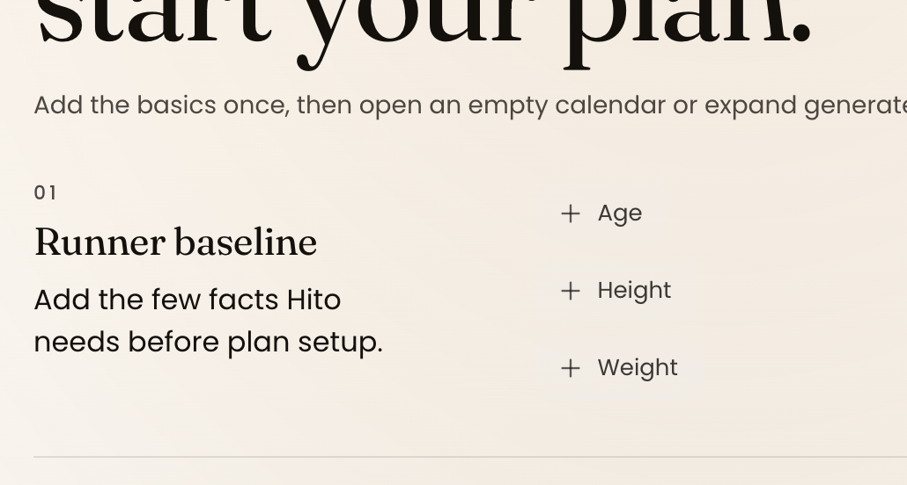

# Onboarding Editable Baseline Chip Commit And Contrast

## Status

completed

## Type

bug

## Priority

high

## Next Recommended Role

product

## Task

Shared onboarding baseline value-chip commit, clear, validation, and contrast behavior accepted.

## Stage

closed

## Exact Handoff Prompt

None. The shared component correction and browser acceptance are complete.

## Issue Category

design

## Severity

high

## Human Priority

none

## Human Status

completed

## Owner

FRONTEND with QA acceptance

## Reported

2026-07-21

## Root Cause And Canonical Owner

Empty Age, Height, and Weight chips were too faint in light mode, and the shared outside-pointer
path restored the previous value before closing. The failure belonged to
`src/components/ui/editable-value-chip.tsx` and its Hito onboarding style contract, not to a Quick
setup route or backend persistence rule.

## Accepted Behavior

- Empty numeric chips are visibly actionable in light and dark themes.
- A valid draft commits when the runner intentionally moves focus or pointer to another control.
- Explicit clear leaves the current onboarding draft empty and restores required-basics gating.
- Invalid non-empty input remains visible and announced instead of silently committing or
  disappearing.
- The same shared contract is used by Quick and Advanced setup.
- Editing the onboarding draft does not persist profile/server truth before the existing reviewed
  confirmation boundary.
- Existing validation ranges, profile prefill, plan preview/confirm, and backend persistence remain
  unchanged.

## Evidence

Accepted browser evidence:

- `qa-artifacts/screenshots/2026-07-21/onboarding-editable-baseline-chip-qa/`;
- `qa-artifacts/screenshots/2026-07-21/onboarding-editable-baseline-chip-qa-rerun/`;
- `qa-artifacts/screenshots/2026-07-21/onboarding-editable-baseline-chip-qa-final/`.

The final inventory covers pointer-away and Tab-away commit, explicit clear, invalid state,
keyboard and pointer paths, Quick and Advanced setup, light/dark desktop, Safari fallback, exact
375px, mobile target size, runtime health, no premature server persistence, targeted lint,
production build, build integrity, and scoped diff hygiene.

## Closeout

Implementation DoD: Passed.

Global QA Acceptance: Passed for this bounded shared-control correction. No further implementation
or release gate remains in this task.
