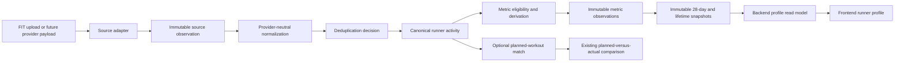

# Runner Activity Intelligence Foundation Architecture

## Work Item ID

2026-07-30-runner-activity-intelligence-foundation-architecture

## Status

ready

## Type

plan

## Priority

high

## Owner

architect

## Scope

import-export-provider-evidence

## Batch

runner-activity-intelligence-foundation

## Archive Intent

retain_in_place

## Next Recommended Role

architect

## Task

Integrate the functionally accepted Gates 1-4 source bundle into source control using the exact
manifest in this item. Gate 5 remains a separate later Backend slice that depends on persisted
normalized sample-set revisions.

## Stage

Gates 1-4 implementation and functional Global QA Acceptance passed on the current dirty working
revision. Source-control release integration is pending and no file has been staged. No Gate 5
advanced metric is implemented. The current source scope remains manual Garmin FIT/ZIP intake only;
provider sync and multi-source reconciliation are future gates.

## Exact Handoff Prompt

```text
ROLE: ARCHITECT

Task:
Apply source-control release integration for the accepted Runner Activity Intelligence Gates 1-4
bundle.

Stage:
ARCHITECT release integration.

Canonical plan:
/Users/ivan/Library/Mobile Documents/com~apple~CloudDocs/4-web/hito-running/docs/tasks/backlog/2026-07-30-runner-activity-intelligence-foundation-architecture.md

Accepted evidence:
/Users/ivan/Library/Mobile Documents/com~apple~CloudDocs/4-web/hito-running/qa-artifacts/screenshots/2026-08-03/runner-activity-gates-1-4-global-qa-final/proof.json

Required outcome:
Stage exactly the files under `Accepted Gates 1-4 release bundle` in the canonical plan and no other
dirty or untracked path. Preserve every path under `Concurrent work to preserve`. Recheck worktree
drift, migration order, validator reachability, generated route/database ownership, and scoped diff
hygiene before staging. Do not reopen functional QA without new evidence and do not include ignored
QA artifacts, stale local credential registry entries, Gate 5, provider sync, or the Backend
Optimization Plan.

Definition of Done:
The staged path set exactly equals the accepted manifest, excluded work remains unstaged and
unchanged, all three migrations remain ordered, every validator/fixture entrypoint is present, and
the staged diff contains no Gate 5, provider, optimization-plan, credential-registry, or unrelated
Frontend work. Report any drift as a named owner ambiguity instead of guessing. Commit or push only
when separately and explicitly authorized.

Approval policy:
Routine local inspection and validation proceed under standing authorization. Staging, commit, push,
deployment, hosted mutation, and provider calls require explicit authorization and are not implied by
this handoff.

Dispatch status:
not sent
```

## Dispatch

Release integration handoff is ready and not sent. No staging, commit, push, deployment, hosted
mutation, or provider call has been performed. Gate 5 remains a separate backlog slice.

## Source-Control Release Integration Manifest (2026-08-03)

This is the exact file-level manifest for the functionally accepted Gates 1-4 working revision. It
does not authorize staging. A release owner must stop on any path-set or mixed-hunk drift rather than
expand the bundle by inference.

### Accepted Gates 1-4 release bundle

Stage these 50 paths together when staging is explicitly authorized:

```text
docs/current-product.md
docs/current-state.md
docs/current-system.md
docs/history/technical-log.md
docs/tasks/backlog/2026-07-30-runner-activity-intelligence-foundation-architecture.md
docs/tasks/backlog/2026-08-02-runner-activity-gate-dependency-reconciliation.md
docs/tasks/backlog/2026-08-02-runner-activity-history-and-explainable-progress-experience.md
docs/tasks/backlog/2026-08-02-runner-activity-progress-review-fixture.md
docs/tasks/frontend-specs/2026-08-02-runner-activity-history-and-explainable-progress-experience.md
docs/tasks/running-coach/2026-07-30-hito-runner-profile-constitution.md
docs/tasks/running-coach/2026-08-02-runner-activity-intelligence-formula-policy-amendment.md
package.json
scripts/lib/qa-test-user-lifecycle.mjs
scripts/lib/runner-activity-gate-4-fixture.ts
scripts/lib/runner-activity-progress-review-fixture.ts
scripts/test-user.mjs
scripts/validate-runner-activity-foundation.ts
scripts/validate-runner-activity-gate-4.ts
scripts/validate-runner-activity-read-models.ts
scripts/validate-workout-evidence-comparison.ts
src/components/progress/ActivityHistoryPanel.tsx
src/components/progress/FactualProgressPanel.tsx
src/components/progress/RunnerActivityProgressExperience.tsx
src/components/progress/runner-activity-progress-types.ts
src/components/progress/runner-activity-progress-view-model.ts
src/lib/runner-activity/activity-evidence.ts
src/lib/runner-activity/backfill-workout-result-activities.ts
src/lib/runner-activity/fact-snapshots.ts
src/lib/runner-activity/garmin-fit-source.ts
src/lib/runner-activity/history-read-model.ts
src/lib/runner-activity/metric-formulas.ts
src/lib/runner-activity/metric-snapshots.ts
src/lib/runner-activity/read-model-types.ts
src/lib/runner-activity/read-model.ts
src/lib/supabase/database.ts
src/lib/workout-result-import/ingest-garmin-result.ts
src/lib/workout-result-import/parse-garmin-fit.ts
src/lib/workout-result-import/read-workout-result-feedback.ts
src/lib/workout-result-import/types.ts
src/routeTree.gen.ts
src/routes/api.runner-activities.$activityId.source.tsx
src/routes/api.runner-activities.$activityId.tsx
src/routes/api.runner-activities.tsx
src/routes/api.runner-activity-progress.tsx
src/routes/api.workout-result.remove.tsx
src/routes/api.workout-result.upload.tsx
src/routes/progress.tsx
supabase/migrations/20260802190244_runner_activity_foundation_gate_1.sql
supabase/migrations/20260802223149_runner_activity_history_and_fact_snapshots.sql
supabase/migrations/20260803134149_runner_activity_gate_4_metrics.sql
```

The bundle has four canonical owners without overlapping truth:

| Surface | Canonical owner | Included responsibility |
| --- | --- | --- |
| Activity/source/revision, factual and Gate 4 metric persistence | Backend runner-activity domain | Migrations, ingestion projection, immutable evidence/observations/snapshots, read models and APIs |
| Runner-facing History and Progress | Frontend Product | Backend-shaped rendering, source/deletion lifecycle, records/load, truthful Gate 5 unavailable |
| Deterministic proof and disposable local fixture lifecycle | Backend/QA tooling | Validators, fixture seed/status/reset, owned-row/storage cleanup |
| Operational status and release boundary | Architect | This manifest, canonical backlog/current-state reconciliation and technical-log receipt |

No accepted file contains a demonstrated unrelated hunk. Generated `src/routeTree.gen.ts` contains
only the new runner-activity routes, and generated `src/lib/supabase/database.ts` contains only the
runner-activity schema/RPC additions required by these migrations.

### Concurrent work to preserve

Do not stage, edit, delete, reset, or otherwise absorb these four paths into this bundle:

| Path | Classification | Named owner |
| --- | --- | --- |
| `AGENTS.md` | Unrelated project execution-policy work | Product/project policy owner |
| `docs/tasks/backlog/2026-08-02-hide-attached-activity-file-dates.md` | Separate accepted Frontend copy cleanup | Frontend Product |
| `src/components/CompletionPanel.tsx` | Implementation for the separate attached-file-date task; no Gates 1-4 hunk | Frontend Product |
| `docs/tasks/backlog/2026-08-03-runner-activity-backend-simplification-and-metric-scalability.md` | Future Backend Optimization Plan explicitly excluded from this release | Architect/Backend future work |

There is no unresolved changed-file ambiguity after independent Backend and Frontend inspection. If
the working tree changes after this manifest, the release owner must reclassify the new or modified
path with its canonical owner before staging.

### Evidence-only and local audit findings

The accepted functional receipt is
`qa-artifacts/screenshots/2026-08-03/runner-activity-gates-1-4-global-qa-final/proof.json`.
`qa-artifacts/` is gitignored protected evidence and is not part of the staging manifest. The two
sibling `global-qa` and `global-qa-rerun` receipts are failed pre-fix evidence, not the final verdict.

The current loopback QA credential registry has one stale entry and three tester-ID drift entries,
with zero cleanup candidates, zero owned product rows, and no active leases. The canonical owner is
the Backend test-user lifecycle. Its drift-checked cleanup apply can remove the single stale entry
when the manifest has zero candidates, and role-scoped `pool-ensure` can reconcile the three reusable
tester IDs without touching runner-owned product rows. Those local QA-identity mutations remain a
separate Backend-owned cleanup action, not Architect release work. All four registry findings remain
non-blocking audit findings here; no credential or product data belongs in this release bundle and
no cleanup is authorized by this manifest.

### Migration and validator reachability

| Order | Migration | Dependency proof |
| --- | --- | --- |
| 1 | `20260802190244_runner_activity_foundation_gate_1.sql` | Creates canonical activity, source, source-revision, activity-revision and planned-match truth |
| 2 | `20260802223149_runner_activity_history_and_fact_snapshots.sql` | Adds factual snapshots and History/delete RPCs over Gate 1 tables |
| 3 | `20260803134149_runner_activity_gate_4_metrics.sql` | Adds immutable evidence, observations and metric snapshots over Gate 1 revisions and replaces the Gate 2 delete RPC |

The deterministic validators remain direct top-level entrypoints:

- `node --import tsx ./scripts/validate-runner-activity-foundation.ts`;
- `node --import tsx ./scripts/validate-runner-activity-read-models.ts`;
- `node --import tsx ./scripts/validate-runner-activity-gate-4.ts`;
- `node --import tsx ./scripts/validate-workout-evidence-comparison.ts`.

The reusable browser fixture remains package-reachable through
`local:activity-review:seed`, `local:activity-review:status`, and
`local:activity-review:reset`. The final Global QA receipt records all required validators, build,
build-integrity, targeted lint, diff hygiene and fixture cleanup as passed on this dirty revision.

### Remaining release prerequisites

1. Recheck that the dirty path set is exactly the 50 accepted paths plus the four preserved paths.
2. Obtain explicit authorization for staging; this audit does not grant it.
3. Stage only the 50 accepted paths and verify the index path set exactly matches this manifest.
4. Treat commit, push, deployment, hosted migration and provider calls as separate explicit gates.
5. Keep Gate 5 `normalized_stream_not_persisted` and provider sync future-only.

## Architecture Status

This plan is linked to the accepted
[Hito Runner Profile Constitution](../running-coach/2026-07-30-hito-runner-profile-constitution.md).
The constitution owns metric meaning, eligibility, confidence, and formula amendments. This plan
owns the provider-neutral system boundaries needed to implement that meaning.
The supporting
[Runner Activity Intelligence Formula Policy Amendment](../running-coach/2026-08-02-runner-activity-intelligence-formula-policy-amendment.md)
resolves the Gate 4/5 metric formulas, evidence thresholds, cohorts, unavailable states, and
invalidation rules. The readiness amendment in this canonical backlog item owns the normalized
sample-set, activity/RPE/official-result, observation/snapshot, and re-baseline consequence
boundaries needed for implementation. The formula-policy document supplies doctrine; it does not
own operational status or dispatch.

Current implementation boundary:

- Gates 1-4: **implemented locally; functional Global QA Acceptance passed on the current dirty
  working revision**;
- source-control release integration for Gates 1-4: **pending**;
- Gate 5 normalized streams/aerobic metrics: **not implemented**;
- provider connections and cross-source reconciliation: **not implemented**;
- Gate 7 for the selected Gates 1-4 functional bundle: **passed**.

The existing
[Provider Activity Ingestion And Comparison Contract](../product-briefs/2026-06-09-provider-activity-ingestion-and-comparison-contract.md)
remains the intake and planned-versus-actual reference. The older
[Strava Activity Ingestion And Sync Plan](2026-06-09-strava-activity-ingestion-and-sync-plan.md)
is subordinate to this provider-neutral foundation and must not launch a provider-specific activity
store or metric path.

## Accepted Product Lifecycle Decisions (2026-07-30)

These decisions resolve Gate 0. They are deliberately narrow: Hito currently accepts only manual
Garmin FIT files and ZIP archives containing exactly one FIT file. Garmin Sync, Suunto, Apple,
Strava, and other provider connections are future work and must not add scope to Gate 1.

1. **Keep normalized activity truth.** Normalized activity facts, provenance, and eligible profile
   contributions remain until the runner explicitly deletes the activity from history.
2. **Keep raw FIT privately by default.** Retain raw FIT/ZIP evidence indefinitely in private
   storage. This preserves the ability to reprocess the source when Hito later supports new
   activity fields or improves its normalization. Raw route coordinates remain private and are not
   copied into profile or comparison read models.
3. **Separate file removal from activity deletion.** `Remove original file` deletes the raw source
   asset only and leaves normalized activity facts intact. `Delete activity from history` removes
   the activity, its normalized observations, comparisons, and profile contribution. A manual
   completion remains a separate self-reported log and never becomes measured evidence.
4. **Backfill existing FIT automatically.** Existing workout-scoped FIT evidence may be migrated
   idempotently into the canonical activity boundary with original provenance and normalizer/formula
   versions. Missing source fields remain missing.
5. **Defer synchronization conflicts.** A future provider disconnect preserves imported history
   until the runner deletes it. If a future sync and a prior manual FIT appear to represent one run,
   Hito asks the runner before replacing or merging source evidence; no automatic overwrite or
   cross-source reconciliation is part of the current manual-upload scope.

## Pre-Implementation Root Cause And Architecture Decision

### Visible need

At plan acceptance, Hito could attach one Garmin FIT/ZIP result to a saved workout and show actual
metrics, deterministic comparison, and bounded feedback. It could not build a trustworthy
longitudinal runner profile or count one run once when multiple providers report it. Gates 1-4 have
since implemented the manual-FIT activity/profile slice; cross-provider reconciliation remains
future Gate 6 work.

### Demonstrated underlying cause

At plan acceptance, result truth was workout-scoped:

- `workout_result_assets.planned_workout_id` is required;
- `workout_actual_metrics.planned_workout_id` is required;
- removal is owned by the workout feedback lifecycle;
- comparison and AI insight are projections of one planned workout.

That contour is correct for plan-versus-run feedback, but it cannot own unplanned activities,
multiple source references, reversible deduplication, provider updates, lifetime records, or
immutable profile snapshots.

### First incorrect owner to avoid

Do not enlarge `src/lib/workout-result-import/*` into the longitudinal profile owner. It remains the
current FIT upload and workout-feedback adapter. A new provider-neutral Backend domain must own
canonical activity truth, while workout comparison consumes a matched canonical activity.

### Architecture decision

Hito will have one runner-owned activity truth independent of plans and providers:

`source evidence -> adapter observation -> normalization -> dedup decision -> canonical activity`

All metrics and snapshots consume only that canonical activity truth. A planned workout match is an
optional relation, not activity identity. Provider adapters translate source facts; they do not own
metrics, deduplication policy, profile meaning, or runner-visible conclusions.

## Pre-Implementation State Versus Accepted Target

The target is implemented for the bounded Gates 1-4 manual-FIT scope except where a row explicitly
describes Gate 5 streams or future multi-provider behavior.

| Concern | State at plan acceptance | Accepted target |
| --- | --- | --- |
| FIT upload | Local FIT/ZIP attached to one planned workout | FIT is one source adapter into canonical activity truth |
| Activity identity | Result asset and actual metrics are identified through a planned workout | Stable runner-owned canonical activity independent of plan assignment |
| Unplanned run | No canonical home | Valid activity with no planned-workout match |
| Multiple providers | No cross-source lifecycle | Multiple source observations support one activity |
| Deduplication | Latest metrics may supersede prior workout evidence | Explicit, reversible, versioned match decision |
| Streams | Parser reads records but persists summary/lap-oriented payload | Optional normalized sample set with source quality and privacy boundaries |
| Comparison | Reads workout-scoped actual metrics | Reads a canonical activity projection matched to a planned workout |
| Progress | Compact plan/log aggregates | Versioned metrics from canonical activities |
| Profile | Runner facts and accepted HR guidance | Runner facts remain separate from immutable activity-derived snapshots |
| Formula changes | No longitudinal metric lifecycle | New formula version produces attributable new results without silent rewrite |

## Canonical Data Flow



No downstream node reparses a raw provider payload. AI may explain a supplied snapshot but may not
calculate a competing metric or mutate activity truth.

## Canonical Logical Boundaries

These are architecture concepts, not approved table, endpoint, or TypeScript names.

| Boundary | Owns | Does not own |
| --- | --- | --- |
| Source observation | Provider/source identity, source revision, ingest time, raw-evidence pointer, source capabilities, fingerprint | Canonical activity identity or metric meaning |
| Normalized activity candidate | Provider-neutral observed fields and optional normalized samples | Deduplication result or runner-facing metric |
| Source link | Relationship between one source revision and one canonical activity | Replacement of source provenance |
| Canonical activity | Runner, sport, start/timezone, durations, distance, context, correction state, current supporting sources | Planned workout content or provider payload |
| Field provenance | Winning source and method for each normalized field | One activity-wide "best provider" |
| Deduplication decision | `matched`, `possible_duplicate`, or `separate`, evidence features, decision/algorithm version, runner override | Silent merge from date alone |
| Plan match | Optional canonical-activity to planned-workout relation, confidence, runner correction | Activity identity or plan mutation |
| Sample set | Ordered optional observations and quality flags | Required truth for summary-only activities |
| Metric observation | One named value, unit, window/segment, source activities, formula version, exclusions, confidence | Mutable runner profile field |
| Profile snapshot | Immutable set of compatible metric observations for one cutoff/window | Universal fitness score or live provider cache |
| Progress comparison | Compatible baseline/current snapshot comparison and explanation | Recalculation under mixed formula versions |

## Activity And Source Identity

### Canonical activity identity

A canonical activity belongs to the Hito runner, not to Garmin, Strava, a FIT file, or a planned
workout. Its minimum stable facts are:

- Hito activity ID and runner ID;
- sport and manual/recorded marker;
- started-at instant, local date, and historical timezone;
- elapsed duration and timer/active duration when available;
- distance when available;
- current quality/correction state;
- zero or more planned-workout matches;
- one or more supporting source links.

### Source identity

Each source observation preserves:

- source kind and provider name;
- provider activity ID when supplied;
- upload fingerprint for files;
- provider/source revision and observed update time;
- ingestion time;
- raw-evidence location or redacted envelope reference;
- available capabilities: summary, laps/splits, records/streams, device metadata;
- provider delete/supersession state.

Provider activity IDs are unique only inside one runner, provider, and connection context. A file
fingerprint identifies the exact uploaded evidence, not automatically the real-world run.

### Field-level provenance

Source priority is field-specific. A canonical activity may use a FIT HR stream, a provider session
timezone, and a runner correction for activity type. Every selected field retains:

- source observation and revision;
- observed, user-corrected, or derived method;
- quality/confidence;
- normalization version.

A lower-ranked source cannot silently replace richer evidence. Source revisions trigger an explicit
canonical revision and downstream invalidation decision.

## Optional Streams And Samples

The sample boundary is sparse and capability-based. A provider adapter may supply none, some, or all
of:

- timestamp or elapsed offset;
- cumulative distance;
- speed or pace evidence;
- heart rate;
- moving/pause state;
- elevation/grade;
- cadence or power with measured/estimated provenance;
- lap, workout-step, or repeat references;
- temperature and sensor-quality evidence.

Rules:

1. Missing samples remain missing.
2. Summary-only activities remain valid for participation, volume, and eligible manual records.
3. Exact latitude/longitude is excluded from the normalized profile contract in v1.
4. Raw FIT evidence may contain route coordinates; its private indefinite retention is governed by
   the accepted Gate 0 Product decision.
5. Do not manufacture a uniform sample cadence. Preserve timestamps, gaps, and downsampling state.
6. Store normalized samples only when a visible metric or comparison purpose requires them.
7. Record-stream and summary-derived values remain distinguishable.

## Provider Adapter Contract

Adapters perform only source-specific acquisition and translation. They return capability-declared
observations into the same normalization boundary.

| Source | V1 mapping | Must not be assumed |
| --- | --- | --- |
| Local FIT/ZIP | Existing private raw asset, session summary, laps, available records, device metadata, upload fingerprint | Every FIT has HR, GPS, laps, workout steps, timezone, or trustworthy distance |
| Future Garmin connection | Provider IDs/revisions and only fields actually supplied by approved endpoints/scopes | Garmin API equals FIT richness or exposes the same step semantics |
| Future Strava connection | Detailed activity, laps/splits, and streams when scopes and API availability permit | Garmin-style workout-step identity, private activities without consent, complete HR/GPS |
| Future providers | Capability-declared adapter into the same observation contract | Provider-specific fields are canonical simply because they exist |
| Manual result | User-entered summary or confirmed official result with visible provenance | Device-observed stream truth |

Provider API endpoint, OAuth, webhook, token, pagination, rate-limit, and commercial-access design is
deferred to each provider integration. No provider integration may bypass canonical normalization
or deduplication.

## Deduplication And Correction

### Candidate generation

Potential duplicates may be proposed only inside one runner boundary using available evidence:

- provider-native linkage or prior source link;
- exact file fingerprint;
- start-time proximity with timezone awareness;
- elapsed duration similarity;
- distance similarity;
- sport compatibility;
- source revision lineage.

### Decision states

- `matched`: evidence is sufficient to attach the source to one canonical activity.
- `possible_duplicate`: uncertainty is visible; neither candidate contributes twice to aggregate
  truth until runner/backend resolution policy is applied.
- `separate`: evidence supports distinct activities.

The implementation must not silently merge two activities because they share a date, and must not
silently count uncertain copies twice.

### Reversibility

Every automated match keeps its evidence features and algorithm version. A runner correction can:

- split a wrongly merged source into a separate canonical activity;
- join a confirmed duplicate;
- correct sport/type;
- assign or unassign a planned workout.

Corrections preserve source evidence and create a new canonical revision. Affected metrics and
snapshots are invalidated and recomputed under their original or explicitly selected formula
version; historical published snapshots remain attributable.

## Metric Contract Matrix

| Metric family | Minimum data | Comparability / exclusion | Confidence and unavailable state |
| --- | --- | --- | --- |
| Sessions, frequency, time, distance | Canonical completed running activity; local date/timezone; timer duration and/or distance | One canonical activity once; exclude deleted/invalid/wrong-sport truth | Available without HR; name missing distance/elevation rather than infer |
| Planned completion | Eligible planned workout plus corrected plan match and completion state | Distinguish completed/partial/skipped/cancelled/plan-changed; exclude Rest and workouts removed before due date | Unavailable for unmatched activities; never reinterpret activity quality |
| Elevation and longest run | Canonical distance/duration; elevation evidence for elevation totals | No elevation total without evidence; longest distance and duration shown separately | Field-specific source confidence |
| Personal best | Timestamped cumulative distance and elapsed timestamps, or user-confirmed official result | No moving-time shortcut, recording gaps, teleports, or implausible jumps; separate race/training/provider/manual | Summary-only provider best remains attributed; otherwise use the formula-policy unavailable reason; Gate 4 excludes within-activity segment calculation |
| Aerobic efficiency | Eligible steady segment; distance; HR with sample durations | Apply formula-policy gates for intent, continuity, pauses, terrain, sensor, and structure | Gate 5 is stream-only; there is no summary/lap/mean-HR fallback |
| Pace at comparable HR | Eligible samples, fixed reference HR series, at least 10 cumulative minutes inside +/-3 BPM | No extrapolation; terrain class and reference bucket fixed within series | Requires qualifying baseline/current windows and per-metric evidence level |
| HR at comparable pace | Repeated eligible aerobic running and fixed observed personal pace bucket | Pace comes from observations, not finish-time goal; context classes remain comparable | Unavailable until repeated matching pace evidence exists |
| Durability / decoupling | Eligible continuous main segment at least 40 minutes with HR and speed/distance | Exclude intervals, progression, races, deliberate fast finish, run/walk; separate terrain classes | Context-sensitive; one session cannot establish a trend |
| Controlled aerobic duration | Continuous eligible samples in the fixed reference-HR series | Stop at material pace collapse, gap, or quality failure | Unavailable until a stable reference series exists |
| Session load | Canonical observed duration and activity-attributed runner RPE 1-10 | Same-runner descriptive arbitrary units only; partial uses observed duration; skipped has no load | Unavailable without immutable activity-linked RPE evidence; use the formula-policy amendment |
| Body/context trends | Runner-approved time series with source and measurement method | Never fold into a fitness/readiness score | Separate contextual series; missing remains missing |
| 28-day snapshots | Canonical activities, eligibility results, metric observations, cutoff/window, formula set | Reproducible source revisions; no carry-forward of stale aerobic value | Volume may be available while aerobic metrics are unavailable |

## Metric Availability, Confidence, And Versioning

### Availability

Each metric returns one of:

- available with value, unit, evidence, and confidence;
- unavailable with a stable reason class;
- invalidated pending recomputation after source/correction change.

Unavailable is product truth, not an error to repair. The Backend must not substitute provider
VO2max, estimated pace, planned targets, age-based HR guidance, or an older snapshot.

### Formula-policy decisions and remaining lifecycle boundaries

Canonical activity persistence does not depend on these decisions, but the relevant metrics remain
unavailable until their owner resolves them:

- **Product / Running Coach:** define the qualifying period for streaks and the planned-completion
  denominator, including partial, stopped, cancelled, and plan-changed states.
- **Explicit later Product decision:** decide when a manual workout log or standalone official result
  is itself a canonical activity rather than evidence attached to an existing recorded activity.
- **Resolved by Running Coach amendment:** baseline/reference arithmetic, stable-sample treatment,
  deterministic unstructured-run analysis, stream-only aerobic truth, reference buckets, evidence
  thresholds, confidence interpretation, non-overlapping windows, session-RPE duration, and PB
  interpolation/gap/plausibility rules.
- **Resolved by this Architecture amendment:** official-result confirmation/correction/withdrawal,
  immutable activity-linked RPE attribution, normalized sample-set lifecycle, shared metric
  observation/snapshot lifecycle, truthful freshness, and evidence-change reference-series repair.
- **Explicit later Product decision:** define the runner-facing trigger, confirmation, and copy for
  intentional re-baseline without changing the amendment's fixed-series arithmetic or rewriting
  historical series. Automatic evidence-change repair is already defined here.

### Confidence

Confidence belongs to each metric, never to the runner as one score. It carries:

- eligible observation count;
- source richness: stream, laps, summary, or manual;
- sensor/source consistency;
- terrain/environment comparability;
- gap/downsampling/quality flags;
- reference-series continuity;
- exclusion counts and reason classes.

The constitution's evidence levels remain canonical:

- insufficient: fewer than 3 eligible observations in either comparison snapshot;
- provisional: 3-5 in each;
- established: at least 6 in each.

### Formula versions

Formula definitions are code-owned, reviewable constants/contracts, not database-configured
behavior or an AI prompt. Every metric and snapshot records:

- constitution version;
- formula version;
- normalization/dedup version where relevant;
- calculation time and owner;
- source activity IDs and canonical revisions;
- eligibility and exclusion results;
- reference-series ID;
- confidence inputs.

A formula amendment never silently overwrites historical truth. It creates a new attributable
calculation series or snapshot and states whether backfill is approved. Frontend never recomputes a
metric.

## Immutable Snapshot Contract

A snapshot is an immutable read model for one runner and cutoff, not a mutable column on
`runner_profiles`.

Snapshot families:

- calendar-week participation;
- rolling 28-day current training;
- first qualifying or explicit 28-day baseline;
- latest qualifying 28-day current fitness;
- rolling 90-day direction;
- lifetime records.

Each snapshot pins:

- runner facts revision used only as context;
- window and timezone boundary;
- canonical activity IDs and revisions;
- metric formula versions;
- values, units, unavailable reasons, exclusions, and confidence;
- creation/recalculation cause.

Changes to runner facts, HR guidance, goals, planned workouts, or provider connections do not
rewrite old snapshots. A source correction may create a replacement snapshot while retaining the
prior attributable version for audit and historical readback.

## Storage And Ownership Boundaries

Backend chose bounded Gates 1-4 schema details under these fixed storage responsibilities. Gate 5
must preserve the same ownership when it later adds normalized sample-set revisions:

| Storage class | Canonical owner | Lifecycle |
| --- | --- | --- |
| Raw file/provider envelope | Source ingestion | Private, source-revision aware, retention-controlled |
| Source observation/link | Activity ingestion | Immutable revisions plus supersession/delete state |
| Canonical activity/revision | Activity domain | Runner-owned, corrected through explicit revision |
| Optional normalized samples | Activity domain | Immutable source-linked evidence, purpose-limited |
| Planned-workout match | Comparison domain | Reversible relation; no plan-content mutation |
| Metric observation | Profile computation | Immutable, formula-versioned, reproducible |
| Profile snapshot/comparison | Profile computation | Immutable read model with explicit replacement lineage |
| Runner facts/HR profile | Existing runner profile owner | Remains separate; never overwritten by activity metrics |

The current workout result tables remain accepted during migration. They cannot become a permanent
second normalized activity store. The Backend implementation must either project them from the new
canonical activity boundary or define a bounded migration/removal condition before dual-write.

## Ownership

| Role | Owns |
| --- | --- |
| Product | Visible purpose, consent, source connection/disconnection, deletion/retention, runner correction semantics |
| Architect | Canonical boundaries, source hierarchy, lifecycle, anti-duplication and migration constraints |
| Backend | Auth/RLS, adapters, normalization, deduplication, corrections, metrics, formula versions, snapshots, read models |
| Running Coach | Metric meaning, eligibility, comparability, confidence interpretation, non-medical language |
| Frontend Product | Render backend activity/profile truth, source/confidence/context, correction and unavailable states |
| QA | Cross-source fixtures, idempotency, dedup/split/join, formula boundaries, snapshots, export/readback, privacy |
| Future integration adapter | Provider auth/acquisition and translation into source observations only |
| AI | Explain supplied accepted truth; never calculate or persist a competing profile |

## Gates 4 And 5 Implementation Readiness Amendment (2026-08-03)

### Authority and reuse rule

This section is the canonical Architecture lifecycle amendment for Gates 4 and 5. The Running Coach
formula-policy amendment remains authoritative for metric meaning; this backlog item remains the
only operational task/status owner. Backend chooses schema, API, and module shapes during its own
implementation preflight.

Gates 4 and 5 extend the implemented pipeline instead of creating another one:

`canonical activity revision -> accepted evidence revision -> immutable metric observation -> formula-versioned profile snapshot -> Backend read model`

Gate 4 establishes the shared observation, snapshot, invalidation, recomputation, and readback seam.
Gate 5 reuses that seam after adding persisted normalized sample-set revisions. Gate 5 must not add
a parallel metric store or a second Progress read model.

### Canonical lifecycle owners

| Truth | Canonical owner | Required lifecycle | Must not become |
| --- | --- | --- | --- |
| Activity and source revisions | Existing Backend activity ingestion domain | Existing immutable revision/current-pointer, raw-retention, correction, and deletion rules | RPE, official-result, or metric storage |
| Runner session-RPE report and attribution | Gate 4 Backend activity-evidence domain | Immutable report revision plus immutable attribution to one activity revision; supersession and ambiguity are explicit | A mutable `workout_logs.rpe` profile field |
| Runner-confirmed official result | Gate 4 Backend activity-evidence domain | Immutable runner assertion against one activity revision; correction supersedes and withdrawal removes current contribution | Device-observed truth or a standalone activity |
| Normalized sample set | Gate 5 Backend activity-normalization domain | Immutable source/activity-linked revision, quality/provenance, current/superseded state, reprocessing, retention, and deletion | Raw payload copy, route store, or read-time parser output |
| Metric observation | Backend profile computation; introduced by Gate 4 and reused by Gate 5 | Immutable evidence/formula attribution plus current, invalidated, and superseded selection | Mutable runner-profile column |
| Reference series | Gate 5 Backend profile computation | Fixed baseline references, predecessor/closure cause, and evidence-change replacement | Frontend or AI baseline state |
| Profile snapshot and Progress composition | Existing Backend profile computation/read-model boundary | Immutable compatible observations, formula versions, historical readback, replacement lineage, and truthful freshness | A second activity or frontend metric model |
| Runner-initiated re-baseline interaction | Product, then Frontend Product over a Backend contract | Explicit future purpose, confirmation, and copy decision | A hidden Gate 5 side effect |

### Immutable session-RPE attribution

1. A Gate 4 RPE report is runner-authored whole-session evidence: integer `1-10`, the accepted
   completed/partial outcome, capture time, actor, and origin provenance. It stores no competing
   activity distance or duration.
2. The report revision and its attribution are immutable. The attribution pins one runner, one
   canonical activity ID, and one exact activity revision. Editing RPE or outcome appends a new
   report/attribution revision and supersedes the prior current attribution; it never overwrites the
   historical value used by an older snapshot.
3. Existing mutable workout-log RPE is intake provenance only. Gate 4 backfills it only when one
   current workout log, one accepted planned-workout match, and one canonical activity revision form
   an exact same-runner relation. An absent or ambiguous link stays unavailable; Backend must not
   choose by date, title, distance, or nearest time.
4. A new canonical activity revision invalidates the current load observation. Backend may create a
   successor attribution only when the canonical activity identity and accepted match remain exact
   and unambiguous; the successor records its predecessor and re-attribution cause. Otherwise use
   `activity_rpe_link_missing` or `activity_rpe_link_ambiguous` after any pending recomputation state.
5. Skipped has no RPE load, no zero observation, and no activity fabrication. Planned duration,
   mutable manual completion duration, HR, pace, AI effort, and planned RPE never substitute for the
   canonical observed duration plus runner report required by the formula policy.
6. Deleting the canonical activity removes its current RPE contribution and triggers recomputation
   from remaining activities. Removing only the raw file does not invalidate a valid RPE attribution.

### Runner-confirmed official-result lifecycle

Gate 4 v1 accepts an official result only as a runner assertion attached to an existing canonical
activity revision. This keeps official-result provenance separate from measured activity truth and
does not decide that a manual workout completion or a result with no activity is a canonical
activity.

- Confirmation pins runner, canonical activity revision, exact standard distance, elapsed result
  time, event date, runner-confirmed provenance, capture time, and actor. Optional event/source
  context may be retained, but runner confirmation alone is never relabelled independently verified.
- Correction appends a new assertion revision and supersedes the prior current assertion. It does
  not rewrite the canonical activity's observed distance, duration, or source provenance.
- Withdrawal closes the current assertion without inventing a replacement value. Current record
  observations and snapshots recompute from remaining eligible evidence; older attributable
  snapshots remain historical while the activity exists.
- A canonical activity revision change does not silently carry an official assertion forward. The
  current result becomes unavailable until the runner confirms or corrects it against the new
  revision. Activity deletion removes the assertion and dependent history under the accepted
  explicit-delete boundary; raw-file removal alone does not.
- Provider-attributed records remain labelled source facts. Whole-activity exact-distance records
  remain Hito-observed activity facts. Neither becomes `runner_confirmed_official_result` without
  the runner assertion lifecycle above.

Supporting a standalone official result with no canonical activity is an explicit future Product
decision. It does not block the bounded Gate 4 result-against-existing-activity capability and must
not be improvised by Backend.

### Persisted normalized sample-set revisions

1. Gate 5 persists an immutable normalized sample-set revision linked to one source revision, one
   canonical activity revision, and one normalizer version. It preserves ordered time/offset,
   cumulative distance, observed HR where available, timer/pause/missing state, field provenance,
   quality flags, and only the additional context allowed by the formula policy.
2. Exact route coordinates remain outside the normalized v1 contract. Sample persistence is
   purpose-limited to Gate 5 record/aerobic evidence, not a general stream warehouse.
3. Reprocessing an available retained raw source creates a new sample-set revision. It becomes the
   current eligible set only after complete validation; the old set remains attributable for
   historical readback while the activity exists. Sample-only reprocessing may retain the existing
   source and activity revisions. If normalized summary facts or source capabilities/normalizer
   attribution change, the existing ingestion owner atomically appends a successor source revision
   and its matching successor activity revision, then pins the new sample set to those successors;
   the sample set never becomes a competing summary or an orphan revision.
4. Sample correction never edits a current set in place. It produces a successor revision, invalidates
   only dependent observations/reference series/snapshots, and records the correction or normalizer
   cause. Reprocessing/backfill must be bounded, idempotent, resumable, and must not run full history
   inside a request.
5. `Remove original file` retains an already accepted sample set and its provenance, so dependent
   metrics remain valid. If no normalized set existed before removal, the truthful state stays
   `normalized_stream_not_persisted`; it is not `updating` and cannot be repaired without new raw
   evidence.
6. `Delete activity from history` removes its sample sets and current/historical metric contribution,
   then recomputes affected records, windows, and reference series from remaining activities. The
   explicit activity-delete privacy boundary is the exception to ordinary historical retention.
7. Metric reads consume the persisted current sample-set revision. They never reparse a raw FIT file,
   lap payload, summary HR, or record count at read time.

### Metric observations, snapshots, and truthful freshness

- Every observation pins the exact evidence revisions required by its formula: activity revision,
  RPE/official-result revision for Gate 4 where applicable, source/sample-set revision for Gate 5,
  eligibility/exclusions, formula version, cohort/reference series, confidence, calculation time,
  and unavailable reason when no value is emitted.
- Observations and snapshots are immutable. A current selector may advance only to a compatible,
  fully calculated replacement. Historical readback addresses the pinned snapshot/formula/evidence
  version; current readback never blends formula versions or silently returns an older value.
- The existing factual snapshot family remains factual. Gate 4 extends the single profile-
  computation owner with metric observations and compatible profile snapshots, but must not duplicate
  Gate 2 facts or create another runner profile. Gate 5 reuses the same composition/readback owner.
- Existing Gate 1-3 History and factual Progress literals remain backward-compatible. Advanced
  metrics enter as a separate Backend-shaped metric family/state within the one Progress composition
  owner; Frontend must not reinterpret factual `current` or mutation-only `updating` as metric truth.
- Fresh authenticated readback, not only the response to a mutation, must expose each advanced
  metric's current, updating, or unavailable state. Factual volume may remain current while one
  advanced metric is updating or unavailable; activity/source `quality.updating` is not a proxy for
  metric recomputation.

| Readback state | Meaning | Required behavior |
| --- | --- | --- |
| `current` | All returned values/unavailable reasons match current accepted evidence and formula versions | Values may be rendered with their provenance, window, confidence, and exclusions |
| `updating` | A known evidence/formula change invalidated current contribution and bounded recomputation is pending | Return no stale value as current; include a stable pending reason and retry/readback semantics |
| `unavailable` | Required evidence is absent, ineligible, invalid, or insufficient and no recomputation is expected to fix it now | Return the first stable formula-policy reason, not an error or fallback value |
| historical version | A caller explicitly requests an older snapshot/series that still exists | Return it as historical with pinned evidence/formula attribution, never as current |

`updating` is temporary lifecycle truth, not a synonym for missing data. When recomputation completes,
the state becomes `current` with a value or truthful unavailable reason. A failed bounded recomputation
keeps current readback non-stale and reports an operational failure separately; it does not restore
the invalidated value.

### Evidence-change consequences for fixed reference series

An activity correction, sample correction, or activity deletion that invalidates a baseline
observation closes the affected reference series. Backend first exposes `updating`, then creates a
successor series from the remaining eligible evidence in the same accepted baseline window and
formula version. The successor pins its predecessor and replacement cause; the old reference is
never silently reused. If the remaining evidence cannot establish a reference, current truth becomes
unavailable with `reference_series_not_established` or the more precise formula-policy reason.

This automatic evidence-repair lifecycle is not a runner-initiated re-baseline. Product still owns
whether, when, and how a runner may intentionally start a new baseline, including confirmation and
copy. Gate 5 must not expose or execute that user mutation until Product accepts it. Neither evidence
repair nor a future intentional re-baseline may rewrite a confirmed plan, mutate coaching targets,
or present the new series as continuous with the old one.

### Two non-overlapping Backend tasks

#### Gate 4 Backend owner - activity assertions and summary-derived profile computation

The smallest owner is the Backend runner-activity evidence/profile-computation boundary. It reuses
canonical activities/revisions, exact planned-workout matches, existing factual snapshot/readback
patterns, and the formula policy. It owns:

- immutable session-RPE report revisions and exact activity-revision attribution;
- runner-confirmed official-result confirmation, correction, withdrawal, and provenance;
- session-RPE load, whole-activity exact-distance records, and supported attributed record facts;
- the shared immutable metric-observation, formula-versioned snapshot, invalidation, recomputation,
  current/updating/unavailable, and historical-readback seam that Gate 5 will consume.

Gate 4 does not persist normalized samples, calculate a best segment inside a longer activity,
compute an aerobic metric, infer a manual activity, add provider sync, implement UI, or decide the
runner-initiated re-baseline interaction. It remains open if RPE/result evidence cannot be pinned
unambiguously, current readback can expose stale values, or the implementation needs one of those
cross-owner decisions.

Required owner proof includes the formula-policy Gate 4 fixtures plus immutable edit history,
ambiguous-link refusal, official-result correction/withdrawal, activity-revision invalidation,
formula-version historical readback, fresh-read pending state, independent factual/advanced-metric
freshness, deletion/raw-removal discrimination, RLS, bounded recomputation, and regression of Gates
1-3. Passing owner-level proof is `Implementation DoD: Passed`; functional Global QA for the
selected Gates 1-4 bundle subsequently passed, while source-control integration remains pending.

#### Gate 5 Backend owner - sample normalization and stream-derived profile computation

The separate owner is the Backend runner-activity sample-normalization/reprocessing boundary working
through the Gate 4 observation/snapshot/readback seam. It owns:

- purpose-limited normalized sample-set revisions, raw-source reprocessing, correction, retention,
  current selection, deletion, and provenance/quality;
- calculated best efforts inside longer activities and the accepted stream-dependent aerobic
  observations, fixed reference series, comparisons, and interpretation;
- affected observation/reference/snapshot invalidation and recomputation without summary fallback.

Gate 5 depends on Gate 4's shared computation/readback seam and on persisted eligible sample sets per
activity. It does not change RPE/official-result lifecycle, duplicate Gate 2 facts, add a provider,
implement Frontend, create route-coordinate analytics, or add runner-initiated re-baseline behavior.
Activities without valid samples remain truthful unavailable; they do not block eligible activities.

Required owner proof includes all formula-policy stream fixtures plus raw-available reprocessing,
raw-removed retention, no-stream refusal, sample correction/supersession, baseline-evidence repair,
activity deletion, old/new formula and sample-set readback, RLS/privacy, bounded resumable backfill,
Gate 4 seam reuse, and Gates 1-4 regression. Gate 5 stays open if any metric reads raw evidence on
demand, uses summary/lap fallback, mixes formula/sample revisions, or serves a stale reference series.

### Explicit Product decisions that remain outside both Backend tasks

- whether a manual workout completion or a standalone official result with no recorded canonical
  activity creates a canonical activity;
- the runner-facing trigger, confirmation, and copy for an intentional re-baseline;
- any future provider connection/disconnection or cross-source merge interaction.

These decisions are explicit non-goals, not hidden Backend defaults. Gate 4 is implemented under the
bounded existing-activity/manual-FIT scope. Gate 5 remains a separate future slice after persisted
normalized sample-set prerequisites exist.

## Phased Delivery Plan

### Gate 0 - Product lifecycle decisions

**Owner:** Product
**Status:** complete on 2026-07-30

The accepted decisions are recorded in [Accepted Product Lifecycle Decisions](#accepted-product-lifecycle-decisions-2026-07-30). Gate 1 may proceed with manual Garmin FIT/ZIP intake only.

### Gate 1 - Canonical activity foundation through current local FIT

**Owner:** Backend
**Dependency:** Gate 0
**Status:** functional Global QA passed for the selected Gates 1-4 bundle; source-control integration
pending

Implement one authenticated runner-owned activity/source/revision boundary using the existing local
FIT/ZIP path as the only input adapter. The accepted outcome must:

- preserve current workout feedback and comparison behavior;
- support an activity with or without a planned-workout match;
- make repeated upload idempotent by exact source identity;
- keep source evidence and canonical activity distinct;
- expose deterministic correction and invalidation semantics;
- avoid provider sync and longitudinal metric UI.

Migration and backfill must be additive, reversible, RLS-protected, and bounded by accepted Gate 0
policy. Temporary dual-write requires an explicit removal gate.

### Gate 2 - Trustworthy 28-day running facts

**Owner:** Backend with Running Coach review
**Dependency:** accepted Gate 1 owner-level contract and implementation evidence. Gate 7 Global QA
is not a prerequisite.
**Status:** functional Global QA passed for the selected Gates 1-4 bundle; source-control integration
pending

Deliver the first useful profile computation from summary-level truth without claiming fitness:

- sessions, frequency, running time, distance, elevation where evidenced;
- longest run distance and duration;
- immutable weekly and 28-day running-fact snapshots;
- source coverage, excluded activities, and explicit missing-field reasons;
- metric-specific unavailable reasons and confidence.

Do not implement streaks, planned completion, personal bests, session-RPE load, pace-at-HR,
HR-at-pace, durability, or an overall fitness score in this gate.

### Gate 3 - Runner activity/profile readback

**Owner:** Frontend Product
**Dependency:** Gate 2
**Status:** functional Global QA passed for the selected Gates 1-4 bundle; source-control integration
pending

Render backend-owned activity history and compact profile truth with provenance, confidence,
excluded/unavailable states, and source/correction affordances. Do not compute metrics, infer
duplicates, or introduce provider-specific profile UI.

### Gate 4 - Records and runner-reported load

**Owner:** Backend runner-activity evidence/profile computation, with Running Coach review
**Dependency:** accepted Gates 1-3 plus the formula-policy and Architecture readiness amendments
**Status:** functional Global QA passed for the selected Gates 1-4 bundle; source-control integration
pending

Implement only the bounded activity-assertion and summary-derived task defined in
[Two non-overlapping Backend tasks](#two-non-overlapping-backend-tasks). Calculated best efforts
inside longer activities and all stream-dependent metrics remain unavailable. Planned completion and
streaks remain separate until their Product meaning is accepted.

### Gate 5 - Stream-dependent aerobic metrics

**Owner:** Backend runner-activity sample normalization/reprocessing and profile computation, with
Running Coach review
**Dependency:** accepted Gate 4 shared observation/snapshot/readback seam plus persisted eligible
normalized sample-set revisions
**Status:** backlog; separate after Gate 4; not dispatchable as part of Gate 4

Implement the separate sample/stream-derived task defined in
[Two non-overlapping Backend tasks](#two-non-overlapping-backend-tasks). Add calculated best efforts,
comparable-aerobic eligibility, aerobic efficiency, pace-at-HR, HR-at-pace, durability, and controlled
aerobic duration exactly under the formula-policy versions. No metric ships until its minimum
evidence, exclusion, context, lifecycle, and reproducibility fixtures pass.

### Gate 6 - First connected provider

**Owner:** Backend / future Integration Manager
**Dependency:** Gates 0-4 as required by provider purpose

Select one provider only after commercial/API access, OAuth scopes, token security, rate limits,
webhook/update/delete behavior, retention, and source capabilities are source-proved. The adapter
must feed the Gate 1 activity boundary and prove cross-source deduplication against FIT.

The old Strava-specific backlog item cannot execute independently of this gate.

### Gate 7 - Global QA Acceptance

**Owner:** QA
**Dependency:** all release-selected gates

**Status for selected Gates 1-4 bundle:** passed on 2026-08-03; source-control integration pending

Run the cross-source, privacy, persistence, formula parity, historical readback, responsive UI, and
cleanup matrix for the selected release boundary. Owner-level Implementation DoD does not imply
Global QA Acceptance.

## Migration, Backfill, And Operational Risks

| Risk | Required control |
| --- | --- |
| Existing FIT truth is workout-scoped | Backfill source links without losing comparison/readback; preserve old IDs during transition |
| Cascading planned-workout deletion | Canonical activity must not disappear merely because plan rows change, except under explicit source-removal policy |
| Dual normalized stores | Time-box dual-write and name the deletion/projection gate before implementation |
| Duplicate historical uploads | Fingerprint and source-revision proof before aggregate backfill |
| Source update/delete | Explicit supersession and metric invalidation, never in-place factual rewrite |
| Formula amendments | Versioned recalculation and historical snapshot attribution |
| Sample volume | Purpose-limited fields, bounded batching, indexes/partition review from measured volume, no premature universal stream warehouse |
| Route privacy | No normalized coordinate persistence in v1; private raw retention follows Product policy |
| RLS/service role | Own-row read policy and server-owned mutations; service role is not actor authorization |
| Backfill cost | Resumable/idempotent batches with progress and failure receipts; no request-bound full-history recomputation |
| Snapshot freshness | Event-driven invalidation plus bounded recomputation; never silently serve stale value as current |
| Export/deletion | Export provenance and snapshot meaning; deletion follows accepted source/activity policy |

## Deletion And Anti-Duplication Rules

1. There is one canonical normalized activity owner. FIT, Garmin, Strava, and future adapters do not
   persist provider-specific metric truth.
2. `workout_actual_metrics` cannot remain a permanent competing activity truth after migration.
3. Planned-versus-actual comparison remains separate from athlete progress and consumes a matched
   canonical activity.
4. `runner_profiles` does not absorb activity arrays, mutable fitness values, or snapshot blobs.
5. Frontend does not calculate metrics, confidence, deduplication, or source precedence.
6. AI does not calculate, repair, or persist profile metrics.
7. Formula versions are code contracts, not a configurable formula registry or generic workflow
   engine.
8. Do not create a provider plugin platform. Each adapter implements the same narrow observation
   boundary.
9. Do not duplicate raw streams in source, normalized, comparison, and snapshot payloads.
10. Retire or redirect the old Strava-specific plan when the provider-neutral Gate 6 supersedes its
    execution handoff; preserve it only as historical intake until then.
11. In the current manual-only scope, raw-file removal never deletes normalized activity truth;
    activity deletion is the only operation that removes its profile contribution.

## Validation Strategy

### Completed Gate 1 manual-FIT Backend inventory

- exact FIT re-upload is idempotent;
- unplanned activity persists without creating a plan/workout;
- optional planned-workout match supports current comparison;
- raw-file removal preserves canonical activity truth and activity deletion removes it;
- removed raw evidence can be restored only through a new attributable source/activity revision;
- RLS denies cross-runner reads/writes;
- existing Garmin feedback upload/remove/readback remains exact;
- migration reset and backfill are reproducible.

The following are future Gate 6/cross-source acceptance, not evidence for completed Gate 1:

- the same real-world run arriving from two different sources contributes once;
- provider source update/delete/supersession follows its accepted connection policy;
- a wrong cross-source merge can split and a wrong source assignment can unassign.

### Metric fixtures

Use the constitution's fixture matrix plus:

- summary-only activity;
- missing HR;
- missing distance;
- HR dropout;
- GPS teleport/gap;
- auto-lap pollution;
- treadmill versus flat road;
- Run/Walk beginner;
- race versus training best;
- manual official result;
- formula amendment with old/new snapshot readback.

Every metric fixture must assert value or unavailable reason, source activities, exclusions,
confidence inputs, and formula version.

### Release evidence

Each implementation owner reports:

`Check | Scenario / environment | Result | Evidence`

Implementation DoD requires affected migrations, RLS/persistence, deterministic fixtures,
readback/export where changed, lint/build-integrity, scoped diff hygiene, and independent QA review.
Functional Global QA for the selected Gates 1-4 bundle passed on the current dirty working revision.
The source-control boundary remains pending until the exact manifest above is integrated; Gate 5 and
provider work retain their own future acceptance gates.

## Explicit Non-Goals

- no universal Hito fitness/readiness score;
- no injury, illness, recovery, cardiovascular, or medical prediction;
- no race prediction from this foundation;
- no silent active-plan mutation from activity metrics;
- no provider connection, OAuth, webhook, token, or endpoint design in this plan;
- no raw-route product surface or exact-coordinate analytics;
- no assumption that Garmin, FIT, and Strava expose equivalent fields;
- no device VO2max promoted to Hito truth;
- no planned HR target inferred from observed activity HR;
- no historical target or confirmed-plan rewrite;
- no frontend metric calculation;
- no public API or generic provider/plugin platform;
- no change to generated-plan review/confirm, runner HR provenance, manual authoring, import/export,
  or current workout feedback behavior.

## Stop Conditions

Stop and return to Product if implementation would:

- guess source deletion, provider disconnect, route retention, or backfill consent;
- expose precise route data beyond the accepted private evidence purpose;
- make provider identity the runner or activity identity;
- create a second activity/profile metric path;
- rewrite accepted historical snapshots or confirmed workout targets;
- silently merge uncertain duplicates;
- require live provider access, paid calls, or hosted mutation outside an approved gate;
- mix provider integration, profile metrics, and runner UI into one unvalidated owner slice.
