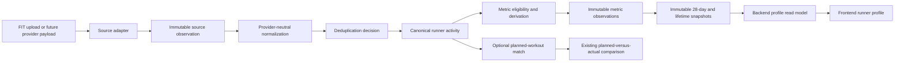

# Runner Activity Intelligence Foundation Architecture

## Work Item ID

2026-07-30-runner-activity-intelligence-foundation-architecture

## Status

ready

## Type

plan

## Priority

high

## Owner

backend

## Scope

import-export-provider-evidence

## Batch

runner-activity-intelligence-foundation

## Archive Intent

retain_in_place

## Next Recommended Role

backend

## Task

Implement the bounded runner-activity foundation through the current manual Garmin FIT intake,
using the accepted activity-retention and correction policy.

## Stage

ARCHITECT plan and Product lifecycle decisions are complete. Backend implementation and Global QA
Acceptance are not started. The current scope is manual Garmin FIT/ZIP intake only; provider sync
and multi-source reconciliation remain future gates.

## Exact Handoff Prompt

```text
ROLE: BACKEND

Task:
Implement Gate 1 of the runner-activity foundation through the existing manual Garmin FIT/ZIP
intake.

Stage:
BACKEND implementation with integrated QA.

Canonical plan:
/Users/ivan/Library/Mobile Documents/com~apple~CloudDocs/4-web/hito-running/docs/tasks/backlog/2026-07-30-runner-activity-intelligence-foundation-architecture.md

Accepted Product decisions:
1. The only current input is a runner-uploaded Garmin FIT file or ZIP containing one FIT file. Do
   not implement provider OAuth, Garmin Sync, other devices, or cross-source reconciliation.
2. Normalized activity facts and provenance are retained indefinitely unless the runner explicitly
   deletes the activity from history. They are eligible to contribute to the runner profile under
   the accepted metric contracts.
3. Raw FIT/ZIP evidence is private and retained indefinitely by default so future normalizers and
   features can reprocess it. `Remove original file` deletes only that raw source asset; normalized
   activity facts remain and the UI must state that reprocessing from the original will no longer be
   possible.
4. `Delete activity from history` removes the canonical activity, its normalized observations,
   comparisons, and profile contribution. A separate self-reported completion remains a manual log,
   not measured evidence. This manual-only scope needs no tombstone or multi-source deduplication
   machinery.
5. Existing workout-scoped FIT evidence may be backfilled automatically, idempotently, with source
   provenance and normalizer/formula versions. Do not fabricate fields unavailable in the source.
6. A future provider disconnect preserves imported history until the runner deletes it. If a future
   sync and a prior manual FIT refer to one run, Hito must ask before replacing or merging sources;
   it must never overwrite automatically. That interaction is out of this gate.

Required outcome:
Establish one authenticated runner-owned activity/source/revision boundary from the current Garmin
FIT/ZIP intake. Preserve current feedback/comparison behavior and do not introduce provider sync,
cross-source deduplication, activity/profile UI, or new coaching formulas.

Definition of Done:
The activity foundation implements these accepted lifecycle rules without a competing activity
truth, and integrated QA proves privacy, idempotency, readback, deletion semantics, and safe
backfill on local data.
```

## Architecture Status

This plan is linked to the accepted
[Hito Runner Profile Constitution](../running-coach/2026-07-30-hito-runner-profile-constitution.md).
The constitution owns metric meaning, eligibility, confidence, and formula amendments. This plan
owns the provider-neutral system boundaries needed to implement that meaning.

This is future architecture, not current product behavior:

- implementation: **not started**;
- migrations and backfill: **not started**;
- provider connections: **not started**;
- runner-facing activity/profile UI: **not started**;
- Global QA Acceptance: **not started**.

The existing
[Provider Activity Ingestion And Comparison Contract](../product-briefs/2026-06-09-provider-activity-ingestion-and-comparison-contract.md)
remains the intake and planned-versus-actual reference. The older
[Strava Activity Ingestion And Sync Plan](2026-06-09-strava-activity-ingestion-and-sync-plan.md)
is subordinate to this provider-neutral foundation and must not launch a provider-specific activity
store or metric path.

## Accepted Product Lifecycle Decisions (2026-07-30)

These decisions resolve Gate 0. They are deliberately narrow: Hito currently accepts only manual
Garmin FIT files and ZIP archives containing exactly one FIT file. Garmin Sync, Suunto, Apple,
Strava, and other provider connections are future work and must not add scope to Gate 1.

1. **Keep normalized activity truth.** Normalized activity facts, provenance, and eligible profile
   contributions remain until the runner explicitly deletes the activity from history.
2. **Keep raw FIT privately by default.** Retain raw FIT/ZIP evidence indefinitely in private
   storage. This preserves the ability to reprocess the source when Hito later supports new
   activity fields or improves its normalization. Raw route coordinates remain private and are not
   copied into profile or comparison read models.
3. **Separate file removal from activity deletion.** `Remove original file` deletes the raw source
   asset only and leaves normalized activity facts intact. `Delete activity from history` removes
   the activity, its normalized observations, comparisons, and profile contribution. A manual
   completion remains a separate self-reported log and never becomes measured evidence.
4. **Backfill existing FIT automatically.** Existing workout-scoped FIT evidence may be migrated
   idempotently into the canonical activity boundary with original provenance and normalizer/formula
   versions. Missing source fields remain missing.
5. **Defer synchronization conflicts.** A future provider disconnect preserves imported history
   until the runner deletes it. If a future sync and a prior manual FIT appear to represent one run,
   Hito asks the runner before replacing or merging source evidence; no automatic overwrite or
   cross-source reconciliation is part of the current manual-upload scope.

## Root Cause And Architecture Decision

### Visible need

Hito can attach one Garmin FIT/ZIP result to a saved workout and show actual metrics, deterministic
comparison, and bounded feedback. It cannot yet build a trustworthy longitudinal runner profile or
count one run once when multiple providers report it.

### Demonstrated underlying cause

Current result truth is workout-scoped:

- `workout_result_assets.planned_workout_id` is required;
- `workout_actual_metrics.planned_workout_id` is required;
- removal is owned by the workout feedback lifecycle;
- comparison and AI insight are projections of one planned workout.

That contour is correct for plan-versus-run feedback, but it cannot own unplanned activities,
multiple source references, reversible deduplication, provider updates, lifetime records, or
immutable profile snapshots.

### First incorrect owner to avoid

Do not enlarge `src/lib/workout-result-import/*` into the longitudinal profile owner. It remains the
current FIT upload and workout-feedback adapter. A new provider-neutral Backend domain must own
canonical activity truth, while workout comparison consumes a matched canonical activity.

### Architecture decision

Hito will have one runner-owned activity truth independent of plans and providers:

`source evidence -> adapter observation -> normalization -> dedup decision -> canonical activity`

All metrics and snapshots consume only that canonical activity truth. A planned workout match is an
optional relation, not activity identity. Provider adapters translate source facts; they do not own
metrics, deduplication policy, profile meaning, or runner-visible conclusions.

## Current State Versus Target State

| Concern | Current state | Target state |
| --- | --- | --- |
| FIT upload | Local FIT/ZIP attached to one planned workout | FIT is one source adapter into canonical activity truth |
| Activity identity | Result asset and actual metrics are identified through a planned workout | Stable runner-owned canonical activity independent of plan assignment |
| Unplanned run | No canonical home | Valid activity with no planned-workout match |
| Multiple providers | No cross-source lifecycle | Multiple source observations support one activity |
| Deduplication | Latest metrics may supersede prior workout evidence | Explicit, reversible, versioned match decision |
| Streams | Parser reads records but persists summary/lap-oriented payload | Optional normalized sample set with source quality and privacy boundaries |
| Comparison | Reads workout-scoped actual metrics | Reads a canonical activity projection matched to a planned workout |
| Progress | Compact plan/log aggregates | Versioned metrics from canonical activities |
| Profile | Runner facts and accepted HR guidance | Runner facts remain separate from immutable activity-derived snapshots |
| Formula changes | No longitudinal metric lifecycle | New formula version produces attributable new results without silent rewrite |

## Canonical Data Flow



No downstream node reparses a raw provider payload. AI may explain a supplied snapshot but may not
calculate a competing metric or mutate activity truth.

## Canonical Logical Boundaries

These are architecture concepts, not approved table, endpoint, or TypeScript names.

| Boundary | Owns | Does not own |
| --- | --- | --- |
| Source observation | Provider/source identity, source revision, ingest time, raw-evidence pointer, source capabilities, fingerprint | Canonical activity identity or metric meaning |
| Normalized activity candidate | Provider-neutral observed fields and optional normalized samples | Deduplication result or runner-facing metric |
| Source link | Relationship between one source revision and one canonical activity | Replacement of source provenance |
| Canonical activity | Runner, sport, start/timezone, durations, distance, context, correction state, current supporting sources | Planned workout content or provider payload |
| Field provenance | Winning source and method for each normalized field | One activity-wide "best provider" |
| Deduplication decision | `matched`, `possible_duplicate`, or `separate`, evidence features, decision/algorithm version, runner override | Silent merge from date alone |
| Plan match | Optional canonical-activity to planned-workout relation, confidence, runner correction | Activity identity or plan mutation |
| Sample set | Ordered optional observations and quality flags | Required truth for summary-only activities |
| Metric observation | One named value, unit, window/segment, source activities, formula version, exclusions, confidence | Mutable runner profile field |
| Profile snapshot | Immutable set of compatible metric observations for one cutoff/window | Universal fitness score or live provider cache |
| Progress comparison | Compatible baseline/current snapshot comparison and explanation | Recalculation under mixed formula versions |

## Activity And Source Identity

### Canonical activity identity

A canonical activity belongs to the Hito runner, not to Garmin, Strava, a FIT file, or a planned
workout. Its minimum stable facts are:

- Hito activity ID and runner ID;
- sport and manual/recorded marker;
- started-at instant, local date, and historical timezone;
- elapsed duration and timer/active duration when available;
- distance when available;
- current quality/correction state;
- zero or more planned-workout matches;
- one or more supporting source links.

### Source identity

Each source observation preserves:

- source kind and provider name;
- provider activity ID when supplied;
- upload fingerprint for files;
- provider/source revision and observed update time;
- ingestion time;
- raw-evidence location or redacted envelope reference;
- available capabilities: summary, laps/splits, records/streams, device metadata;
- provider delete/supersession state.

Provider activity IDs are unique only inside one runner, provider, and connection context. A file
fingerprint identifies the exact uploaded evidence, not automatically the real-world run.

### Field-level provenance

Source priority is field-specific. A canonical activity may use a FIT HR stream, a provider session
timezone, and a runner correction for activity type. Every selected field retains:

- source observation and revision;
- observed, user-corrected, or derived method;
- quality/confidence;
- normalization version.

A lower-ranked source cannot silently replace richer evidence. Source revisions trigger an explicit
canonical revision and downstream invalidation decision.

## Optional Streams And Samples

The sample boundary is sparse and capability-based. A provider adapter may supply none, some, or all
of:

- timestamp or elapsed offset;
- cumulative distance;
- speed or pace evidence;
- heart rate;
- moving/pause state;
- elevation/grade;
- cadence or power with measured/estimated provenance;
- lap, workout-step, or repeat references;
- temperature and sensor-quality evidence.

Rules:

1. Missing samples remain missing.
2. Summary-only activities remain valid for participation, volume, and eligible manual records.
3. Exact latitude/longitude is excluded from the normalized profile contract in v1.
4. Raw FIT evidence may contain route coordinates; its private indefinite retention is governed by
   the accepted Gate 0 Product decision.
5. Do not manufacture a uniform sample cadence. Preserve timestamps, gaps, and downsampling state.
6. Store normalized samples only when a visible metric or comparison purpose requires them.
7. Record-stream and summary-derived values remain distinguishable.

## Provider Adapter Contract

Adapters perform only source-specific acquisition and translation. They return capability-declared
observations into the same normalization boundary.

| Source | V1 mapping | Must not be assumed |
| --- | --- | --- |
| Local FIT/ZIP | Existing private raw asset, session summary, laps, available records, device metadata, upload fingerprint | Every FIT has HR, GPS, laps, workout steps, timezone, or trustworthy distance |
| Future Garmin connection | Provider IDs/revisions and only fields actually supplied by approved endpoints/scopes | Garmin API equals FIT richness or exposes the same step semantics |
| Future Strava connection | Detailed activity, laps/splits, and streams when scopes and API availability permit | Garmin-style workout-step identity, private activities without consent, complete HR/GPS |
| Future providers | Capability-declared adapter into the same observation contract | Provider-specific fields are canonical simply because they exist |
| Manual result | User-entered summary or confirmed official result with visible provenance | Device-observed stream truth |

Provider API endpoint, OAuth, webhook, token, pagination, rate-limit, and commercial-access design is
deferred to each provider integration. No provider integration may bypass canonical normalization
or deduplication.

## Deduplication And Correction

### Candidate generation

Potential duplicates may be proposed only inside one runner boundary using available evidence:

- provider-native linkage or prior source link;
- exact file fingerprint;
- start-time proximity with timezone awareness;
- elapsed duration similarity;
- distance similarity;
- sport compatibility;
- source revision lineage.

### Decision states

- `matched`: evidence is sufficient to attach the source to one canonical activity.
- `possible_duplicate`: uncertainty is visible; neither candidate contributes twice to aggregate
  truth until runner/backend resolution policy is applied.
- `separate`: evidence supports distinct activities.

The implementation must not silently merge two activities because they share a date, and must not
silently count uncertain copies twice.

### Reversibility

Every automated match keeps its evidence features and algorithm version. A runner correction can:

- split a wrongly merged source into a separate canonical activity;
- join a confirmed duplicate;
- correct sport/type;
- assign or unassign a planned workout.

Corrections preserve source evidence and create a new canonical revision. Affected metrics and
snapshots are invalidated and recomputed under their original or explicitly selected formula
version; historical published snapshots remain attributable.

## Metric Contract Matrix

| Metric family | Minimum data | Comparability / exclusion | Confidence and unavailable state |
| --- | --- | --- | --- |
| Sessions, frequency, time, distance | Canonical completed running activity; local date/timezone; timer duration and/or distance | One canonical activity once; exclude deleted/invalid/wrong-sport truth | Available without HR; name missing distance/elevation rather than infer |
| Planned completion | Eligible planned workout plus corrected plan match and completion state | Distinguish completed/partial/skipped/cancelled/plan-changed; exclude Rest and workouts removed before due date | Unavailable for unmatched activities; never reinterpret activity quality |
| Elevation and longest run | Canonical distance/duration; elevation evidence for elevation totals | No elevation total without evidence; longest distance and duration shown separately | Field-specific source confidence |
| Personal best | Timestamped cumulative distance and elapsed timestamps, or user-confirmed official result | No moving-time shortcut, recording gaps, teleports, or implausible jumps; separate race/training/provider/manual | Summary-only provider best remains attributed; otherwise unavailable; implementation waits for versioned gap/interpolation policy |
| Aerobic efficiency | Eligible steady segment; distance; HR with sample durations | Apply constitution gates for intent, continuity, pauses, terrain, sensor, and structure | V1 remains stream-only until Running Coach resolves how a summary fallback can prove the required coverage/pause gates |
| Pace at comparable HR | Eligible samples, fixed reference HR series, at least 10 cumulative minutes inside +/-3 BPM | No extrapolation; terrain class and reference bucket fixed within series | Requires qualifying baseline/current windows and per-metric evidence level |
| HR at comparable pace | Repeated eligible aerobic running and fixed observed personal pace bucket | Pace comes from observations, not finish-time goal; context classes remain comparable | Unavailable until repeated matching pace evidence exists |
| Durability / decoupling | Eligible continuous main segment at least 40 minutes with HR and speed/distance | Exclude intervals, progression, races, deliberate fast finish, run/walk; separate terrain classes | Context-sensitive; one session cannot establish a trend |
| Controlled aerobic duration | Continuous eligible samples in the fixed reference-HR series | Stop at material pace collapse, gap, or quality failure | Unavailable until a stable reference series exists |
| Session load | Whole-session duration and runner RPE 0-10 | Same-runner descriptive arbitrary units only | Unavailable without RPE; duration basis and partial/stopped handling require a formula decision before implementation |
| Body/context trends | Runner-approved time series with source and measurement method | Never fold into a fitness/readiness score | Separate contextual series; missing remains missing |
| 28-day snapshots | Canonical activities, eligibility results, metric observations, cutoff/window, formula set | Reproducible source revisions; no carry-forward of stale aerobic value | Volume may be available while aerobic metrics are unavailable |

## Metric Availability, Confidence, And Versioning

### Availability

Each metric returns one of:

- available with value, unit, evidence, and confidence;
- unavailable with a stable reason class;
- invalidated pending recomputation after source/correction change.

Unavailable is product truth, not an error to repair. The Backend must not substitute provider
VO2max, estimated pace, planned targets, age-based HR guidance, or an older snapshot.

### Formula-policy decisions still required

Canonical activity persistence does not depend on these decisions, but the relevant metrics remain
unavailable until their owner resolves them:

- **Product / Running Coach:** define the qualifying period for streaks and the planned-completion
  denominator, including partial, stopped, cancelled, and plan-changed states.
- **Product / Architect:** decide when a manual workout log is also a canonical activity rather than
  only a planned-workout result.
- **Running Coach:** define time-weighted baseline median HR, stable-sample treatment, deterministic
  warm-up extraction, and classification of an unstructured run as steady aerobic.
- **Running Coach:** resolve the summary-only aerobic fallback against the mandatory 90% stream
  coverage and pause gates. Until then, v1 aerobic efficiency is stream-only.
- **Running Coach / Product:** define reference-pace bucket width and evidence minimum for
  HR-at-comparable-pace.
- **Running Coach:** define deterministic confidence downgrades and personal variability thresholds
  for `stable`, `mixed`, and `improving`.
- **Running Coach / Product:** define explicit re-baseline semantics, baseline/current window
  overlap, and the duration basis for session-RPE load.
- **Running Coach / Backend:** define versioned PB interpolation, recording-gap, and GPS plausibility
  thresholds.

### Confidence

Confidence belongs to each metric, never to the runner as one score. It carries:

- eligible observation count;
- source richness: stream, laps, summary, or manual;
- sensor/source consistency;
- terrain/environment comparability;
- gap/downsampling/quality flags;
- reference-series continuity;
- exclusion counts and reason classes.

The constitution's evidence levels remain canonical:

- insufficient: fewer than 3 eligible observations in either comparison snapshot;
- provisional: 3-5 in each;
- established: at least 6 in each.

### Formula versions

Formula definitions are code-owned, reviewable constants/contracts, not database-configured
behavior or an AI prompt. Every metric and snapshot records:

- constitution version;
- formula version;
- normalization/dedup version where relevant;
- calculation time and owner;
- source activity IDs and canonical revisions;
- eligibility and exclusion results;
- reference-series ID;
- confidence inputs.

A formula amendment never silently overwrites historical truth. It creates a new attributable
calculation series or snapshot and states whether backfill is approved. Frontend never recomputes a
metric.

## Immutable Snapshot Contract

A snapshot is an immutable read model for one runner and cutoff, not a mutable column on
`runner_profiles`.

Snapshot families:

- calendar-week participation;
- rolling 28-day current training;
- first qualifying or explicit 28-day baseline;
- latest qualifying 28-day current fitness;
- rolling 90-day direction;
- lifetime records.

Each snapshot pins:

- runner facts revision used only as context;
- window and timezone boundary;
- canonical activity IDs and revisions;
- metric formula versions;
- values, units, unavailable reasons, exclusions, and confidence;
- creation/recalculation cause.

Changes to runner facts, HR guidance, goals, planned workouts, or provider connections do not
rewrite old snapshots. A source correction may create a replacement snapshot while retaining the
prior attributable version for audit and historical readback.

## Storage And Ownership Boundaries

The implementation must choose schema details later, but storage responsibilities are fixed:

| Storage class | Canonical owner | Lifecycle |
| --- | --- | --- |
| Raw file/provider envelope | Source ingestion | Private, source-revision aware, retention-controlled |
| Source observation/link | Activity ingestion | Immutable revisions plus supersession/delete state |
| Canonical activity/revision | Activity domain | Runner-owned, corrected through explicit revision |
| Optional normalized samples | Activity domain | Immutable source-linked evidence, purpose-limited |
| Planned-workout match | Comparison domain | Reversible relation; no plan-content mutation |
| Metric observation | Profile computation | Immutable, formula-versioned, reproducible |
| Profile snapshot/comparison | Profile computation | Immutable read model with explicit replacement lineage |
| Runner facts/HR profile | Existing runner profile owner | Remains separate; never overwritten by activity metrics |

The current workout result tables remain accepted during migration. They cannot become a permanent
second normalized activity store. The Backend implementation must either project them from the new
canonical activity boundary or define a bounded migration/removal condition before dual-write.

## Ownership

| Role | Owns |
| --- | --- |
| Product | Visible purpose, consent, source connection/disconnection, deletion/retention, runner correction semantics |
| Architect | Canonical boundaries, source hierarchy, lifecycle, anti-duplication and migration constraints |
| Backend | Auth/RLS, adapters, normalization, deduplication, corrections, metrics, formula versions, snapshots, read models |
| Running Coach | Metric meaning, eligibility, comparability, confidence interpretation, non-medical language |
| Frontend Product | Render backend activity/profile truth, source/confidence/context, correction and unavailable states |
| QA | Cross-source fixtures, idempotency, dedup/split/join, formula boundaries, snapshots, export/readback, privacy |
| Future integration adapter | Provider auth/acquisition and translation into source observations only |
| AI | Explain supplied accepted truth; never calculate or persist a competing profile |

## Phased Delivery Plan

### Gate 0 - Product lifecycle decisions

**Owner:** Product
**Status:** complete on 2026-07-30

The accepted decisions are recorded in [Accepted Product Lifecycle Decisions](#accepted-product-lifecycle-decisions-2026-07-30). Gate 1 may proceed with manual Garmin FIT/ZIP intake only.

### Gate 1 - Canonical activity foundation through current local FIT

**Owner:** Backend
**Dependency:** Gate 0

Implement one authenticated runner-owned activity/source/revision boundary using the existing local
FIT/ZIP path as the only input adapter. The accepted outcome must:

- preserve current workout feedback and comparison behavior;
- support an activity with or without a planned-workout match;
- make repeated upload idempotent by exact source identity;
- keep source evidence and canonical activity distinct;
- expose deterministic correction and invalidation semantics;
- avoid provider sync and longitudinal metric UI.

Migration and backfill must be additive, reversible, RLS-protected, and bounded by accepted Gate 0
policy. Temporary dual-write requires an explicit removal gate.

### Gate 2 - Trustworthy 28-day running facts

**Owner:** Backend with Running Coach review
**Dependency:** Gate 1

Deliver the first useful profile computation from summary-level truth without claiming fitness:

- sessions, frequency, running time, distance, elevation where evidenced;
- longest run distance and duration;
- immutable weekly and 28-day running-fact snapshots;
- source coverage, excluded activities, and explicit missing-field reasons;
- metric-specific unavailable reasons and confidence.

Do not implement streaks, planned completion, personal bests, session-RPE load, pace-at-HR,
HR-at-pace, durability, or an overall fitness score in this gate.

### Gate 3 - Runner activity/profile readback

**Owner:** Frontend Product
**Dependency:** Gate 2

Render backend-owned activity history and compact profile truth with provenance, confidence,
excluded/unavailable states, and source/correction affordances. Do not compute metrics, infer
duplicates, or introduce provider-specific profile UI.

### Gate 4 - Records and runner-reported load

**Owner:** Backend with Running Coach review
**Dependency:** Gate 2 and the relevant formula-policy decisions

Add personal best efforts and session-RPE load only after elapsed-segment/gap/GPS rules,
user-confirmed official-result provenance, duration basis, partial/stopped handling, and snapshot
coverage are versioned. Planned completion and streaks remain separate until their Product meaning
is accepted.

### Gate 5 - Stream-dependent aerobic metrics

**Owner:** Backend with Running Coach review
**Dependency:** stable Gate 1 sample evidence and Gate 2 snapshots

Add comparable-aerobic eligibility, aerobic efficiency, pace-at-HR, HR-at-pace, durability, and
controlled aerobic duration exactly under constitution formula versions. No metric ships until its
minimum evidence, exclusion, context, and reproducibility fixtures pass.

### Gate 6 - First connected provider

**Owner:** Backend / future Integration Manager
**Dependency:** Gates 0-4 as required by provider purpose

Select one provider only after commercial/API access, OAuth scopes, token security, rate limits,
webhook/update/delete behavior, retention, and source capabilities are source-proved. The adapter
must feed the Gate 1 activity boundary and prove cross-source deduplication against FIT.

The old Strava-specific backlog item cannot execute independently of this gate.

### Gate 7 - Global QA Acceptance

**Owner:** QA
**Dependency:** all release-selected gates

Run the cross-source, privacy, persistence, formula parity, historical readback, responsive UI, and
cleanup matrix for the selected release boundary. Owner-level Implementation DoD does not imply
Global QA Acceptance.

## Migration, Backfill, And Operational Risks

| Risk | Required control |
| --- | --- |
| Existing FIT truth is workout-scoped | Backfill source links without losing comparison/readback; preserve old IDs during transition |
| Cascading planned-workout deletion | Canonical activity must not disappear merely because plan rows change, except under explicit source-removal policy |
| Dual normalized stores | Time-box dual-write and name the deletion/projection gate before implementation |
| Duplicate historical uploads | Fingerprint and source-revision proof before aggregate backfill |
| Source update/delete | Explicit supersession and metric invalidation, never in-place factual rewrite |
| Formula amendments | Versioned recalculation and historical snapshot attribution |
| Sample volume | Purpose-limited fields, bounded batching, indexes/partition review from measured volume, no premature universal stream warehouse |
| Route privacy | No normalized coordinate persistence in v1; private raw retention follows Product policy |
| RLS/service role | Own-row read policy and server-owned mutations; service role is not actor authorization |
| Backfill cost | Resumable/idempotent batches with progress and failure receipts; no request-bound full-history recomputation |
| Snapshot freshness | Event-driven invalidation plus bounded recomputation; never silently serve stale value as current |
| Export/deletion | Export provenance and snapshot meaning; deletion follows accepted source/activity policy |

## Deletion And Anti-Duplication Rules

1. There is one canonical normalized activity owner. FIT, Garmin, Strava, and future adapters do not
   persist provider-specific metric truth.
2. `workout_actual_metrics` cannot remain a permanent competing activity truth after migration.
3. Planned-versus-actual comparison remains separate from athlete progress and consumes a matched
   canonical activity.
4. `runner_profiles` does not absorb activity arrays, mutable fitness values, or snapshot blobs.
5. Frontend does not calculate metrics, confidence, deduplication, or source precedence.
6. AI does not calculate, repair, or persist profile metrics.
7. Formula versions are code contracts, not a configurable formula registry or generic workflow
   engine.
8. Do not create a provider plugin platform. Each adapter implements the same narrow observation
   boundary.
9. Do not duplicate raw streams in source, normalized, comparison, and snapshot payloads.
10. Retire or redirect the old Strava-specific plan when the provider-neutral Gate 6 supersedes its
    execution handoff; preserve it only as historical intake until then.
11. In the current manual-only scope, raw-file removal never deletes normalized activity truth;
    activity deletion is the only operation that removes its profile contribution.

## Validation Strategy

### Gate 1 Backend inventory

- exact FIT re-upload is idempotent;
- same run with one and then two sources contributes once;
- unplanned activity persists without creating a plan/workout;
- optional planned-workout match supports current comparison;
- source update/delete/supersession follows Gate 0 policy;
- wrong merge can split and wrong assignment can unassign;
- RLS denies cross-runner reads/writes;
- source correction invalidates only dependent metrics/snapshots;
- existing Garmin feedback upload/remove/readback remains exact;
- migration reset and backfill are reproducible.

### Metric fixtures

Use the constitution's fixture matrix plus:

- summary-only activity;
- missing HR;
- missing distance;
- HR dropout;
- GPS teleport/gap;
- auto-lap pollution;
- treadmill versus flat road;
- Run/Walk beginner;
- race versus training best;
- manual official result;
- formula amendment with old/new snapshot readback.

Every metric fixture must assert value or unavailable reason, source activities, exclusions,
confidence inputs, and formula version.

### Release evidence

Each implementation owner reports:

`Check | Scenario / environment | Result | Evidence`

Implementation DoD requires affected migrations, RLS/persistence, deterministic fixtures,
readback/export where changed, lint/build-integrity, scoped diff hygiene, and independent QA review.
Global QA remains `Not started` until Gate 7 is explicitly assigned.

## Explicit Non-Goals

- no universal Hito fitness/readiness score;
- no injury, illness, recovery, cardiovascular, or medical prediction;
- no race prediction from this foundation;
- no silent active-plan mutation from activity metrics;
- no provider connection, OAuth, webhook, token, or endpoint design in this plan;
- no raw-route product surface or exact-coordinate analytics;
- no assumption that Garmin, FIT, and Strava expose equivalent fields;
- no device VO2max promoted to Hito truth;
- no planned HR target inferred from observed activity HR;
- no historical target or confirmed-plan rewrite;
- no frontend metric calculation;
- no public API or generic provider/plugin platform;
- no change to generated-plan review/confirm, runner HR provenance, manual authoring, import/export,
  or current workout feedback behavior.

## Stop Conditions

Stop and return to Product if implementation would:

- guess source deletion, provider disconnect, route retention, or backfill consent;
- expose precise route data beyond the accepted private evidence purpose;
- make provider identity the runner or activity identity;
- create a second activity/profile metric path;
- rewrite accepted historical snapshots or confirmed workout targets;
- silently merge uncertain duplicates;
- require live provider access, paid calls, or hosted mutation outside an approved gate;
- mix provider integration, profile metrics, and runner UI into one unvalidated owner slice.
