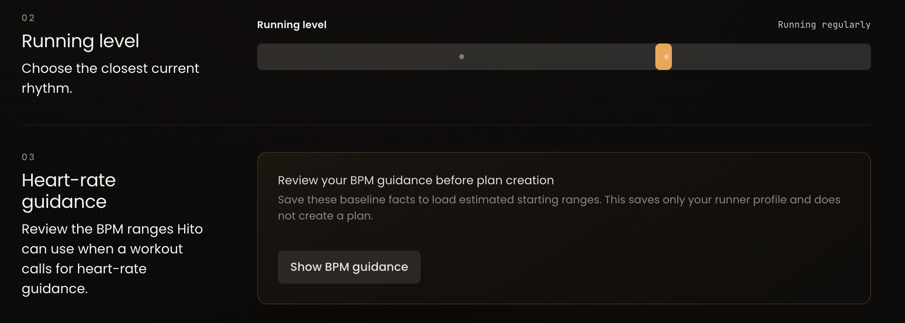

# Hito DS Slider Marker Lane And Smooth Motion

## Work Item ID

2026-08-11-hito-ds-slider-marker-lane-and-smooth-motion

## Status

completed

## Type

design-system-contract

## Priority

high

## Owner

design_system

## Scope

shared HitoSlider/HitoDualRange presentation, canonical slider CSS, and `/hitoDS` slider specimens

## Archive Intent

retain_in_place

## Stage

DESIGN SYSTEM shared slider stacking, motion, and cursor-affordance contract complete. Product
consumer adoption remains a subsequent Frontend Product follow-up.

## Task

Correct the shared slider contract so discrete scale markers can appear visibly below the rail/handle
lane, and visible slider value movement is smooth across the existing control-size scale. The
existing native input remains the semantic control. This is not permission to replace Hito sliders,
add a second slider system, or change product data behavior.

## User Report

On authenticated `/` at dark `1470×801`, the Running level slider’s two internal dots are inside the
rail and visually weak. Ivan requires them below the slider so they are plainly visible. He also
requires slider value movement to appear smooth, with existing Hito motion/easing and appropriate
reduced-motion behavior.



## Evidence And Root Cause

- The captured input has canonical DS class `hito-slider-input`; the shared owner is
  `src/components/ui/hito-slider.tsx` plus `src/styles/controls-lists.css`.
- Current thumb CSS transitions only background, box-shadow, and active scale. Its native position
  still changes discretely with controlled values.
- The two Running level tick dots are currently route-local `::before`/`::after` utilities in
  `src/components/onboarding/QuickSetupPlanSetupSections.tsx`. They are not semantic controls and
  sit at rail center. Their product use must be migrated by FRONTEND only after the shared primitive
  exposes an accepted marker lane.
- Existing previous-value markers are actionable restore buttons. They are a separate behavior and
  must retain their controlled restoration, focus, and accessible names.

## Expected Behavior

1. The shared primitive can render an explicitly requested set of passive discrete tick markers in
   a visible marker lane below its rail. They are not pointer targets or focus stops.
2. The current-value handle, any selection geometry, and the visual marker/rail positions transition
   with the existing Hito motion contract when controlled values change. Native range semantics,
   pointer/keyboard behavior, accessibility, and exact values remain immediate and truthful.
3. `prefers-reduced-motion` removes nonessential visual interpolation.
4. All existing xs/sm/md/lg sizes, alpha rail/selection treatment, focus-visible, disabled/invalid,
   and previous-value restore behavior remain intact.
5. `/hitoDS` exposes the shared marker-lane and motion state without a new playground, primitive,
   token family, or route.

## Reuse-First Boundary

Reuse `HitoSlider`, `HitoDualRange`, existing control-size/radius and motion tokens, the canonical
CSS owner, current controlled callbacks, prior-value marker behavior, and the existing Slider
playground/validator. Expected new production runtime artifacts: **none**. A minimal optional prop
on the existing primitive is acceptable only if it replaces the route-local marker hack and makes no
new framework or generic registry necessary.

Do not edit Product consumers, Backend, persistence, heart-rate policy, Figma, new tokens, shared
Button/Input contracts, dependencies, lockfile, hosted systems, or unrelated dirty work. The product
consumer migration is a follow-up Frontend responsibility.

## Validation Expectations

| Check                    | Scenario / environment                                           | Required evidence                                                                  |
| ------------------------ | ---------------------------------------------------------------- | ---------------------------------------------------------------------------------- |
| Source ownership         | Primitive, CSS, current marker hack, and direct consumer map     | One shared marker/motion owner; no second slider or compatibility path             |
| DS contract              | Existing slider/DS validator                                     | Size/radius, alpha, restore, and canonical APIs remain valid                       |
| Motion and accessibility | `/hitoDS` single and dual, pointer/keyboard/focus/reduced-motion | Exact controlled values remain truthful while visual motion is smooth when enabled |
| Presentation             | Desktop and exact 375px, light/dark                              | Marker lane is visible and contained; no page overflow                             |
| Static/build             | Focused formatting/lint/diff and build when uncontended          | No new diagnostics in task-owned seams                                             |

## Next Recommended Role

frontend (Product lane, routed by Product)

## Executed Handoff Prompt

```text
ROLE: DESIGN SYSTEM

Mode: Tracked
Stage: Shared slider marker-lane and smooth-motion correction

Read AGENTS.md, agents/design-system.agent.md, skills/hito-frontend-design-system/SKILL.md,
skills/hito-qa-browser-regression/SKILL.md, and this canonical item before any write:
docs/tasks/backlog/2026-08-11-hito-ds-slider-marker-lane-and-smooth-motion.md

Task: Correct the canonical HitoSlider/HitoDualRange presentation so requested passive discrete
markers render below the rail in a visible marker lane and controlled visual value movement is smooth
at every existing control size. Preserve native range semantics, existing values, keyboard/pointer
behavior, accessible names/focus, reduced motion, alpha rail/selection treatment, and actionable
previous-value restore markers.

Source facts: HitoSlider and controls-lists.css own the shared primitive. Current CSS transitions
thumb styling but not controlled position. The two Running level dots are a route-local Frontend
pseudo-element hack; do not edit that consumer. Give Frontend a minimal accepted shared primitive
contract it can adopt afterward, rather than retaining a second marker recipe.

Reuse existing primitives, CSS, motion and size/radius tokens, slider playground, validator, and
controlled callbacks. New runtime artifacts: none. Do not add a new slider, playground, registry,
token family, route, dependency, compatibility layer, Product behavior, Backend/persistence change,
or Figma work. Preserve concurrent dirty source byte-for-byte.

Prove the shared contract with focused DS/static/browser evidence at desktop and exact 375px in light
and dark, including pointer/keyboard/focus, restore markers, reduced-motion behavior, and no
overflow/console errors. Use a bounded read-only QA reviewer only if it materially improves the
interaction proof. Do not claim Global QA or release readiness.

Append an English receipt with exact before/after source/responsibility, validation table, retained
restore-marker rationale, and FRONTEND Product as next owner for the Running level consumer adoption.
In-progress commentary may be Russian; final formal report is English.
```

## Product Clarification — 2026-08-11

The phrase “under the handles” is about **stacking**, not a separate vertical marker lane.

- A marker dot remains visible when its position is distinct from a current handle.
- If a dot and orange handle occupy the same position, the dot must be fully occluded by the handle.
  It must never show through or on top of that handle; the captured pale dot inside the orange
  handle is the defect.
- Preserve the existing accessible previous-value restore behavior. Solve its visual stacking and
  hit-target relationship truthfully; do not replace it with a new slider or a non-interactive
  duplicate.
- Smooth visual motion remains required with the existing Hito easing and reduced-motion behavior.
  Exact native value, pointer, and keyboard semantics stay immediate and truthful.

This clarification supersedes the earlier wording that required a visible marker lane “below the
rail.”

## Product Correction — Shared Cursor-Affordance Parity — 2026-08-11

### Demonstrated Cause

The completed stacking/motion implementation does not yet provide coherent pointer affordance:

- `src/styles/controls-lists.css:1318` gives `.hito-slider-input` `cursor: pointer`.
- `src/styles/controls-lists.css:1563-1594` gives HitoDualRange native thumbs `cursor: grab` and
  `cursor: grabbing`.
- The audit at `/Users/ivan/.codex/attachments/238e3d65-9faf-48f0-9b84-a3efa7c866fb/pasted-text.txt`
  confirmed that the single and dual visual handle motion is already identical; only cursor
  affordance diverges at the shared native input contract.

### Task

Extend the existing HitoSlider/HitoDualRange contract so single and dual sliders expose one
intentional grab/grabbing pointer affordance at their actual native hit-testing surfaces. Decide
the rail-versus-handle rule deliberately inside the current semantic-input model; do not create a
second interaction layer or alter native pointer/keyboard value truth.

Reuse only `HitoSlider`, `HitoDualRange`, `controls-lists.css`, the existing Slider playground,
and the existing DS validator. New runtime artifacts, tokens, primitives, wrappers, event models,
dependencies, and Product CSS: none.

Do not edit `QuickSetupPlanSetupSections.tsx` or `HeartRateProfileSection.tsx`. The Product
consumer will adopt the already accepted `markers` prop only after this shared correction closes.

### Validation

Prove cursor hover and active/drag affordance on the current single and dual `/hitoDS` specimens,
along with unchanged stacking, focus-visible, disabled/invalid state, restore targets, immediate
native values, visual motion, and reduced-motion contract. Add only the smallest existing-validator
assertion needed to prevent this cursor divergence returning. This is focused DS implementation;
Global QA and release readiness are out of scope.

### Design System Cursor Correction Preflight — 2026-08-11

- **Exact cursor contract:** the rail/click region uses `pointer`; a draggable native handle uses
  `grab`; an active handle or active rail drag uses `grabbing`; disabled rail and handle surfaces use
  `not-allowed`.
- **Demonstrated cause and first incorrect owner:** `.hito-slider-input` currently owns a single-only
  `pointer` declaration while only the dual native thumb pseudo-elements own `grab/grabbing`. The
  canonical slider selectors in `src/styles/controls-lists.css` are the first incorrect owner.
- **Reused seam and smallest change:** preserve the single native input as its rail/thumb hit surface,
  the dual rail pointer handler, and both native thumb hit surfaces; replace the divergent cursor
  declarations with shared single/dual selector groups and add the smallest existing-validator
  assertion that locks the rail-versus-handle rule.
- **New runtime artifacts:** none. No component, prop, event model, token, wrapper, dependency,
  Product CSS, fixture, or compatibility path is proposed.
- **Removed/simplified responsibility:** the single-only `pointer` rule and dual-only
  `grab/grabbing` rules stop defining separate affordance contracts. No accepted stacking, motion,
  restore, accessibility, focus, disabled/invalid, or reduced-motion responsibility is replaced.
- **Focused proof:** rendered `/hitoDS` computed cursor at the single and dual rail/handle surfaces,
  actual single and dual drag/value updates, disabled cursor coverage, focused DS validator,
  formatting/lint, and diff hygiene. Live active-state cursor evidence is claimed only if the
  non-prompting browser path can observe the held pointer state directly.

### Exact Handoff Prompt

```text
ROLE: DESIGN SYSTEM

Mode: Tracked correction
Stage: Shared single/dual slider cursor-affordance parity

Read `AGENTS.md`, `agents/design-system.agent.md`,
`skills/hito-frontend-design-system/SKILL.md`,
`skills/hito-qa-browser-regression/SKILL.md`, and this item before any write:
`/Users/ivan/Developer/hito-running/docs/tasks/backlog/2026-08-11-hito-ds-slider-marker-lane-and-smooth-motion.md`

The completed stacking/motion contract is accepted. Correct only the demonstrated remaining shared
divergence: `HitoSlider` has `cursor:pointer` on its native input, while `HitoDualRange` native
thumbs use `grab/grabbing`. Make their pointer affordance one intentional shared contract at the
real native hit-testing surfaces, including a deliberate rail-versus-handle decision.

Reuse only the existing HitoSlider, HitoDualRange, canonical slider CSS, Slider playground, and
DS validator. Add no primitive, component, token, wrapper, event model, dependency, Product CSS,
or compatibility layer. Do not edit any Product consumer, including Running level and BPM guidance.
Preserve immediate native pointer/keyboard values, accessibility, focus, disabled/invalid states,
previous-value restore, accepted stacking/motion, and reduced-motion behaviour.

Prove the pointer cursor at rest and while active/dragging for single and dual specimens in
`/hitoDS`, then run focused DS/static checks and the smallest relevant existing validator coverage.
Do not claim Global QA or release readiness. Do not stage, commit, push, deploy, access hosted
state, call providers, or alter unrelated dirty work.

Use Russian for in-progress commentary. Final formal receipt must be English, include the exact
cursor contract, files changed, proof, and FRONTEND Product as the next owner for marker adoption.
```

## Design System Execution Preflight — 2026-08-11

- **Outcome:** place passive scale markers, actionable previous-value visuals, selection geometry,
  and solid current handles in one canonical visual-position layer where a handle fully occludes a
  coincident dot, while native input values remain immediate.
- **Demonstrated cause and first incorrect owner:** browser thumbs currently own solid handle
  presentation without a positional transition, while previous markers and the recorded route-local
  dots sit in higher sibling stacking layers. The shared primitives and canonical slider CSS are the
  first owner; the Product consumer remains a later Frontend migration.
- **Reused seam:** `HitoSlider`, `HitoDualRange`, their native inputs and controlled callbacks,
  xs/sm/md/lg geometry, existing motion/easing and reduced-motion tokens, restore buttons,
  `SliderPlayground`, and the existing DS validator.
- **Smallest change and new runtime artifacts:** add one optional passive `markers` value list to
  each existing primitive and one visual-position layer per primitive. New files, primitives,
  routes, dependencies, tokens, frameworks, and persistence artifacts: **none**.
- **Removed/simplified responsibility:** solid handle drawing moves from the browser thumb to the
  shared visual layer so handle, selection, and marker position use one stacking/motion owner. The
  native thumb remains the hit-testing and semantic control. The route-local onboarding recipe is
  retained only because its migration is explicitly outside Design System ownership.
- **Focused proof:** shared validator and static/build checks; `/hitoDS` single/dual marker stacking,
  restore, pointer/keyboard/focus and reduced-motion evidence; desktop and exact 375px in light/dark;
  overflow and console health. Stop rather than add a second interaction model if native pointer
  semantics cannot be preserved.

## Design System Implementation Receipt — 2026-08-11

### Task, mode, and outcome

- **Mode / stage:** Tracked / Design System implementation complete.
- **Product outcome:** `HitoSlider` and `HitoDualRange` now accept one optional passive `markers`
  list and render rail/selection, passive markers, actionable previous-value visuals, and solid
  current handles through one shared visual-position contract. A marker remains visible at a
  distinct value; a coincident marker shares the handle center but is fully occluded by the solid
  handle.
- **Exact value contract:** native range inputs remain the semantic and hit-testing controls. Their
  controlled values update immediately; only the non-semantic visual layer interpolates with the
  existing Hito easing and becomes immediate under `prefers-reduced-motion`.
- **New runtime artifacts:** none. No primitive, route, token family, dependency, registry,
  persistence shape, or compatibility layer was added.

### Before / after source responsibility

- **Before:** browser range thumbs drew solid handles without positional easing; previous markers
  and route-local dots occupied separate higher visual layers, allowing a pale dot to remain visible
  through a coincident handle.
- **After:** transparent native thumbs retain semantics and pointer/keyboard ownership, while the
  existing shared primitives own one visual track. Passive and previous-value dots are `z-index: 1`;
  solid current handles are `z-index: 2/3`; the dual selection is `z-index: 0`. Restore buttons
  remain separate accessible 24px targets above the semantic input and call the existing controlled
  callbacks.
- **Simplified responsibility:** solid-handle drawing moved out of duplicated browser-thumb chrome;
  single and dual marker visuals reuse one CSS declaration group and the existing control-size,
  radius, color, motion, and reduced-motion tokens.
- **Retained boundary:** the onboarding Running level pseudo-markers remain unchanged because Product
  consumer adoption is explicitly Frontend Product ownership. No local product workaround was
  introduced.

### Files changed

- `src/components/ui/hito-slider.tsx`
- `src/components/ui/hito-dual-range.tsx`
- `src/styles/controls-lists.css`
- `src/components/hito-ds/slider-playground.tsx`
- `scripts/validate-hito-ds-component-contracts.ts`
- `docs/tasks/backlog/2026-08-11-hito-ds-slider-marker-lane-and-smooth-motion.md`

The material CSS change replaces the native-thumb presentation for both primitive kinds and carries
the same stacking, focus, active, Firefox/WebKit, and reduced-motion contract. It does not create a
parallel recipe. A pre-existing unrelated Slider playground description hunk was preserved in place.

### Validation inventory

| Check                        | Scenario / environment                                                                                                                                                            | Result                         | Evidence                                                                                                                                                                                                                           |
| ---------------------------- | --------------------------------------------------------------------------------------------------------------------------------------------------------------------------------- | ------------------------------ | ---------------------------------------------------------------------------------------------------------------------------------------------------------------------------------------------------------------------------------- |
| Root-cause artifact          | Supplied dark `1470×801` onboarding capture plus current shared and route-local source                                                                                            | Passed                         | Capture shows the pale dot inside the orange handle; source mapped the solid thumb and higher marker layers to their exact owners.                                                                                                 |
| Source / consumer map        | Exact searches for both primitives, previous-value API, and route-local marker recipe                                                                                             | Passed                         | One shared optional `markers` API was added to the existing primitives; no second slider or product consumer change.                                                                                                               |
| Shared DS validator          | `npm run validate-hito-ds-components`                                                                                                                                             | Passed                         | `Hito DS component validator: contract ok`; 320 scanned files, two slider kinds, four shared sizes.                                                                                                                                |
| Focused lint                 | `npx eslint src/components/ui/hito-slider.tsx src/components/ui/hito-dual-range.tsx src/components/hito-ds/slider-playground.tsx scripts/validate-hito-ds-component-contracts.ts` | Passed                         | No diagnostics.                                                                                                                                                                                                                    |
| Formatting / diff hygiene    | Focused Prettier plus `git diff --check`                                                                                                                                          | Passed                         | Task-owned files format cleanly; no whitespace errors.                                                                                                                                                                             |
| Production build             | `npm run qa:server:start` with the canonical managed loopback runtime                                                                                                             | Passed                         | Client, SSR, Nitro, and post-build integrity completed; only existing dependency/chunk warnings. Before teardown, final runtime status was healthy and build freshness was `fresh` / `receipt_matches`.                            |
| Desktop stacking / themes    | `/hitoDS/components#slider`, 1280px, light and dark                                                                                                                               | Passed                         | Single handle and coincident marker shared center `597.53125px`; handle `z=2`, marker `z=1`, with solid signal handle and alpha neutral marker in both themes. Dual endpoints used the same lower-marker / higher-handle contract. |
| Exact mobile presentation    | `/hitoDS/components#slider`, exact 375×812, light and dark                                                                                                                        | Passed                         | `clientWidth=scrollWidth=375`; coincident single center `201.328125px`, handle `z=2`, marker `z=1`; both single and dual controls remained contained and visually readable.                                                        |
| Controlled motion            | `/hitoDS` single slider, enabled motion                                                                                                                                           | Passed                         | Controlled value reached `Effort 10 out of 10` immediately while handle geometry continued from `x=769.515625` through `x=775.796875` to `x=775.8046875`; CSS uses the existing 140ms ease-out token.                              |
| Restore pointer path         | `/hitoDS` single and dual                                                                                                                                                         | Passed                         | Single restored 10→4 through `Restore baseline 4 out of 10`; dual lower restored `[4,7]→[3,7]` and upper restored `[4,7]→[4,8]`, proving independent endpoint callbacks.                                                           |
| Accessible restore semantics | Rendered DOM plus shared source/static contract                                                                                                                                   | Passed with live-key gap       | Restore controls remain native `type="button"` elements with exact accessible names and focus-visible outlines; native range inputs and existing dual key handler remain unchanged.                                                |
| Reduced motion               | Shared CSS/static contract                                                                                                                                                        | Passed with live-emulation gap | The media query removes handle, marker, restore-target, and selection transitions and suppresses active scaling. The selected browser exposed viewport but no reduced-motion emulation capability.                                 |
| Browser health               | Desktop/mobile, light/dark                                                                                                                                                        | Passed                         | No console errors or warnings; no horizontal overflow.                                                                                                                                                                             |
| Diff ownership               | Dirty-tree review and `git diff --check`                                                                                                                                          | Passed                         | Only the six listed task seams were changed by this slice; all unrelated dirty work was preserved without staging or publishing.                                                                                                   |

### Coverage gaps and consequence

- The selected non-prompting browser path focused the native controls but did not deliver synthetic
  range or button keypresses. Live keyboard activation is therefore not claimed. Source inspection,
  native element semantics, unchanged key handlers, focus CSS, validator, and build cover the
  preserved contract, but a later Global QA browser with working physical key injection should own
  the live keyboard acceptance.
- The browser exposed no `prefers-reduced-motion` override. Reduced-motion behavior is proven at the
  stylesheet/validator layer, not by a live emulated screenshot.
- The canonical QA server was stopped after browser proof. Its post-stop status reports the runtime
  artifact absent together with the private Admin snapshot marker; this is a teardown/runtime-state
  limitation, not a new source or completed-build diagnostic.
- No Product consumer migration, authenticated-route replay, hosted proof, Global QA Acceptance, or
  release readiness is claimed.

### Next boundary

Product may route a separate Frontend Product follow-up to replace the Running level route-local
pseudo-markers with the accepted shared `markers` prop. Design System implementation has no blocker;
the current task is complete within its owner boundary. No handoff was dispatched by Design System.

## Design System Cursor-Affordance Correction Receipt — 2026-08-11

### Task, stage, and exact contract

- **Mode / stage:** Tracked correction / shared single-dual slider cursor parity complete.
- **Cursor contract:** a slider rail or click-to-position region uses `pointer`; a draggable native
  thumb uses `grab`; an active thumb or active rail drag uses `grabbing`; disabled rail and thumb
  surfaces use `not-allowed`.
- **Hit-surface ownership:** the single native range input remains its rail and thumb hit-testing
  surface, with its thumb pseudo-element overriding the rail cursor. The dual range keeps the
  existing rail pointer handler for click/rail-drag and native thumb pseudo-elements for endpoint
  drag. No visual-layer element became interactive.
- **New runtime artifacts:** none. No component, prop, token, wrapper, event model, dependency,
  fixture, Product CSS, or compatibility path was added.

### Source correction and preserved boundaries

- Removed the single-only `cursor: pointer` declaration and the dual-only thumb
  `grab/grabbing` declarations as separate contracts.
- Added shared single/dual selector groups for pointer rails, grab thumbs, grabbing active states,
  and disabled cursors in the existing canonical slider CSS.
- Added one focused assertion to the existing DS validator so rail-versus-thumb parity cannot drift
  independently across single and dual primitives.
- Preserved native values and callbacks, keyboard semantics, focus-visible, disabled/invalid state,
  actionable previous-value restore, accepted marker stacking, motion/reduced-motion, all sizes,
  and Product consumers byte-for-byte.

### Files changed by this correction

- `src/styles/controls-lists.css`
- `scripts/validate-hito-ds-component-contracts.ts`
- `docs/tasks/backlog/2026-08-11-hito-ds-slider-marker-lane-and-smooth-motion.md`

`HitoSlider`, `HitoDualRange`, the Slider playground, Running level, and Heart Rate Profile received
no correction-specific source edit.

### Validation inventory

| Check                             | Scenario / environment                                     | Result                        | Evidence                                                                                                                                                                                               |
| --------------------------------- | ---------------------------------------------------------- | ----------------------------- | ------------------------------------------------------------------------------------------------------------------------------------------------------------------------------------------------------ |
| Demonstrated cause                | Current canonical CSS and accepted audit                   | Passed                        | Single rail/input owned `pointer` while only dual native thumbs owned `grab/grabbing`; motion and stacking were already accepted.                                                                      |
| Shared DS validator               | `npm run validate-hito-ds-components`                      | Passed                        | Contract OK across 320 scanned files, two slider kinds, and four shared sizes; the new assertion covers pointer rails, grab thumbs, active grabbing, and disabled rail cursors.                        |
| Focused static checks             | Focused Prettier, validator ESLint, and `git diff --check` | Passed                        | No formatting, lint, or whitespace diagnostics in correction-owned seams.                                                                                                                              |
| Production build/runtime          | `npm run qa:server:start`                                  | Passed                        | Client, SSR, Nitro, and post-build integrity completed; canonical loopback runtime was healthy with `fresh` / `receipt_matches`. Existing dependency directive and chunk-size warnings were unchanged. |
| Rest rail cursor                  | Chrome `/hitoDS/components#slider`, desktop                | Passed                        | Live computed cursor was `pointer` on the single input/rail and dual rail.                                                                                                                             |
| Single thumb drag / active cursor | Chrome `/hitoDS`, native single range                      | Passed                        | Physical thumb drag changed `Effort 6→8→6`; during the held drag the input reported `:active=true`, cursor `grabbing`, and returned to `pointer` after release.                                        |
| Dual thumb drag                   | Chrome `/hitoDS`, lower native endpoint                    | Passed                        | Physical native-thumb drag changed only the lower endpoint `[4,7]→[5,7]→[4,7]`. Runtime CSSOM contains `grab` and active `grabbing` rules for the dual WebKit native thumb.                            |
| Dual rail drag / active cursor    | Chrome `/hitoDS`, rail away from handles                   | Passed                        | During held rail drag, the rail reported `:active=true`, cursor `grabbing`, and immediate value `[4,9]`; release settled to `[4,8]` and cursor `pointer`.                                              |
| Disabled affordance               | Built runtime CSSOM plus focused validator                 | Passed with live-specimen gap | Runtime CSSOM contains `not-allowed` for the dual rail and both single/dual native thumbs; the current Slider playground has no rendered disabled specimen.                                            |
| Accepted stacking/motion/restore  | Chrome rendered specimen plus existing validator           | Passed                        | Coincident single marker and handle retained the same center with marker `z=1`, handle `z=2`; 140ms ease-out remained; restore targets remained native buttons with their accessible labels.           |
| Browser health                    | Chrome `/hitoDS`                                           | Passed                        | No console errors or warnings; `clientWidth=scrollWidth=1470`.                                                                                                                                         |

### Coverage consequence and next owner

- Chromium does not expose the dual range thumb pseudo-element cursor through computed-style reads;
  the live native-thumb drag, built runtime CSSOM, and focused validator jointly prove that surface.
- The current `/hitoDS` Slider playground has no disabled specimen, so disabled cursor coverage is
  runtime-CSSOM/static rather than a live hover capture. No new demo state was added for this narrow
  correction.
- No Product route, hosted state, provider, Global QA Acceptance, or release readiness is claimed.
- FRONTEND Product remains the next owner, routed by Product, for adopting the accepted shared
  `markers` prop and deleting the Running level route-local marker recipe. Design System dispatched
  no handoff.
