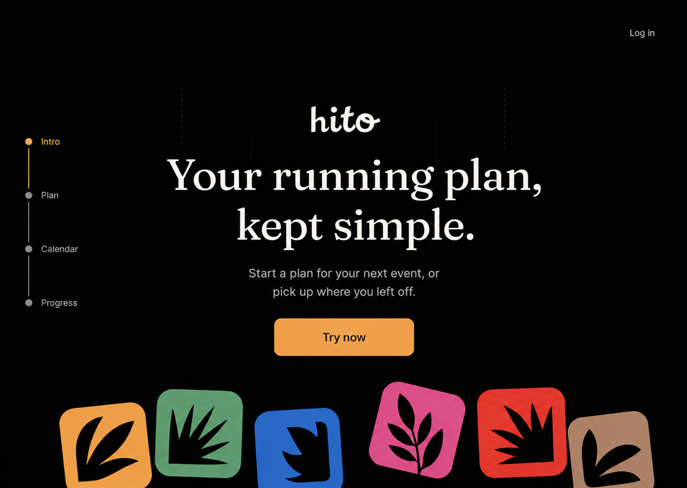
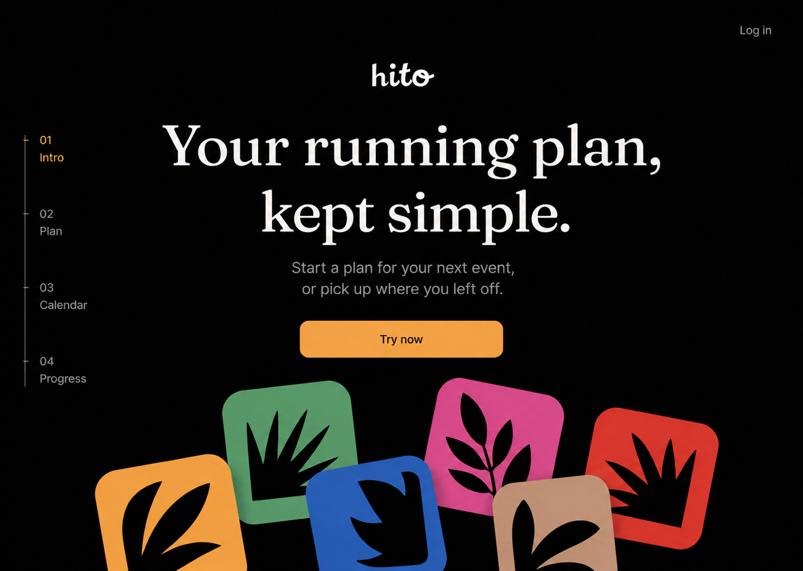
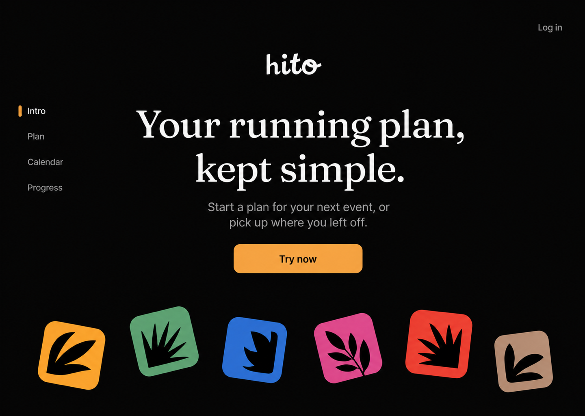

# Hito Marketing Kinetic Icon Hero Discovery — 2026-08-15

## Work Item ID

2026-08-15-hito-marketing-kinetic-icon-hero-discovery

## Status

ready

## Type

Tracked — Marketing composition, motion, navigation, and authentication-entry discovery

## Priority

medium

## Owner

DESIGNER

## Epic

marketing-and-growth

## Stage

Black centered landing revision rendered — awaiting Ivan's floor-density selection

## Next Recommended Role

PRODUCT

## Scope

Define the first viewport and entry interaction for a full public Hito landing page. The current
photographic auth hero is replaced by a fixed dark marketing canvas with one centered brand/copy/CTA
stack, a top-right login action, a desktop in-page location rail, and decorative HitoMark tiles that
fall behind the live plane and settle at the bottom. This item also defines the source-backed
landing section labels that the rail can navigate.

This is not a new authentication lifecycle, a shared Design System primitive, a generic motion
engine, a dashboard, or implementation approval.

## Archive Intent

Retain the selected composition, motion, navigation, and auth-entry contract; compact after the
later Marketing implementation and independent acceptance.

## Task

Capture Ivan's black centered landing correction, provide three bounded desktop floor-density
references at one size, recommend one, and preserve an implementation-ready FRONTEND Marketing
boundary. Keep the existing Hito logo, typography, controls, HitoMark vocabulary, authentication
actions, and route truth canonical.

## Ivan's Accepted Direction

The previous photographic, split-auth, right-cascade, and diagonal compositions are superseded.
The accepted direction is:

- no hero photograph, photo overlay, or atmospheric gradient;
- one flat near-black Hito marketing canvas;
- one Hito wordmark centered above the copy, not repeated in a separate header brand slot;
- centered heading “Your running plan, kept simple.”;
- centered support copy “Start a plan for your next event, or pick up where you left off.”;
- one centered primary action, “Try now”, which opens the existing signup/email auth mode;
- one quiet “Log in” action at the top right, which opens the same auth owner in login mode;
- a left desktop location rail that highlights the current landing section; and
- HitoMark tiles that enter from above behind the live content and settle along the bottom edge.

The settled frame does not show an inline auth form. Registration/login is a progressive overlay
interaction, so the hero reads as a landing page rather than a login screen.

## Current Source And Ownership Evidence

| Concern              | Current source fact                                                                                                                                          | Decision and preserved boundary                                                                                                                        |
| -------------------- | ------------------------------------------------------------------------------------------------------------------------------------------------------------ | ------------------------------------------------------------------------------------------------------------------------------------------------------ |
| Public entry         | `src/components/AuthEntryScreen.tsx` is shared by unauthenticated `/login` and preview-mode `/`.                                                             | Evolve this owner later; do not create `/welcome`, a second landing route, or parallel auth state.                                                     |
| Auth truth           | The same owner already renders login/signup tabs, local login, email magic-link states, validation, sending, sent, and error copy.                           | `Try now` and `Log in` select existing modes; they do not invent registration, persistence, or provider behavior.                                      |
| Sheet                | `src/components/ui/sheet.tsx` owns the canonical right/bottom modal surface, overlay, title/description, close action, focus containment, and side variants. | Reuse it for auth entry. A route-local modal recipe is prohibited.                                                                                     |
| Brand                | `src/components/ui/hito-logo.tsx` owns the Hito wordmark.                                                                                                    | Runtime renders one `HitoLogo`; reference-render lettering is not a new logo asset.                                                                    |
| Marks                | `src/components/ui/hito-mark.tsx` owns canonical marks, sizes, radii, theme-resolved colors, and decorative semantics.                                       | Runtime reuses six `HitoMark` instances; generated glyphs are composition shorthand only.                                                              |
| Typography           | Foundations expose Poppins UI/body roles and Fraunces display roles.                                                                                         | Reuse the existing display/body/button roles; no landing font family or local type scale.                                                              |
| Dark canvas          | Foundations expose the dark structural stone vocabulary and current foreground/signal roles.                                                                 | Use a deliberate fixed dark Marketing canvas from the existing darkest structural vocabulary; do not add a theme-wide color or local raw black recipe. |
| Product destinations | The live product exposes Calendar and Progress; plan setup/review is an existing product flow.                                                               | The landing rail uses only `Intro`, `Plan`, `Calendar`, and `Progress`; no unsupported Pricing, Coaching, Community, or Integration claims.            |
| Photograph           | `login-desert-horizon.jpg` is still referenced by `/hitoDS` brand documentation.                                                                             | Remove it only from the public-entry consumer later. Do not delete the asset globally in this slice.                                                   |
| Motion               | Hito exposes 100/140/180/220/260ms durations and ease-out; no physics dependency exists.                                                                     | Compose the entry from existing primitives and bounded rAF; add no package or shared motion framework.                                                 |

The wider checkout was dirty at revision preflight. Relevant runtime owners remained read-only. The
only admitted writes in this stage are this canonical item and task-owned PNG references.

## Black Centered Desktop References

All three settled references are normalized to 1440 × 1024. They share the exact product hierarchy,
six decorative marks, one CTA, the same left-rail labels, and the same flat dark canvas. They differ
only in floor density and scrollspy presentation.

### Candidate 1 — Wide runway



- Six large marks form a low continuous runway.
- The connected scroll rail is clearest as a progress metaphor.
- It carries more visual mass and its subtle entry traces risk looking like annotation chrome.

### Candidate 2 — Dense pile



- Six large marks overlap as a playful physical heap.
- It communicates gravity most strongly.
- It competes with the CTA and crops more aggressively at short desktop heights.

### Candidate 3 — Gallery floor



- Six medium marks settle as a sparse, slightly rotated floor with visible gaps.
- It preserves the strongest centered hierarchy and remains recognizably kinetic.
- It communicates less simulated weight than Candidate 2, but is materially safer for reflow and
  short viewports.

### Designer recommendation

Recommend **Candidate 3 — Gallery floor**. It most directly matches Ivan's instruction that the
tiles finish at the bottom while leaving the logo, headline, copy, and action unmistakably central.
Candidate 2 is a valid alternative if the desired personality is intentionally louder and more
physical. Candidate 1 should not be selected unless the entry traces are removed from the final
implementation.

The three PNGs are static task references only. They are not runtime assets, canonical SVG exports,
Figma frames, browser proof, or implementation approval.

## Landing Information Architecture

The left rail is an in-page location control, not the authenticated App Shell sidebar. The minimum
truthful landing story is:

1. **Intro** — brand promise, support copy, `Try now`, and kinetic marks.
2. **Plan** — the existing goal input, plan preparation, and review concept; no adaptive-coaching
   claim beyond implemented product truth.
3. **Calendar** — the existing planned workout/calendar experience.
4. **Progress** — the existing planned-versus-completed progress experience.

Do not add Pricing, Testimonials, Community, AI Coach, Integrations, or FAQ merely to fill the rail.
A later Product content decision may add a section only when its claim and destination are real.

### Desktop rail behavior

- Fixed near the left viewport edge from the Intro hero through the last named section.
- Each item is a normal anchor to a stable section ID.
- The active item uses the existing signal color plus `aria-current="location"`; inactive items use
  the existing secondary text role.
- Click moves to the section. Scroll updates the current item through one bounded observer; it must
  not change route state, trap scrolling, or continuously write history.
- Keyboard focus uses the canonical ring. The active indicator never replaces focus evidence.
- When the footer is reached, `Progress` remains current until another named section intersects.

### Narrow behavior

Below the desktop rail breakpoint, do not squeeze a left sidebar beside the content. Replace it with
a compact sticky horizontal in-page nav using the same four anchors and current-location semantics.
Every target remains at least the canonical comfortable touch size, horizontal overflow does not
create page-level side scrolling, and ordinary vertical page scrolling stays primary.

## Selected Hero Contract

### Desktop settled frame

Reference viewport: 1440 × 1024; runtime uses normalized/flow layout and supports shorter heights.

1. **Canvas plane:** a full-viewport fixed dark Marketing canvas. The landing does not switch to a
   light photograph or light structural theme.
2. **Header action plane:** `Log in` at the top right. No duplicated header logo or top navigation.
3. **Live hero plane:** one centered `HitoLogo`, the exact existing heading/support copy, and one
   `Try now` action. The stack remains in normal document flow and above every mark for its entire
   lifecycle.
4. **Decorative plane:** six canonical Hito marks enter behind the live plane and settle in the
   bottom 18–22% of the viewport. They remain pointer-transparent and non-semantic.
5. **Location plane:** the left rail sits outside the central text measure and never becomes a
   product App Shell.

Recommended desktop mark set: `long`, `hills`, `tempo`, `recovery`, `intervals`, and `trail`, all
using canonical solid tile backgrounds. Candidate 3 uses medium/large responsive sizes rather than
six fixed 128px boxes. The later owner may make bounded optical position adjustments during browser
proof, but may not raise the settled floor into the CTA/copy region without returning to Product.

### Entry and fall

- All six start 6–12rem above the hero with deterministic x positions matching their final floor
  order.
- They fall on the decorative plane behind the logo, copy, CTA, header action, and scrollspy.
- Use transform and opacity only. Target 900–1040ms per tile with 40–60ms stagger; the complete
  sequence ends within 1.4s and runs once per document load.
- Allow one bounded 4px settle correction and at most 3deg rotation correction. No bounce chain,
  rolling, collision solver, blur, parallax, scroll-linked motion, or repeat.
- Final positions exist in server-rendered markup. Failure or disabled JavaScript shows the settled
  frame immediately and never delays the hero or authentication actions.

### Pointer response

- Eligible only for `hover: hover`, `pointer: fine`, and no reduced-motion preference.
- Listen only on the hero root; never use a global listener, pointer capture, `preventDefault`,
  sample history, storage, analytics, or telemetry.
- Influence applies only to already-settled bottom marks. Radius: 96px. Maximum translation: 8px.
  Maximum rotation: 2deg.
- Coalesce current coordinates into at most one pending `requestAnimationFrame`; schedule zero
  frames when the pointer is idle or outside the bottom field.
- Clamp movement below the CTA safe boundary and within the hero. Marks use `pointer-events: none`.

## Authentication Entry Contract

### `Try now`

- Opens the existing auth owner in signup/email mode.
- Desktop uses the existing right-side `Sheet`; narrow/coarse layouts use its bottom side.
- The first valid field receives focus according to the existing dialog contract.
- The underlying landing remains visible but inert while the modal sheet is open.
- This label does not prove or introduce a distinct backend account-creation lifecycle. If Product
  requires registration behavior beyond the existing signup/email path, return to PRODUCT and
  BACKEND before implementation.

### `Log in`

- Opens the same Sheet in login mode; it does not navigate to a second visual screen.
- Direct `/login` remains a supported deep link and renders the same landing with login mode open.
- Closing restores focus to the triggering action. Escape, overlay dismissal, browser Back, and
  direct-link behavior must be decided as one route/state contract rather than independent local
  flags.

### Preserved states

The later implementation must preserve local-login enabled/disabled, signup/email mode, magic-link
enabled/disabled, empty/invalid email, sending, sent, invalid credentials, local unavailable,
password visibility, `next` redirect intent, and direct `/login` entry. The visual relocation of
the form does not authorize auth-server, persistence, provider, or redirect changes.

## Mobile, Reduced Motion, And Accessibility

| Mode                   | Required outcome                                                                                                                                                                |
| ---------------------- | ------------------------------------------------------------------------------------------------------------------------------------------------------------------------------- |
| Desktop reduced motion | Six marks render directly in the selected settled floor. No fall, nudge, delayed reveal, or substitute fade/scale.                                                              |
| Mobile/coarse pointer  | Three canonical medium marks render as a static bottom floor. No fall or nudge. Hero copy and CTA remain in ordinary vertical flow.                                             |
| Touch                  | No pointer capture, drag, tap reaction, scroll reaction, haptics, or touch nudge.                                                                                               |
| Keyboard               | Skip link, rail anchors, `Try now`, and `Log in` have visible canonical focus; Sheet traps and restores focus through the existing primitive.                                   |
| Screen reader          | Marks are decorative, `aria-hidden`, non-focusable, and absent from reading order. Rail is a named in-page navigation landmark; current section uses `aria-current="location"`. |
| 320 CSS px / zoom      | One-dimensional page scroll, no clipped CTA/copy, no persistent left rail, and no decorative obstruction at 200% text zoom.                                                     |
| JavaScript failure     | Static hero, working anchor links, direct `/login`, and auth actions remain available; motion/scrollspy enhancement may disappear.                                              |
| Theme                  | Public landing remains intentionally fixed dark. Text, CTA, fields, focus, and canonical marks must still meet their measured contrast contracts on that canvas.                |

Maintained guidance:

- [WCAG 2.2 — Animation from Interactions](https://www.w3.org/WAI/WCAG22/Understanding/animation-from-interactions.html)
- [WCAG 2.2 — Pause, Stop, Hide](https://www.w3.org/WAI/WCAG22/Understanding/pause-stop-hide)
- [WCAG 2.2 — Reflow](https://www.w3.org/WAI/WCAG22/Understanding/reflow)
- [WAI-ARIA — aria-current](https://www.w3.org/TR/wai-aria-1.2/#aria-current)
- [MDN — touch-action](https://developer.mozilla.org/en-US/docs/Web/CSS/Reference/Properties/touch-action)
- [web.dev — Animations and performance](https://web.dev/articles/animations-and-performance)

## Renderer Decision

| Approach                              | Fit                                                                                                                                       | Decision       |
| ------------------------------------- | ----------------------------------------------------------------------------------------------------------------------------------------- | -------------- |
| Bounded DOM/CSS plus event-driven rAF | Reuses real HitoMark nodes, deterministic z-planes/final positions, SSR, reduced motion, responsive omission, and focus-safe DOM auth.    | **Recommend.** |
| Canvas                                | Duplicates mark rendering/theme/DPR logic and complicates layering around DOM text, anchors, and Sheet triggers for only six known marks. | Reject.        |
| Physics library                       | Adds bodies, collision tuning, runner lifecycle, nondeterministic rest, and a package when final positions are deliberately art-directed. | Reject.        |

The desired physical impression does not require simulated collision.

## Performance And Bundle Budget

- Runtime dependencies: **+0**. New runtime image/font/SVG assets: **+0**.
- Remove the public-entry photograph import only from the later Marketing consumer; retain the
  existing image while `/hitoDS` still truthfully references it.
- Reference PNGs remain documentation-only and must never be imported by runtime.
- Desktop renders exactly six canonical mark nodes; mobile paints exactly three.
- Incremental route renderer, scrollspy, auth-entry state, and route-local styles target 8 KiB gzip
  with a hard stop at 12 KiB. Do not add optimization infrastructure merely to hit this budget.
- Animate only transform and opacity. No animated dimensions, top/left, shadow, filter, gradient,
  photo overlay, or background.
- No timer, perpetual loop, physics runner, global pointer listener, pointer collection, storage,
  telemetry, or network call for the decoration.

## Later FRONTEND Marketing Implementation Boundary

No implementation is dispatched by this item. After Ivan selects one of the three revised floor
references, PRODUCT may prepare one FRONTEND Marketing task with these independently reversible
slices:

1. **Static landing seam:** evolve `src/components/AuthEntryScreen.tsx` into the fixed-dark public
   landing shell; remove its photograph/inline-form presentation while preserving all auth logic and
   direct-route truth.
2. **Auth Sheet composition:** reuse canonical Sheet and existing controls to open signup from
   `Try now` and login from `Log in`; preserve every auth state and redirect intent.
3. **Landing sections and rail:** add only the approved Intro/Plan/Calendar/Progress sections and
   one in-page location nav using accepted Product copy and existing UI references.
4. **Decorative renderer:** add one route-local fixed mark set, deterministic fall/settle geometry,
   pointer eligibility, cleanup, mobile omission, and reduced-motion behavior.
5. **Route-local Marketing styles:** selector-prefixed canvas, layout, rail, responsive floor, and
   keyframes using existing tokens and type/control contracts.

Reuse `HitoLogo`, `HitoMark`, `HitoButton`, `Sheet`, existing fields/tabs, typography, spacing,
motion, focus, and color contracts. Do not edit root tokens, canonical DS CSS, package files, auth
server behavior, Product routes, HitoMark/HitoLogo art, Figma, analytics, or hosted state.

Return to PRODUCT if new marketing claims/copy are required. Return to DESIGN SYSTEM only if the
existing Sheet cannot truthfully provide the responsive right/bottom contract without a shared
primitive change. Return to BACKEND if “registration” requires behavior beyond the current auth
truth.

## Later Acceptance Inventory

| Check               | Required later evidence                                                                                                                       |
| ------------------- | --------------------------------------------------------------------------------------------------------------------------------------------- |
| Source boundary     | Only admitted FRONTEND Marketing owners plus receipt; no package, token, DS, auth-server, asset-source, or unrelated route mutation.          |
| Desktop composition | Selected floor at 1440×1024, 1280×800, and 1024×768; centered hierarchy and top-right login remain unobstructed.                              |
| Auth entry          | `Try now` opens signup/email mode; `Log in` and direct `/login` open login mode; close/Back/focus return and `next` intent are preserved.     |
| Auth states         | Local login, signup/email, magic-link availability, invalid/sending/sent, credentials, password visibility, and error growth remain truthful. |
| Landing navigation  | Intro/Plan/Calendar/Progress anchors, keyboard focus, current-location state, browser history behavior, and no route-sidebar confusion.       |
| Entry motion        | Six deterministic paths behind the live plane, one sequence ≤1.4s, no repeat, final SSR positions.                                            |
| Pointer             | Local listener only, bottom-field limits honored, zero frames idle/outside, no protected-region movement.                                     |
| Mobile/reflow       | 320, 375, 768 CSS px and 200% text zoom; horizontal compact nav, three static marks, one-dimensional scroll, bottom auth Sheet.               |
| Reduced motion      | Static settled state before load and after runtime preference change; no residual transition or frame.                                        |
| Accessibility       | Landmarks, heading order, `aria-current`, labels, errors, focus ring/trap/return, and decorative-tree omission.                               |
| Performance         | +0 dependencies/assets, budget met, transform/opacity only, no continuous work, decoration CLS = 0.                                           |

Focused browser proof belongs to the later implementation owner. Global QA, Figma parity, release,
and deployment remain separate unperformed gates.

## Rollback And Stop Conditions

Motion-off rollback keeps the selected static dark composition and removes entry/nudge enhancement.
Auth-composition rollback restores the current inline `AuthEntryScreen` without changing auth logic.
Full Marketing rollback removes the route-local landing/rail/renderer and restores the current
public-entry presentation; it does not delete the photograph or mutate auth/backend owners.

Stop and return if the selected design cannot preserve every auth state; if the fixed dark canvas
requires a theme-wide token rewrite; if marks need interactive hit targets; if a continuous
simulation, canvas, package, copied mark art, new route, unsupported marketing claim, touch
interception, pointer collection, or second auth model becomes necessary; or if the accepted
reflow/contrast/performance limits fail.

## Selection Gate

The black centered landing direction is accepted. The remaining visual choice is the settled floor:
Candidate 1, 2, or 3. Designer recommends **Candidate 3 — Gallery floor**. Do not dispatch FRONTEND
until Ivan selects one candidate or requests one bounded refinement.

## Handoff Prompt

```text
ROLE: PRODUCT

Review the three black centered 1440 × 1024 landing references and the revised contract in
docs/tasks/backlog/2026-08-15-hito-marketing-kinetic-icon-hero-discovery.md. The fixed black canvas,
centered logo/copy/Try now stack, top-right Log in, left Intro/Plan/Calendar/Progress location rail,
and bottom-settled marks are accepted. Ask Ivan to select floor Candidate 1, 2, or 3, or request one
bounded refinement. DESIGNER recommends Candidate 3. Do not dispatch FRONTEND or infer final visual
acceptance until Ivan selects the floor in the current discussion.
```

## Discovery Validation And Lifecycle Receipt

- **Role file:** `agents/designer.agent.md`.
- **Project skill:** `skills/hito-frontend-design-system/SKILL.md` for owner tracing, DS reuse,
  responsive/auth state boundaries, and later role separation.
- **Visual workflow:** Product Design get-context/ideate plus built-in ImageGen. Saved Product Design
  context was absent, so the user-provided reference and current Hito source were used.
- **Task-owned writes:** this canonical item and three new black-centered PNG references under
  `docs/tasks/backlog/assets/2026-08-15-hito-marketing-kinetic-icon-hero-discovery/`.
- **Historical references:** the earlier desert/right/central/diagonal PNGs remain as rejected
  discovery history; they are not current implementation targets.
- **Validation required here:** 1440 × 1024 dimensions, direct render inspection, Markdown asset
  links, scoped formatting, external guidance availability, and Git diff hygiene.
- **Intentionally not performed:** runtime implementation, browser/runtime acceptance, package or
  source mutation, Figma mutation/parity, hosted validation, Global QA, release, deployment, stage,
  commit, push, or dispatch.
- **Subagent:** none; no independent reviewer was required for this bounded visual revision.
- **Next owner:** PRODUCT to obtain Ivan's floor selection. FRONTEND Marketing remains unselected and
  undispatched until that gate passes.
