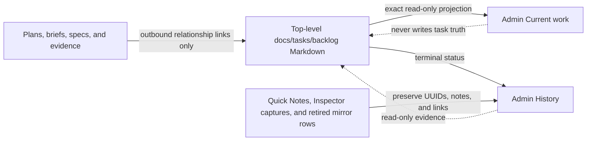

# Hito Admin Work Items Authority And Usability Consolidation

## Work Item ID

d4651a98-b5bc-46c0-8420-fa60ded26c6a

## Status

completed

## Type

Tracked — Admin work-item authority and usability consolidation

## Priority

high

## Owner

ARCHITECT

## Epic

platform-and-operations

## Evidence From

[Admin Work Items Deployed Repository Mirror Delivery](./2026-08-06-admin-work-items-deployed-repository-mirror-delivery.md)

## Scope

Define one understandable and migration-safe Work Items model for the Hub Admin surface. The
canonical operational queue remains Markdown under `docs/tasks/backlog/`; the Admin surface must
project that truth instead of mixing active tasks with plans, specifications, briefs, and manually
created Quick Notes. Preserve historical records and stable work-item identities while designing
the smallest safe migration and implementation sequence.

## Archive Intent

Retain canonical Markdown records and existing Supabase-backed capture/Quick Note history until an
accepted migration has preserved their evidence and links. No destructive deletion is admitted by
this discovery or its first implementation slice.

## Task

Produce the architecture decision and staged migration plan for a human-first Work Items page.
The user must be able to tell at a glance what Hito is doing, why it exists, its Epic, priority,
owner, current status, latest outcome, and related work. Creating a task must have one canonical
path: Ivan asks PRODUCT to add a Markdown backlog item, including low-priority items; Quick Note
must no longer be a second task-creation workflow.

## User Direction

- Remove **Quick Note** as a Work Items creation surface because it creates a confusing second
  queue. Low priority is sufficient for deferred tasks.
- Keep only meaningful user-facing types. Plans, briefs, specifications, captures, and archive
  mechanics must not present as competing current task types.
- Every non-bug work item has a registered Epic. The Admin projection must read that exact Epic and
  use a stable, accessible Epic colour treatment rather than inferring it from title or prose.
- Lead each row/detail with a plain-language summary, current status and latest meaningful update;
  keep technical handoff prompts and verbose receipts secondary.
- Show approved related-work links and relationships without creating a second hierarchy or
  database authority.
- Do not lose or silently rewrite old Markdown items, repository mirror identities, Quick Notes,
  Inspector captures, notes, or audit history.

## Confirmed Current Facts

- `docs/tasks/backlog/` is already the repository's sole operational queue; plans, briefs and specs
  are supporting material, not lifecycle authority.
- The Admin importer currently reads five roots: backlog, product briefs, frontend specs, active
  plans and archived plans. The resulting source/type vocabulary is exposed in the Work Items UI.
- Repo-derived rows are mirrored into `admin_capture_items`, while Quick Notes are separately
  created and edited in that same Supabase table. This makes one page display two authorities.
- The canonical Markdown parser does not yet project the required `Epic` field, so the UI cannot
  truthfully filter or colour by Epic.
- Local Admin reads rescan the filesystem; deployed Admin reads the bundled repository snapshot.
  Any design must retain a factual, deployable projection rather than introducing a second live
  task store.

## Required Architecture Decision

1. Define the single current Work Items authority, the retained-history boundary, and exactly how
   Quick Notes and Inspector captures remain available as historical evidence without remaining
   active task records.
2. Recommend the smallest canonical Markdown presentation contract for a current item: title,
   one-sentence human summary, status, latest update, priority, owner, Epic, and the already
   approved relationship fields (`Parent`, `Depends On`, `Evidence From`, `Supersedes`). Decide
   whether an explicit `Summary`/`Latest Update` field is required or whether an existing bounded
   field can truthfully serve each purpose.
3. Reduce the visible type/source taxonomy to the minimum necessary. Distinguish an active bug from
   normal work without treating documents, plans, source roots, or capture mechanisms as product
   task types.
4. Define the registered Epic projection and stable, non-colour-only visual mapping, including the
   controlled migration for non-bug current records and `legacy-history` terminal records required
   by the repository policy.
5. Identify the migration path that preserves immutable Work Item IDs, historical Admin rows,
   notes, and inbound links; define rollback, archival/read-only treatment, and any necessary
   data backfill. Do not prescribe a destructive table reset or a parallel service.
6. Map the smallest serial implementation boundaries across ARCHITECT, BACKEND and FRONTEND Product
   (and DESIGN SYSTEM only if a shared Epic marker is genuinely missing), with validation needed to
   prove that the Admin page and canonical Markdown truth remain synchronized locally and after a
   deployment snapshot refresh.

## What Not To Touch

- Do not implement UI, importer, schema, migration, or Supabase changes in this discovery.
- Do not change `docs/tasks/backlog/` lifecycle truth, delete Quick Notes/captures, rewrite historic
  work-item IDs, or regenerate terminal receipts.
- Do not create a project-management service, a second queue, a generated index, a new dashboard,
  or a title-derived Epic classifier.
- Do not alter Runner Calendar, Progress, Design System chart work, the shared runtime, hosted
  state, providers, Git lifecycle, or release state.

## Validation Expectations

- Direct source census of every importer root, parser field, Admin list/filter, Quick Note/capture
  mutation and mirror synchronization seam.
- One evidence-backed current-versus-history authority diagram and a staged, reversible migration
  recommendation with first implementation owner.
- Verify all referenced local Markdown links, focused Prettier, `git diff --check`, and preservation
  of non-task-owned source bytes. No runtime, database, browser, build, hosted, or Git claim is
  required for an architecture decision.

## Stage

Architecture authority and reversible-migration decision completed

## Next Recommended Role

PRODUCT

## Blocker

None. No further Ivan decision is required. PRODUCT must activate the existing Epic-classification
item before the first Backend implementation slice.

## Architecture Receipt

### Role, mode, and boundary

- Role: ARCHITECT.
- Mode: Tracked discovery.
- Role file: `agents/architect.agent.md`.
- Skill: `skills/hito-architecture-audit/SKILL.md`.
- Task artifact: this canonical item only.
- Subagent: none; the source boundary was directly demonstrable and no independent discriminator
  remained.
- Acceptance: architecture decision only. No importer, database, fixture, browser, build, hosted,
  release, or Global QA acceptance is claimed.

### Direct source census

| Current seam                                                          | Demonstrated fact                                                                                                                                                                                                                                                                                                             | Consequence                                                                                                                                                  |
| --------------------------------------------------------------------- | ----------------------------------------------------------------------------------------------------------------------------------------------------------------------------------------------------------------------------------------------------------------------------------------------------------------------------- | ------------------------------------------------------------------------------------------------------------------------------------------------------------ |
| `scripts/admin-backlog-import/sources.json`                           | The mirror admits five roots: backlog, product briefs, frontend specs, active plans, and archived plans. The current checkout contains 306 admitted backlog Markdown paths, 12 briefs, 40 specs, 11 active plans, and 76 archived plans. One admitted backlog path is a nested SVG evidence document rather than a work item. | Root membership currently masquerades as work-item taxonomy. The target selector must admit top-level backlog items only, not every recursive Markdown file. |
| `scripts/admin-backlog-import/markdown.ts`                            | The closed field list omits `Epic` and all four approved relationships. `Scope` is passed through a slug validator, so normal prose is rejected. The parser also falls back to title/body inference for status, role, and type.                                                                                               | The existing parser cannot produce the accepted human-readable contract and must not infer authority from prose.                                             |
| Backlog metadata                                                      | A direct top-level header census found 305 backlog records. Only 35 currently contain an Epic. Among 69 records with recognizable nonterminal status, 41 non-bug records lack Epic.                                                                                                                                           | The controlled Epic classification is a prerequisite; the importer must not manufacture the missing values.                                                  |
| `scripts/import-repo-work-items-to-admin-backlog.ts`                  | The H1 is replaced by the first `Task` line when present; the generated `note` is normally a handoff prompt or receipt excerpt. The importer writes source kind/group/lifecycle and a collapsed five-state Admin status into JSON metadata and columns.                                                                       | Title, summary, latest update, owner, and canonical status need separate exact projections; a handoff prompt is not row summary copy.                        |
| `src/lib/admin-work-items.ts` and `src/lib/admin-capture-contract.ts` | Source groups expose Backlog, Active plans, Specs, Briefs, and Archive. Current owner/target-role enums do not cover every canonical role file, and `target_role` is used where the Markdown `Owner` is the required fact.                                                                                                    | Current filters are not the canonical vocabulary. Owner must come from Markdown metadata, independently of the legacy prompt target column.                  |
| `admin_capture_items` migrations                                      | One table stores repository mirrors, Quick Notes, and Inspector captures. The UUID primary key, unique repository Work Item ID, and unique source-type/path indexes already protect identity. JSON metadata can carry the required projection.                                                                                | No schema migration, new table, or database authority is required.                                                                                           |
| `src/lib/admin-capture.server.ts`                                     | Repository-derived rows are read-only, but non-repository rows can still be created, triaged, appended to, and Quick Notes can be physically deleted. The list and counts filter the five-state column and source groups.                                                                                                     | A second mutable queue still exists. Historical rows must become read-only and deletion must disappear without deleting their bytes.                         |
| `src/routes/admin.capture.tsx` and its view model                     | The page offers Add Quick Note, editable capture metadata, deletion, source/type filters, internal Admin statuses, source paths, and prompt-first detail.                                                                                                                                                                     | The page currently optimizes for implementation plumbing rather than understandable current work.                                                            |
| Local and deployed synchronization                                    | Loopback reads rescan the filesystem. Deployed reads load a private bundled snapshot produced from the same source manifest, and both reuse the same importer. Automatic reads run with stale archival disabled.                                                                                                              | One manifest and one parser can remain the projection seam. There is no need for a generated index or a second service.                                      |

The current five-root mirror and Quick Note editor explain the usability failure; no additional
product choice is needed.

### Authority and retained-history decision



1. `docs/tasks/backlog/` remains the sole operational authority. Only a top-level Markdown file
   with a stable Work Item ID is eligible for the Work Items projection; `README.md`, nested assets,
   plans, briefs, specs, and archive documents are not task rows.
2. **Current** is the default Admin view and contains canonical nonterminal backlog statuses only:
   `backlog`, `ready`, `in_progress`, and `blocked`.
3. **History** is a read-only presentation boundary, not another queue. It contains terminal
   canonical backlog records plus preserved Quick Notes, Inspector captures, and repository rows
   from retired import roots. Historic database rows keep their UUID, timestamps, note,
   `note_history`, source path, Work Item ID, and source metadata unchanged.
4. Supporting documents can appear only as typed outbound relationship links from a canonical
   item. They do not receive status, priority, owner, Epic, or a competing list row.
5. Admin never edits canonical task truth. Ivan creates work through PRODUCT, which writes the
   Markdown item. Quick Note creation, manual capture triage/note mutation, and Quick Note deletion
   leave the Work Items surface and server contract. Existing records are not deleted or rewritten.

### Minimum canonical presentation contract

No `Summary` or `Latest Update` Markdown field is required.

| Presentation fact | Canonical source and rule                                                                                                                                                                                                                                                                                                       |
| ----------------- | ------------------------------------------------------------------------------------------------------------------------------------------------------------------------------------------------------------------------------------------------------------------------------------------------------------------------------- |
| Title             | The document H1, bounded for display. Do not replace it with `Task`.                                                                                                                                                                                                                                                            |
| Summary           | The first plain-language sentence of `Scope`, preserving prose rather than slug-normalizing it. Missing Scope is a source diagnostic; title/body inference is forbidden.                                                                                                                                                        |
| Status            | Exact canonical Markdown status. The five-state `admin_capture_items.status` value remains an internal legacy storage projection and is not user-facing truth.                                                                                                                                                                  |
| Latest update     | For `ready`, `in_progress`, and `blocked`, use the exact `Stage`; for `backlog`, show the factual status explanation “Awaiting Product dispatch.” Terminal History may use the first explicit `Outcome` or `Result` paragraph; when neither exists, show a missing-update diagnostic and the source link rather than infer one. |
| Priority          | Exact Markdown priority.                                                                                                                                                                                                                                                                                                        |
| Owner             | Exact Markdown `Owner`, normalized only against the canonical named-role registry. Do not substitute `Next Recommended Role` or the legacy database `target_role`.                                                                                                                                                              |
| Epic / Bug        | A non-bug displays its exact registered Epic. `Type: Bug` displays `Bug` and has no Epic. Missing/invalid nonterminal Epic fails closed as a source diagnostic.                                                                                                                                                                 |
| Related work      | Project only `Parent`, `Depends On`, `Evidence From`, and `Supersedes` as typed outbound links. Preserve label and target; do not synthesize reverse ownership or copy target lifecycle.                                                                                                                                        |
| Technical detail  | `Task`, handoff prompt, source path, receipts, parser diagnostics, and raw capture evidence remain available in secondary disclosure, not the row lead.                                                                                                                                                                         |

The visible taxonomy is therefore deliberately small:

- view: **Current** or **History**;
- kind: **Work** or **Bug**;
- lifecycle: the seven canonical Markdown statuses;
- filters: Status, Priority, Owner, Epic/ Bug, and search;
- history origin, when relevant: Canonical closeout, Quick Note, Inspector capture, or Retired mirror.

Plans, specs, briefs, capture mechanisms, source roots, `context_capture`, `change_request`, and the
five-state Admin status are not visible current task types.

### Epic registry, projection, and accessible colour policy

The registered source is the existing active product roadmap. The exact projection is:

| Slug                               | Label                             | Existing `HitoMetadataTag` treatment |
| ---------------------------------- | --------------------------------- | ------------------------------------ |
| `runner-core-readiness`            | Runner Core Readiness             | light / signal                       |
| `runner-evidence-and-progress`     | Runner Evidence & Progress        | light / success                      |
| `adaptive-blueprint-planning`      | Adaptive Blueprint Planning       | light / rollout                      |
| `commercial-financial-foundation`  | Commercial & Financial Foundation | light / warning                      |
| `owner-analytics-and-scenario-lab` | Owner Analytics & Scenario Lab    | light / rollout                      |
| `platform-and-operations`          | Platform & Operations             | light / neutral                      |
| `marketing-and-growth`             | Marketing & Growth                | light / signal                       |
| `legacy-history`                   | Historical / Legacy               | light / muted                        |

The label is always rendered and is the authority; colour is supplemental and intentionally need
not be unique. The mapping is one explicit slug-keyed Frontend constant, never a title/prose hash or
free-text colour. The tag's accessible name contains the full label, filters use the text label, and
focus/selection never depends on colour. Focused acceptance must prove text contrast of at least
4.5:1 in light and dark themes and visible keyboard focus. The existing shared metadata tag already
owns these treatments, so no DESIGN SYSTEM production slice is planned. A failed contrast proof is
the sole discriminator that returns this marker to DESIGN SYSTEM; Frontend must not add route-local
colour CSS.

Classification follows existing policy: every current non-bug gets one factual registered Epic;
bugs remain Epic-free; terminal non-bug history receives `legacy-history` only when evidence cannot
support a factual product Epic. Parser/importer code rejects or diagnoses missing and unknown values
and never assigns an Epic.

### Reversible migration and serial owner programme

#### 0. PRODUCT dispatches the existing ARCHITECT classification item

Use
`2026-08-15-hito-backlog-epic-taxonomy-and-admin-projection.md`; do not create a duplicate task.
ARCHITECT inventories top-level backlog items, assigns factual registered Epic values to non-bugs,
keeps bugs Epic-free, records exceptions, and changes no status, owner, receipt, runtime source, or
database state. This closes the demonstrated missing-Epic prerequisite.

#### 1. BACKEND — projection foundation, no authority cutover

In the existing parser/importer/read-model seams:

- project H1, prose Scope summary, exact status, priority, Markdown Owner, Epic, Stage-derived update,
  and the four outbound relationships into existing JSON metadata;
- separate canonical Owner from the legacy prompt `target_role` and cover all canonical named roles
  in metadata without changing the table constraint;
- remove title/body inference from canonical backlog facts and surface missing/invalid metadata as
  diagnostics;
- preserve the five current roots temporarily while contract proofs demonstrate identical row UUIDs,
  Work Item IDs, source identities, notes, and history metadata; and
- prove filesystem and bundled-snapshot projections produce the same path/content digest.

No migration or new persistence shape is admitted.

#### 2. BACKEND — authority cutover and historical freeze

- Narrow the shared source manifest/snapshot selector to top-level `docs/tasks/backlog/*.md` except
  `README.md`; do not recursively admit `assets/`.
- Make Current/History an explicit read-model discriminator. Current queries only nonterminal
  canonical backlog rows; History includes terminal backlog and every preserved noncanonical row.
- Remove the now-only Quick Note create server function and fail closed any remaining mutation or
  deletion attempt against historical manual/capture rows. Keep repository rows read-only.
- Do not run destructive cleanup or stale-row deletion. Old plan/spec/brief mirror rows remain
  history-only. Automatic synchronization continues with stale archival disabled.

Because rows remain in place, restoring the previous manifest and code restores the old view while
preserving the same identities.

#### 3. FRONTEND Product — human-first Work Items surface

Reuse the existing Admin data-table toolbar, row/list primitives, `HitoMetadataTag`, and disclosure
patterns. Remove Add Quick Note and all manual triage/note/delete controls. Default to Current;
provide a clearly secondary History view. Lead each row with H1 title, Scope summary, exact status,
latest update, priority, owner, and Epic/Bug. Show relationships as typed links and move source path,
prompt, receipts, parser diagnostics, and legacy capture evidence into secondary detail. Replace
Source/Type/Target-role filters with Status/Priority/Owner/Epic and preserve search, keyboard use,
mobile containment, and deep links. No route-local task store or colour rules are admitted.

#### 4. QA — independent acceptance

After both owners are terminal, independently replay parser/importer/read model and Admin UI against
current work, terminal work, a bug, every Epic, each relationship type, missing/invalid metadata,
Quick Note history, Inspector history, retired mirror history, local filesystem refresh, deployed
bundle refresh, keyboard use, light/dark contrast, narrow viewport containment, and rollback.

### Identity, preservation, rollback, and validation contract

Before Backend mutation, record counts and hashes by source class plus the complete sets of database
UUIDs, canonical Work Item IDs, source-type/path identities, note values, `note_history`, and
timestamps. After each stage:

1. every pre-existing row UUID and evidence value still exists byte-for-byte;
2. current rows map one-to-one to eligible top-level canonical backlog Work Item IDs;
3. no plan, brief, spec, nested asset, Quick Note, or Inspector capture appears in Current;
4. every historical row is visible read-only in History and every prior deep link still resolves;
5. local filesystem and bundled snapshot produce the same eligible paths, content hashes, Epic,
   relationships, summary, and update;
6. missing/invalid authority metadata is diagnostic and never inferred; and
7. a second refresh is idempotent and changes no identity or manual evidence.

Rollback is code/config rollback in reverse owner order: restore the previous Frontend, then the
previous read model and five-root manifest. No data restore is required because the migration does
not delete, rewrite, or move rows. If any identity/evidence value changes, any old link breaks, a
noncanonical row enters Current, a current row disappears, or the local/bundle projections diverge,
stop before Frontend adoption and restore the preceding source version.

### Rejected alternatives and residual boundary

- A new table, tracker, generated index, service, database-authored task, or compatibility layer is
  rejected: existing Markdown plus JSON projection can represent the contract.
- A destructive table reset or Quick Note cleanup is rejected: IDs, notes, links, and audit
  evidence are retained.
- Inferring Summary, Epic, owner, status, or type from title/prose is rejected. Only bounded exact
  canonical fields are admitted.
- Importing plans/specs/briefs and merely hiding their type labels is rejected because it preserves
  competing current-task authority.
- Adding both `Summary` and `Latest Update` fields is rejected as duplicate narration; existing
  `Scope`, `Stage`, status, and explicit terminal outcome sections already own those facts.

The remaining boundary is implementation and acceptance. Hosted row counts and preservation have
not been inspected or mutated by this discovery. The pre-existing deployed-mirror child remains
blocked on its own legitimate authenticated hosted acceptance; this decision neither closes nor
weakens that gate.

### Recommended first implementation handoff to PRODUCT

PRODUCT should activate the existing Epic taxonomy item, assign its controlled classification slice
to ARCHITECT, and dispatch only this boundary:

```text
ROLE: ARCHITECT

Task: Hito Backlog Epic Taxonomy And Admin Projection
Mode: Tracked
Canonical item: docs/tasks/backlog/2026-08-15-hito-backlog-epic-taxonomy-and-admin-projection.md
Stage: Controlled canonical backlog Epic classification

PRODUCT has activated and assigned the existing item to ARCHITECT. Inventory every top-level canonical
backlog Markdown item. Give each non-bug exactly one factual Epic from the registered roadmap taxonomy;
keep Type: Bug items Epic-free; use legacy-history only for terminal non-bug records whose retained
evidence cannot support a factual product Epic. Record counts and exact exceptions in that item.

Change only the one Epic metadata line required by the classification and the task-owned receipt. Do
not change status, owner, task prose, relationships, receipts, runtime source, importer, Admin UI,
database, fixtures, hosted state, or Git lifecycle. Validate the classification inventory, local
Markdown links, scoped formatting, and git diff --check, then return the exact Backend projection
prerequisite to PRODUCT. Do not dispatch Backend yourself.
```

This handoff requires PRODUCT first to make the existing item's status/owner truthful. No new task or
unresolved Ivan decision is required.
