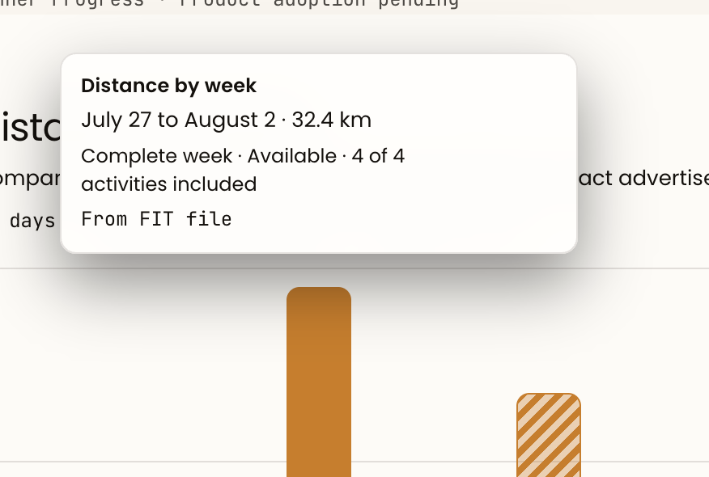
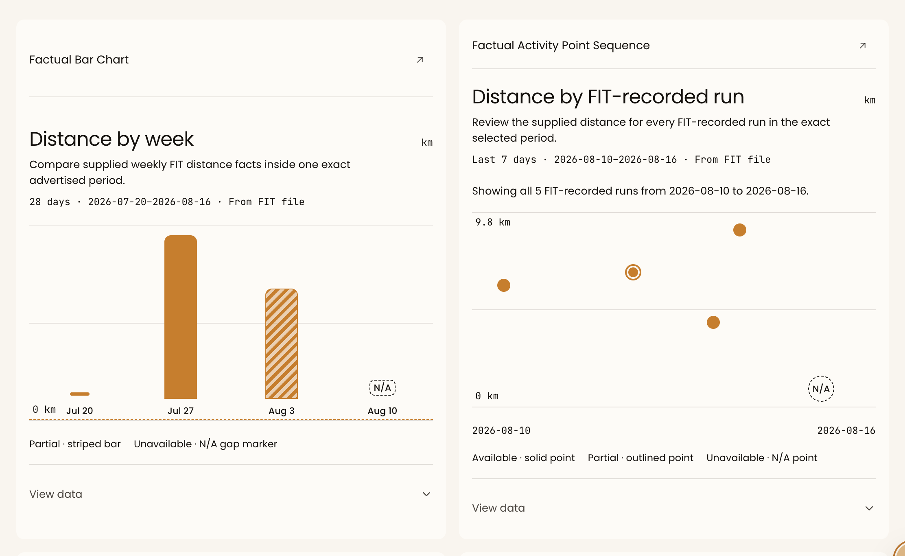

# Hito DS Depth, Overview, And Factual Chart Batch

## Work Item ID

e8e8f0b8-c55f-4499-b059-593f70950570

## Status

completed

## Type

Tracked — Design System reference and factual-chart batch

## Priority

high

## Owner

DESIGN SYSTEM

## Epic

runner-evidence-and-progress

## Parent

[Runner Core Roadmap](../../plans/active/2026-08-15-hito-runner-product-readiness-and-progressive-materialization-roadmap.md)

## Supersedes

[DS Overview Tabs Showcase Centering](./2026-08-17-hito-ds-overview-tabs-showcase-centering.md)

[Runner Progress Chart Composition And Period Controls Redesign](./2026-08-17-hito-runner-progress-chart-composition-and-period-controls-redesign.md)

## Scope

Create one serial Design System batch for three connected `/hitoDS` reference outcomes:

1. a canonical, theme-aware five-level elevation scale (`XS`, `SM`, `MD`, `LG`, `XL`), each
   exactly two outer shadows, plus a Depth showcase;
2. the local Overview Tabs-showcase centring repair; and
3. a factual-chart reference composition in which the chart heading is anchored below the card
   header and factual period controls are understandable rather than technical.

The batch first receives one DESIGNER decision. DESIGN SYSTEM then owns foundations, shared factual
figure/reference composition, the Overview specimen repairs, and `/hitoDS` proof. FRONTEND Product
adopts the accepted Progress composition separately, using the existing Backend period/metric/date
contract unchanged.

## Archive Intent

Retain through the accepted visual decision, serial Design System implementation, Product adoption,
and focused proof. Compact to the five-level recipe, corrected Overview references, factual-control
hierarchy, removed duplicate recipes, and evidence.

## Task

Make `/hitoDS` show depth and factual chart content with quiet, legible hierarchy:

- elevated surfaces use a semantic elevation level only when layered above another surface; `none`
  remains valid for flat content;
- Overview tabs are centred inside their own showcase, without changing the shared Tabs primitive;
- factual chart title and user controls lead the reading order; visual breathing room goes around the
  plot, never above a displaced heading; and
- raw ISO ranges, coverage fractions, provenance, and missingness remain factual but do not all
  compete in the first scan. They stay available through concise context, active readback, states,
  and the native table.

## User Report

Ivan reported a harsh chart-tooltip shadow and requested subtle two-layer `XS` through `XL` depth.
He also reported that Overview Tabs have drifted left although the specimen should be centred. Finally,
the chart cards have a large blank region above their headings and lead with heavy technical prose;
the runner needs direct quick-period controls and a discoverable Custom calendar action rather than
passively reading a fixed date range.

## Evidence



Source SHA-256: `c521bd8cc039a76823ec824d9a6f327f1b13bf63daeb34c866ab132184133277`.



Source SHA-256: `0a1b0acc389f6cec67c1aec71e05878596177b3f4385e1ae6036761af421bf15`.

The screenshots prove visual hierarchy defects, not a new chart data model or a blanket
border-to-shadow policy.

## Observed Behavior

- `src/styles/foundations.css` exposes only the single `--hito-shadow-soft`; Dark/default currently
  uses `0 14px 38px ... / 32%` and Light uses `0 12px 34px ... / 14%`.
  `src/styles/shell-admin-analytics.css` separately hard-codes
  `.hito-tooltip` as `0 18px 40px rgba(0, 0, 0, 0.44)`.
- The Overview Tabs wrapper at
  `src/components/hito-ds/reference-overview-page.tsx:237` is full width without horizontal
  alignment. Its correctly `inline-flex` `.hito-tabs` child therefore begins at the left edge.
- The Overview chart figures are vertically centred inside grid showcase cards, leaving empty space
  above their figcaptions. The shared factual primitives lead with title, purpose, exact dates,
  evidence label, coverage, and table state, while `FactualProgressPanel` places existing
  quick-period, metric, and custom-date controls in a separate verbose form.

## Expected Behavior

- One documented five-level elevation scale resolves to exactly two outer shadows in both themes;
  the ambient layer stays quiet and the directional layer grows progressively without muddy halos.
- A controlled Depth showcase maps existing surface types to the scale and demonstrates `none`.
  Focus, selection, validation, state semantics, and meaningful structural edges remain separate.
- Tabs and their readback are centred at desktop width and contained on narrow screens.
- Every current factual chart shows a runner-facing heading first, followed by one compact
  Backend-advertised quick-period control, the metric selection, and the plot. Custom is visibly a
  calendar action that opens the existing validated start/end date flow.
- FIT provenance, coverage/included count, partial/unavailable reasons, future-week meaning, active
  readback, and the native table remain accessible and truthful. No trend, readiness, fitness, or
  non-FIT actual is implied.

## Source Investigation

The first incorrect owner is split only along established boundaries:

- DESIGN SYSTEM owns foundation elevation tokens, duplicate shared shadow recipes, shared factual
  figure captions, and `/hitoDS` Overview composition;
- FRONTEND Product owns the existing `/progress` period/metric/custom-date composition in
  `src/components/progress/FactualProgressPanel.tsx`.

The Backend already advertises quick periods and validates custom dates. This batch must reuse that
contract rather than create date math, a second period store, a calendar engine, a chart framework,
or a route-local CSS workaround.

## What Not To Touch

Do not change Backend period boundaries, formulas, FIT-only membership, bucket aggregation, PB rules,
calendar/workout flows, source-plan history, route search/history semantics, Figma, hosted state,
dependencies, or a future line-chart decision. Do not replace all borders with shadows; add a new
component family, runtime styling layer, compatibility alias, generic date engine, or chart package.
The Local Inspector geometry overlay is a separate FRONTEND DevTools task and is explicitly outside
this batch.

## Validation Expectations

DESIGNER first provides one concise visual decision covering the five recipes, component-to-level
mapping, Depth showcase, desktop/mobile chart composition, compact controls, and visible-versus-
disclosed factual information. It must use source evidence and current authoritative design guidance.

DESIGN SYSTEM then reuses existing foundation/reference seams, removes admitted duplicate shadow
recipes, proves exact two-layer output, verifies chart title/control/plot order, tab centring,
Light/Dark hierarchy, keyboard/pointer behavior, native-table parity, reduced motion, desktop/mobile
containment, focus preservation, and console health. FRONTEND Product later proves every advertised
period, custom-date apply/reject/reload/back-forward, metric changes, and no payload rewriting.

## Stage

DESIGN SYSTEM consolidated fix-forward completed

## Next Recommended Role

PRODUCT

## Blocker

None for the assigned Design System batch. DSQA-01 and DSQA-02 are fixed and passed a fresh focused
Light/Dark desktop/375 replay plus compact regression smoke. FRONTEND Product adoption remains a
separate PRODUCT handoff and does not begin from this item.

The full Design System validator also retains one unrelated pre-existing documentation-role failure:
`Current product, system, and state docs must record the production-shipped /hitoDS role.` The new
Depth, elevation-mapping, tooltip-owner, Overview, factual-figure, pluralization, and focus-return
assertions themselves pass. This separate documentation-owner gate is not repaired or absorbed by
the factual primitive fix-forward.

## Designer Decision — 2026-08-17

### Verdict

Accept one restrained Hito depth ramp and one compact factual-figure composition. Depth communicates
only actual detachment from a parent surface. It does not restyle ordinary cards, replace meaningful
edges, or encode focus, selection, validation, drag, or data state. Overview Tabs remain the shared
Tabs primitive inside a corrected local wrapper. Factual charts retain Backend-shaped facts and the
native table while moving technical detail out of the first scan.

No unresolved Ivan decision remains. The implementation sequence is DESIGN SYSTEM first, followed
by FRONTEND Product adoption. The Local Inspector is not part of either slice.

### Source-Backed Cause And Reuse Inventory

| Concern                   | Demonstrated source fact                                                                                                                                                                                                                                                | First owner and smallest seam                                                                                                                                                               |
| ------------------------- | ----------------------------------------------------------------------------------------------------------------------------------------------------------------------------------------------------------------------------------------------------------------------- | ------------------------------------------------------------------------------------------------------------------------------------------------------------------------------------------- |
| Elevation                 | `foundations.css` has one `--hito-shadow-soft`; shared overlays use unrelated one-layer raw shadows. The tooltip's complete surface recipe is incorrectly located in `shell-admin-analytics.css`, while `overlays-feedback.css` owns only its motion variables.         | DESIGN SYSTEM: add semantic elevation values in `foundations.css`; finish the shared tooltip owner in `overlays-feedback.css`; replace only admitted shared overlay shadow values.          |
| Legacy soft shadow        | `--hito-shadow-soft` still has live DESIGN SYSTEM and FRONTEND DevTools consumers.                                                                                                                                                                                      | Do not delete or alias it in this batch. DESIGN SYSTEM may migrate its own consumers. Deletion stops until PRODUCT separately routes the remaining DevTools consumers to FRONTEND DevTools. |
| Tabs                      | `.hito-tabs` is correctly `inline-flex`. The Overview wrapper is full-width and supplies no horizontal alignment, so the specimen begins at the left edge.                                                                                                              | DESIGN SYSTEM: local wrapper and readback in `reference-overview-page.tsx`; no `useHitoTabs`, `.hito-tabs`, or shared Tabs change.                                                          |
| Chart card hierarchy      | `ShowcaseCard` applies `min-h-64 content-center` to every preview, vertically centring the factual figure and leaving empty space above its caption.                                                                                                                    | DESIGN SYSTEM: a local top-aligned Overview preview mode; do not create a Card family or alter all showcase cards.                                                                          |
| Factual-chart verbosity   | Both factual primitives repeat title, purpose, exact ISO dates, provenance, and technical evidence before the plot. `FactualProgressPanel` separately repeats the title and renders ISO dates inside every quick-period option.                                         | DESIGN SYSTEM owns compact figure anatomy and one bounded controls slot. FRONTEND Product owns the supplied controls, query state, URL/history behavior, and Backend request.               |
| Period and calendar truth | Backend already advertises `This week`, `Last 7 days`, `Last 1 month`, and `Last 6 months`, returns canonical start/end/as-of/future intervals, and validates custom inclusive dates. `HitoDateField` already owns calendar, typing, min/max, Escape, and focus return. | Reuse those contracts unchanged. No date engine, local interval math, new store, or custom field is admitted.                                                                               |
| Factual sequence          | The current payload preserves every accepted FIT activity, observation state/reason, included counts, and future-day meaning.                                                                                                                                           | Keep points, gaps, state reasons, and the native table lossless. This batch changes hierarchy, not membership or evidence meaning.                                                          |

### Authoritative Principles Used

- [Fluent 2 Elevation](https://fluent2.microsoft.design/elevation) supports only the general physical
  principle used here: a consistent direction and a sharp directional layer plus a softer ambient
  layer communicate increasing distance. Hito does **not** reuse Fluent values, token names,
  component mappings, brand-shadow formulas, or visual language.
- [USWDS Data Visualizations](https://designsystem.digital.gov/components/data-visualizations/)
  supports a simple first message, text context that matches the audience, reduced dependence on
  interaction, and a tabular representation of underlying data.
- [WCAG 2.2 Focus Appearance explanation](https://www.w3.org/WAI/WCAG22/Understanding/focus-appearance.html)
  explains that outside shadow/glow is not part of the component perimeter and recommends a visible
  focus indicator with sufficient area and contrast. Hito elevation therefore never substitutes for
  the canonical focus ring.

Material Design values, naming, colour logic, surface model, and component mappings were explicitly
excluded. The result below is derived from Hito's existing warm `stone`/`taupe` primitives, restrained
surface ladder, small radii, and preference for quiet containment.

### Canonical Hito Elevation Contract

Expose exactly these semantic foundation tokens:

- `--hito-elevation-xs`
- `--hito-elevation-sm`
- `--hito-elevation-md`
- `--hito-elevation-lg`
- `--hito-elevation-xl`

Each computed value contains exactly two comma-separated **outer** shadows: directional first,
ambient second. Negative spread keeps the ambient layer close to the surface. No token includes an
inset highlight, focus ring, outline, border, state colour, transition, or transform.

Dark/default candidate values:

```css
--hito-elevation-xs:
  0 1px 2px -1px color-mix(in oklch, var(--stone-950) 40%, transparent),
  0 3px 8px -5px color-mix(in oklch, var(--stone-950) 20%, transparent);
--hito-elevation-sm:
  0 2px 4px -2px color-mix(in oklch, var(--stone-950) 42%, transparent),
  0 7px 18px -10px color-mix(in oklch, var(--stone-950) 22%, transparent);
--hito-elevation-md:
  0 3px 8px -3px color-mix(in oklch, var(--stone-950) 44%, transparent),
  0 12px 28px -14px color-mix(in oklch, var(--stone-950) 24%, transparent);
--hito-elevation-lg:
  0 5px 14px -5px color-mix(in oklch, var(--stone-950) 46%, transparent),
  0 22px 48px -20px color-mix(in oklch, var(--stone-950) 26%, transparent);
--hito-elevation-xl:
  0 8px 22px -8px color-mix(in oklch, var(--stone-950) 48%, transparent),
  0 34px 72px -28px color-mix(in oklch, var(--stone-950) 28%, transparent);
```

Light candidate values preserve the same geometry but use the warmer, lighter `taupe-650` pigment
at lower alpha:

```css
--hito-elevation-xs:
  0 1px 2px -1px color-mix(in oklch, var(--taupe-650) 12%, transparent),
  0 3px 8px -5px color-mix(in oklch, var(--taupe-650) 6%, transparent);
--hito-elevation-sm:
  0 2px 4px -2px color-mix(in oklch, var(--taupe-650) 13%, transparent),
  0 7px 18px -10px color-mix(in oklch, var(--taupe-650) 7%, transparent);
--hito-elevation-md:
  0 3px 8px -3px color-mix(in oklch, var(--taupe-650) 14%, transparent),
  0 12px 28px -14px color-mix(in oklch, var(--taupe-650) 8%, transparent);
--hito-elevation-lg:
  0 5px 14px -5px color-mix(in oklch, var(--taupe-650) 16%, transparent),
  0 22px 48px -20px color-mix(in oklch, var(--taupe-650) 10%, transparent);
--hito-elevation-xl:
  0 8px 22px -8px color-mix(in oklch, var(--taupe-650) 18%, transparent),
  0 34px 72px -28px color-mix(in oklch, var(--taupe-650) 12%, transparent);
```

These values are Hito-specific because their pigments come from Hito's warm neutral foundation,
their negative spreads suppress broad halos, XS/SM remain nearly imperceptible, and the mapping is
limited to Hito's existing detached overlay hierarchy. Increasing elevation expands separation more
than darkness. A consumer must use `none` when there is no real parent/child detachment.

#### Intended Mapping

| Level  | Admitted existing surface                                               | Explicit non-use                                                        |
| ------ | ----------------------------------------------------------------------- | ----------------------------------------------------------------------- |
| `none` | Canvas, cards, state surfaces, rows, tabs, chart cards, inline controls | Not a missing style; this is the default.                               |
| `XS`   | Tooltip and a tiny detached copy/value affordance                       | Never hover, selection, focus, or a generic card.                       |
| `SM`   | Anchored menu, popover, and date picker                                 | Never a field, button, or selected tab.                                 |
| `MD`   | Detached toast/feedback surface                                         | Never a semantic status colour or validation indicator.                 |
| `LG`   | Side sheet/drawer above an overlay                                      | Never shell/sidebar containment.                                        |
| `XL`   | Blocking dialog above an overlay                                        | Never marketing depth, a dashboard card, or blanket border replacement. |

Meaningful borders remain when they provide structural edge, adjacency, selection, focus, or
contrast evidence. The scale does not absorb inset highlights, chart marks, calendar drag previews,
auth/marketing composition, window/info-window recipes, or Admin-local surfaces without a separate
source-backed owner decision.

#### Depth Showcase

Add one `Foundations → Depth` reference using the existing foundations/reference route. Show `None`
and `XS`–`XL` at the same small specimen size, on both canvas and surface parent colours, with:

- token name, resolved two-layer value, intended surface, and prohibited use;
- live theme switching without a special showcase palette;
- restrained overlap sufficient to reveal distance, not a wall of floating cards; and
- one concise boundary note: focus, state, selection, and structural edges are separate contracts.

The showcase does not add an Inspector registry or geometry overlay. `--hito-shadow-soft` may remain
documented as legacy until its cross-owner consumers are migrated; it is not aliased to a new level.

### Overview Tabs Decision

Centre only the local specimen wrapper and its active-panel readback. The wrapper should be a
full-width, min-width-safe grid/flex container with centred items and centred text. The existing
inline tab list keeps its semantics and keyboard implementation. At narrow width the list remains
contained and may scroll horizontally rather than shrinking touch targets or clipping labels.

Do not change `useHitoTabs`, `.hito-tabs`, shared tab alignment, tab sizing, or Product consumers.
This is a reference-composition correction, not a primitive defect.

### Factual Chart Composition

#### Options Compared

| Option                                                                                                                                                        | Result                                                                                                                                 | Decision    |
| ------------------------------------------------------------------------------------------------------------------------------------------------------------- | -------------------------------------------------------------------------------------------------------------------------------------- | ----------- |
| A. Existing figure owns caption, context, a bounded controls slot, plot, active readback, and table disclosure. Product supplies existing controls and state. | Keeps semantics and reading order together without moving period truth into DESIGN SYSTEM. Reusable by bar and point-sequence figures. | **Accept.** |
| B. Product places a toolbar and repeated heading outside an unchanged figure.                                                                                 | Requires duplicate labels/relationships, preserves the current heading gap, and lets route layout drift from `/hitoDS`.                | Reject.     |
| C. New chart/card/control framework owns periods, metrics, and date fields.                                                                                   | Duplicates working primitives and Backend state, widens ownership, and violates the batch boundary.                                    | Reject.     |

Implement Option A as a bounded composition seam on the **existing** factual figures, such as a
typed `controls` region rendered after the concise figure introduction and before the plot. It must
not become a generic slot registry or own query/data behavior. The weekly bar chart keeps its exact
current 28-day weekly-bucket contract; activity-sequence quick periods must not be copied onto it.

#### Accepted Desktop Order

1. Existing showcase/card header.
2. Runner-facing figure heading and unit directly below that header; no vertically centred blank
   band.
3. At most one short purpose/caveat line. Observed pace must say unlike runs are not a performance
   comparison.
4. Compact existing period and metric controls. Show each quick-period label once; do not repeat ISO
   dates inside every option. `Custom` includes a calendar icon and disclosure state.
5. One quiet selected-period context line with human-readable exact start/end dates and `FIT` once.
6. Plot with the visual breathing room allocated around the marks and axes.
7. Conditional state/legend and persistent active-point readback when relevant.
8. Existing native-table disclosure with complete values and reasons.

The first scan should answer: what metric, what exact period, what FIT evidence state, and what the
plot contains. It must not claim a trend, readiness, fitness, pace comparability, or a non-FIT actual.

#### Custom Period Interaction

- `Custom` is part of the existing radio/toggle period group, carries the calendar icon, and exposes
  `aria-expanded` plus `aria-controls` for its inline panel.
- Activation reveals the existing two `HitoDateField`s and Apply action; it does not open either
  calendar automatically. Focus remains on the Custom control, and the next Tab reaches Start date.
- Each date field retains its own typing/calendar, min/max, Escape, and focus-return behavior.
- Invalid Apply focuses the first invalid field, as the current Product seam already does.
- Selecting a Backend-advertised quick period closes the Custom panel and keeps focus on that
  selected period. No client date calculation or silent correction is admitted.

#### Mobile At 375 CSS Pixels

- Stack heading, purpose, controls, context, and plot in DOM order.
- Let the existing period and metric groups wrap or use contained horizontal overflow; never reduce
  existing touch-target dimensions.
- Make the revealed Custom panel full-width, stack Start/End fields, and keep Apply obvious without
  a sticky overlay.
- Contain plot overflow inside the figure. Do not make the page horizontally scroll.
- Preserve complete labels under pt-BR expansion; truncate neither selected dates nor state reasons.

#### Visible Versus Disclosed Facts

| Always visible                                                                                                   | Visible when applicable                                                                                                           | Available in readback/table disclosure                                                                                                         |
| ---------------------------------------------------------------------------------------------------------------- | --------------------------------------------------------------------------------------------------------------------------------- | ---------------------------------------------------------------------------------------------------------------------------------------------- |
| Metric, unit, purpose/caveat, selected period label, exact start/end once, FIT source once, plot, current state. | Future-days interval, incomplete included count, partial/unavailable/updating/error reason, pace non-comparability, active point. | Formula/revision details, full coverage counts and reasons, each activity date/context/value, missing observation reason, every charted value. |

An unavailable or error reason, selected exact dates, incomplete membership, and future-day meaning
are never hidden only in a tooltip. Pointer hover is optional enhancement; keyboard focus, touch/tap,
active readback, and the native table preserve equivalent access. Reduced motion keeps all depth
static and disables nonessential plot transitions; no elevation transition communicates state.

### Serial Implementation Boundary

#### Slice DS-1 — Foundation And Depth Reference

Owner: DESIGN SYSTEM.

- Add the five theme-resolved tokens to `foundations.css` and expose them through the existing
  foundation/Tailwind owner only if current consumers need utilities.
- Add the `Foundations → Depth` showcase through existing reference navigation/model/page seams.
- Add no file, component family, runtime registry, or compatibility alias.
- Prove ten computed theme/level values and exactly two outer layers per token.
- Rollback: remove the five unused tokens and the single reference section before any consumer
  migration.

#### Slice DS-2 — Shared Detached Surfaces

Owner: DESIGN SYSTEM.

- Map tooltip/value affordance to `XS`; menu/popover/date picker to `SM`; shared toast to `MD`;
  sheet to `LG`; dialog to `XL`.
- Move the complete shared `.hito-tooltip` surface recipe from `shell-admin-analytics.css` to its
  existing `overlays-feedback.css` owner and delete the superseded rule/value.
- Replace admitted DS-owned raw detached-surface shadows; preserve their existing border, blur,
  radius, motion, and focus behavior.
- Migrate DS-owned `--hito-shadow-soft` consumers where their real surface mapping is proven. Leave
  the legacy foundation token in place while DevTools consumers remain.
- Rollback: revert one consumer mapping at a time without changing the token definitions.

#### Slice DS-3 — Overview And Existing Factual Figures

Owner: DESIGN SYSTEM.

- Centre the local Tabs wrapper/readback and add narrow-width containment.
- Add a local top-aligned mode to the existing Overview showcase composition and use it only for the
  factual figures.
- Compact both existing factual figure captions and add the bounded controls region/order above;
  keep plot, states, active readback, and native table lossless.
- Update `/hitoDS` examples in both themes and at desktop/375 widths. Do not modify shared Tabs.
- Rollback: remove the local composition mode/controls region and restore the previous reference
  markup; no data contract changes are involved.

#### Slice FE-1 — Progress Adoption

Owner: FRONTEND, Product lane, after DS-3 is accepted.

- In `FactualProgressPanel.tsx`, supply existing `HitoChoiceToggle`, `HitoDateField`, and `HitoButton`
  composition to the accepted figure region; remove duplicated outer headings and repeated ISO
  labels.
- Preserve selection/search/history/reload behavior, every Backend-advertised period, custom
  validation, as-of maximum, metric selection, future interval, every FIT point, and retry state.
- Do not rewrite payloads, calculate ranges, add a date engine, or alter the weekly bar contract.
- Rollback: restore the previous Product composition while leaving DS primitives compatible.

The unrelated Local Inspector geometry overlay remains FRONTEND DevTools work. If PRODUCT later
wants `--hito-shadow-soft` deleted, it must first route that consumer migration separately; the
DESIGN SYSTEM owner stops rather than hiding it behind an alias.

### Stop Conditions

- Stop an elevation slice if a token computes to anything other than two outer shadows, XS/SM form a
  visible halo, Light becomes grey/blue, Dark becomes a hard black cutout, or an element appears to
  float without actual detachment.
- Stop consumer migration if removing a border loses structural/contrast evidence or if focus/state
  meaning becomes dependent on shadow. This task contains no blanket border removal.
- Stop legacy-token deletion while any DevTools or unclassified live consumer remains.
- Stop factual-figure work if the composition seam begins owning periods, date math, query state,
  chart membership, or a second table.
- Stop Product adoption if an advertised period/date/state differs from the Backend payload, Custom
  needs silent date correction, a FIT activity is omitted, or a reason becomes tooltip-only.
- Return any new Product behavior, shared primitive, framework, package, Backend contract, or Figma
  requirement to PRODUCT rather than expanding this batch.

### Later Validation Matrix

| Check             | Scenario / environment                                                         | Required observation                                                                                                            |
| ----------------- | ------------------------------------------------------------------------------ | ------------------------------------------------------------------------------------------------------------------------------- |
| Token resolution  | Dark and Light; XS–XL                                                          | Exactly two outer layers; theme pigment and geometry match this decision; no inset/focus/state layer.                           |
| Quiet depth       | Canvas and surface parents                                                     | XS/SM are nearly imperceptible but locate a detached surface; no bright halo, hard cutout, or Material-like floating-card wash. |
| Surface mapping   | Tooltip, menu/popover/date picker, toast, sheet, dialog                        | Computed token matches intended level; existing edge, blur, radius, focus, and motion remain.                                   |
| Flat boundary     | Cards, rows, tabs, chart cards, state surfaces                                 | `none`; no new generic shadow or border removal.                                                                                |
| Focus             | Keyboard through every mapped interactive surface                              | Canonical ring remains visible and independent; no focus state relies on elevation.                                             |
| Reduced motion    | `prefers-reduced-motion: reduce`                                               | Shadow is static; no elevation transition or plot animation communicates state.                                                 |
| Tabs              | Desktop and 375px; keyboard/pointer                                            | Specimen and readback centred; labels contained; shared tab semantics and navigation unchanged.                                 |
| Figure hierarchy  | Bar and activity sequence; both themes                                         | Heading follows card header; controls precede plot; breathing room surrounds plot rather than a displaced heading.              |
| Periods           | Four quick periods plus Custom                                                 | Each exact range appears once; Custom reveals existing validated fields; reload/back/forward preserves Product state.           |
| Truth states      | Ready, empty, partial, updating, unavailable, error, This-week future interval | No stale or missing fact is presented as zero; reasons and included counts remain visible when decision-bearing.                |
| Equivalent access | Pointer, keyboard, touch/tap, screen reader, native table                      | Hover is optional; active readback and complete table preserve values/reasons; no colour-only meaning.                          |
| Responsive copy   | 375px and desktop; English and pt-BR                                           | No page overflow, clipped dates, truncated state reasons, or reduced touch targets.                                             |
| Source hygiene    | Focused lint/typecheck, token/reference validators, build, console             | No manifest/token drift, duplicate tooltip owner, TypeScript/CSS error, or console error.                                       |

### Discovery Validation And Boundaries

- Inspected the current foundation/import owners, shared overlay and date-picker recipes, Overview
  composition, factual bar/activity-sequence primitives, Progress controls, Backend-advertised
  period/state contract, and live `--hito-shadow-soft` consumers.
- Opened the three maintained external sources above on 2026-08-17. Their principles informed the
  decision; no external system's values or API were copied.
- No runtime source, CSS, token, component, fixture, Figma, hosted state, generated output, Git
  lifecycle, browser, build, or QA acceptance was changed or claimed.
- No subagent was used; the source and decision seams were direct and bounded.

## Exact Handoff Prompt

```text
ROLE: DESIGN SYSTEM

Task: Hito DS Depth, Overview, And Factual Chart Batch
Mode: Tracked
Canonical item: docs/tasks/backlog/2026-08-17-hito-ds-two-layer-elevation-token-system.md
Stage: Consolidated fix-forward for DSQA-01 and DSQA-02

Fix both demonstrated Design System defects in one bounded source pass:
1. Use the existing activity-sequence factual context formatter to render singular `1 activity` and
   plural `n activities`, without changing the Backend count, membership, periods, provenance,
   state reasons, readback, or native table.
2. In both existing factual primitives, make the existing active-readback Close action return focus
   to the active/pinned plot point after the button unmounts. Preserve roving focus, Enter/Space
   pinning, Escape behavior, HitoButton, payload truth, tooltips, state reasons, and native tables.

Do not change elevation, detached-surface mappings, Overview Tabs, Product routes, Backend truth,
fixtures, migrations, dependencies, DevTools, Figma, hosted state, or unrelated dirty bytes. Reuse
the existing primitive refs and handlers; add no compatibility layer or generic focus abstraction.
Run focused static proof and a fresh browser replay for DSQA-01/02 plus a compact regression smoke
of the accepted DS matrix. Update this item with the full English receipt and return to PRODUCT only
after the outcome is truthful.
```

## Design System Execution Preflight — 2026-08-17

- **Mode and owner:** Tracked; DESIGN SYSTEM owns the serialized DS-1 through DS-3 source work.
- **Existing seams reused:** the default/Light foundation theme blocks, Foundations navigation and
  reference page, `overlays-feedback.css` detached-surface owner, existing overlay/date-picker/value
  affordance selectors, Overview `ShowcaseCard`, the two existing factual primitives and their
  `HitoDsPlayground` references, and the existing DS validator.
- **Smallest behavior change:** add the accepted five-level Hito elevation contract; map only the
  admitted detached surfaces; relocate the complete tooltip recipe to its existing overlay owner;
  centre only the Overview Tabs specimen; top-align only the two factual Overview cards; and give
  both factual figures one bounded typed controls region before factual context and the plot.
- **New runtime artifacts:** none. No file, package, token framework, component family, generic
  chart/card/period abstraction, date engine, state store, or compatibility layer was added.
- **Superseded responsibility removed:** the hard-coded tooltip surface recipe in
  `shell-admin-analytics.css`, the raw admitted overlay shadows, the DS-owned `shadow-soft` use on
  Popover and the Value Tag remove affordance, the unaligned local Tabs wrapper, and the universal
  vertical-centering assumption for factual Overview previews.
- **Preserved boundaries:** `--hito-shadow-soft` remains while DevTools consumers are live; Product
  `FactualProgressPanel`, Backend periods/formulas/membership, shared Tabs, cards/rows/state surfaces,
  focus/selection/validation shadows, Calendar drag/window shadows, Figma, hosted state,
  dependencies, and unrelated dirty hunks remain outside the task.

## Tracked Implementation Receipt — 2026-08-17

### Product Outcome And Root Cause

The Design System now has one Hito-specific five-level depth vocabulary, exactly two outer shadows
per level and per theme, plus a physical Foundations Depth reference. Only source-proven detached
surfaces consume the new levels. The duplicate tooltip authority is removed. Overview Tabs are
centred through their local wrapper, factual Overview cards start at the top, and both factual
figures expose the same bounded heading-controls-context-plot hierarchy without changing any data,
period, interaction, or native-table contract.

The demonstrated causes were the absence of a semantic elevation scale, raw unrelated detached
surface shadows, the tooltip recipe living in the Admin shell stylesheet instead of the overlay
owner, a full-width Overview Tabs wrapper without alignment, and one universal `content-center`
preview rule applied to long factual figures.

### Files Changed

- `src/styles/foundations.css`
- `src/styles/overlays-feedback.css`
- `src/styles/shell-admin-analytics.css`
- `src/styles/controls-fields.css`
- `src/components/ui/popover.tsx`
- `src/components/ui/value-tag.tsx`
- `src/components/ui/hito-factual-bar-chart.tsx`
- `src/components/ui/hito-factual-activity-point-sequence.tsx`
- `src/components/hito-ds/reference-model.ts`
- `src/components/hito-ds/reference-foundations-page.tsx`
- `src/components/hito-ds/reference-overview-page.tsx`
- `src/components/hito-ds/factual-bar-chart-playground.tsx`
- `src/components/hito-ds/factual-activity-point-sequence-playground.tsx`
- `scripts/validate-hito-ds-component-contracts.ts`
- this canonical item

Generated TypeScript/JSON manifests were checked but not changed.

### Source Hierarchy And Deletion Evidence

- Default/Dark uses the accepted warm `stone-950` pigment and Light uses `taupe-650`; each of
  `--hito-elevation-xs/sm/md/lg/xl` has exactly two comma-separated outer layers and no inset layer.
- `--hito-shadow-soft` still has exactly two theme definitions and its live DevTools consumers remain
  untouched.
- Mappings are exact: Tooltip and Value Tag affordance `XS`; menu, popover, and date picker `SM`;
  toast `MD` plus its existing inset highlight; sheet `LG`; dialog `XL`.
- `overlays-feedback.css` is now the sole stylesheet containing the complete `.hito-tooltip` recipe;
  the superseded `shell-admin-analytics.css` copy and raw shadow are deleted.
- No generic elevation was added to cards, rows, tabs, chart figures, state surfaces, validation,
  selection, or focus. Existing borders, blur, radius, motion, focus rings, and semantic/structural
  edges remain.
- Foundations contains one `Depth` navigation target and a two-parent (`Canvas`, `Surface`) live
  `None` plus `XS`–`XL` reference. Overview uses local centring for Tabs and a typed `top` preview
  mode only for the two factual figures.
- Both factual primitives keep their complete plot, point/bucket truth, missingness and reasons,
  active readback, and native table. Their optional typed controls slot is presentation-only; the DS
  playground controls update only local reference state/metric. Backend period selection, Product
  query/history/custom dates, and payload shaping remain outside the primitive.

### Validation

| Check                        | Scenario / environment                                                          | Result                          | Evidence                                                                                                                                                                                                                                                                                                                                                          |
| ---------------------------- | ------------------------------------------------------------------------------- | ------------------------------- | ----------------------------------------------------------------------------------------------------------------------------------------------------------------------------------------------------------------------------------------------------------------------------------------------------------------------------------------------------------------- |
| Exact token contract         | Source parser and focused DS assertions; both theme blocks                      | Passed                          | Ten definitions, exact approved geometry/pigments, two outer layers each, no inset; `--hito-shadow-soft` retained twice.                                                                                                                                                                                                                                          |
| Owner and mapping census     | Foundation, overlay, controls, component, and validator source searches         | Passed                          | One tooltip stylesheet owner; exact XS/SM/MD/LG/XL consumers; excluded flat/state/focus consumers unchanged.                                                                                                                                                                                                                                                      |
| Factual/reference contract   | Focused source assertions and production compilation                            | Passed                          | Heading → controls → factual context → plot/state order, top-only factual Overview mode, locally centred Tabs, native table/readback branches retained.                                                                                                                                                                                                           |
| Manifest parity              | `node scripts/generate-hito-ds-manifest.mjs --check`                            | Passed                          | `primitiveColors=43`, `semanticColors=41`, `textStyles=14`; no generated drift.                                                                                                                                                                                                                                                                                   |
| Focused formatting           | Prettier check for every task-owned TS/TSX/CSS/validator path                   | Passed                          | All matched files use Prettier formatting.                                                                                                                                                                                                                                                                                                                        |
| Focused lint                 | ESLint for task-owned TS/TSX and validator paths                                | Passed                          | No lint output.                                                                                                                                                                                                                                                                                                                                                   |
| Diff hygiene                 | `git diff --check`                                                              | Passed                          | No whitespace errors.                                                                                                                                                                                                                                                                                                                                             |
| Production build             | Fresh isolated writable runtime root via `HITO_QA_RUNTIME_ROOT`                 | Passed                          | Vite client/SSR, Nitro, finalize/postbuild, and private Admin integrity completed; only existing chunk-size/framework unused-import warnings were emitted.                                                                                                                                                                                                        |
| Full DS validator            | `npm run validate-hito-ds-components`                                           | Blocked by unrelated assertion  | All task-added assertions pass; the command remains red only on the pre-existing product/system/state documentation-role assertion quoted in Blocker.                                                                                                                                                                                                             |
| Fresh managed browser matrix | `qa_fixture`; 1470×801 and 375×812; Dark/Light                                  | Blocked by environment          | At replay time the build was present and receipt-matching, but the repository server exited before loopback bind in this sandbox. No stale bundle, visual, interaction, or console evidence was substituted. The later receipt-only snapshot change returned status to the expected `artifact_missing` drift.                                                     |
| Independent QA review        | Existing named QA role; read-only source review and independent admission check | Source Passed / browser Blocked | QA confirmed exact token/layer counts, one tooltip owner, admitted mappings, flat-boundary preservation, Depth/Overview/factual hierarchy, and no task-owned source defect. Its independent status check reproduced `build=present` and fresh `receipt_matches` with no managed, compatible, healthy bound process; it correctly performed no browser navigation. |

### Coverage Consequence And Next Owner

Implementation source, ownership, static contracts, manifest parity, and production compilation are
proven. Visual quietness, computed browser shadows, detached-surface focus/motion behavior, exact
Tabs interaction/containment, factual control interaction/state/table parity, responsive layout,
and console health remain unaccepted until a fresh healthy managed `qa_fixture` can bind. This item
therefore remains blocked and does not yet hand off FE-1.

When the fresh browser matrix passes, PRODUCT may dispatch the already-defined FRONTEND Product
adoption: supply the existing `HitoChoiceToggle`, `HitoDateField`, and `HitoButton` controls from
`FactualProgressPanel` into the accepted figure controls region while preserving Backend period,
URL/history, custom-date validation, FIT membership, and table truth. No Product source was changed
or accepted here.

### Reporting Boundary

This is Design System implementation evidence only. It does not claim Frontend Product adoption,
Global QA, Figma parity, hosted acceptance, release readiness, deployment, or deletion of the live
legacy `--hito-shadow-soft` contract.

Role file: `agents/design-system.agent.md`. Skills used:
`skills/hito-frontend-design-system/SKILL.md` and
`skills/hito-qa-browser-regression/SKILL.md`. Subagent used: existing named `ROLE: QA`, bounded
read-only source/admission review; no implementation was delegated.

## Fresh Managed Browser-Acceptance Retry — 2026-08-17

### Scope And Admission Discriminator

This retry reopened no runtime source. It targeted only the missing focused browser acceptance for
the accepted DS-1 through DS-3 bytes. The Browser Path Preflight classified it as focused
Implementation DoD evidence, not Global QA. Stale artifacts, old screenshots, production data, and
an ad-hoc second server were excluded.

The first status check reported:

- URL `http://127.0.0.1:3000/`, PID `32568`, loopback bound;
- canonical saved owner state with launcher PID `32534`, server PID `32568`, command
  `npm run serve:local`, and `providerMode: qa_fixture`;
- `compatible: false`, `healthy: false`, `build: broken`, `artifactFreshness: stale`, and
  `freshnessReason: artifact_missing`;
- private Admin snapshot digest failure
  `f04b8bfc7bbc435185068cf26033ac36ef2cd390259572810ac2612e34479df4`.

The transport log confirms that this exact state belongs to the repository loopback server and is
listening, but current process-command introspection is unavailable to the lifecycle classifier.
That evidence made the target exact enough to attempt canonical shutdown, not safe enough to ignore
the failed lifecycle gate or reuse the stale artifact.

### Exhausted Safe Local Alternatives

| Attempt                                  | Result                                                                 | Consequence                                                                                                                                              |
| ---------------------------------------- | ---------------------------------------------------------------------- | -------------------------------------------------------------------------------------------------------------------------------------------------------- |
| `npm run qa:server:stop`                 | Failed: `Refusing to stop unmanaged process on port 3000 (pid 32568).` | Repository lifecycle could not release the occupied canonical port.                                                                                      |
| Exact launcher group `kill -TERM -32534` | Failed: `operation not permitted`                                      | Platform sandbox denied termination; no approval was requested.                                                                                          |
| Exact server/launcher PID termination    | Failed for PIDs `32568` and `32534`: `operation not permitted`         | The known stale listener remained active.                                                                                                                |
| New managed build/start                  | Not run                                                                | Starting or rebuilding behind an unreleased port-3000 listener would contend with shared runtime state and could not produce an admitted healthy server. |
| Browser navigation                       | Not run                                                                | The required fresh, compatible, healthy, receipt-matching admission never existed; no stale visual evidence was substituted.                             |

### Validation

| Check                       | Scenario / environment                                                        | Result                         | Evidence                                                                                                                                                               |
| --------------------------- | ----------------------------------------------------------------------------- | ------------------------------ | ---------------------------------------------------------------------------------------------------------------------------------------------------------------------- |
| Accepted DS source scope    | Elevation, detached surfaces, Depth, Overview, factual primitives/playgrounds | Passed, unchanged              | No new source defect or scope expansion was admitted during the retry.                                                                                                 |
| Task-owned DS assertions    | Existing focused validator paths                                              | Passed                         | The full command reaches only the unrelated documentation-role failure recorded below.                                                                                 |
| Full DS validator           | `npm run validate-hito-ds-components`                                         | Blocked by unrelated assertion | `Current product, system, and state docs must record the production-shipped /hitoDS role.`                                                                             |
| Manifest parity             | `node scripts/generate-hito-ds-manifest.mjs --check`                          | Passed                         | `primitiveColors=43`, `semanticColors=41`, `textStyles=14`.                                                                                                            |
| Focused formatting and lint | Task-owned DS TS/TSX/CSS/validator paths                                      | Passed                         | Prettier matched every file; focused ESLint returned no output.                                                                                                        |
| Diff hygiene                | `git diff --check`                                                            | Passed                         | No whitespace errors.                                                                                                                                                  |
| Fresh build and runtime     | Canonical `qa_fixture` lifecycle                                              | Blocked before rebuild         | The stale listener could not be stopped through repository or exact-PID paths.                                                                                         |
| Required browser matrix     | 1470×801 and 375×812; Light/Dark                                              | Not run                        | Exact two-layer computed output, mapped surfaces, Tabs interactions, factual hierarchy/states/table, focus/reduced-motion, containment, and console remain unaccepted. |

### Lifecycle And Coverage Consequence

The accepted implementation remains source-stable, but the browser acceptance gap remains complete:
no computed-shadow, visual-quietness, interactive, responsive, or console result from this retry is
claimed. The item returns to `blocked` at runtime admission. PRODUCT must first serialize and release
the existing port-3000 runtime owner; DESIGN SYSTEM can then rebuild one fresh managed `qa_fixture`
and replay only this matrix. FE-1 remains unstarted.

Role file: `agents/design-system.agent.md`. Skills used:
`skills/hito-frontend-design-system/SKILL.md` and
`skills/hito-qa-browser-regression/SKILL.md`. No subagent was used. No Product, Backend, DevTools,
fixture, Admin, migration, hosted, provider, Figma, Git-lifecycle, release, or deployment source was
changed or accepted.

## Independent Full Browser Defect Audit Receipt — 2026-08-17

### Task, Stage, And Validation Layer

- **Task:** Hito DS Depth, Overview, And Factual Chart Batch — Full Browser Defect Audit.
- **Stage:** independent tracked Design System browser acceptance for the completed DS-1 through
  DS-3 batch.
- **Validation layer:** focused local Design System source acceptance only. Product adoption,
  Global QA, Figma, hosted, release, deployment, and production acceptance remain outside this
  receipt.
- **Runtime admission:** immediately before browser evidence, and again immediately before this
  receipt, `npm run qa:server:status` reported PID `45475`, `managed: true`, `compatible: true`,
  `healthy: true`, `loopbackBind: true`, `providerMode: qa_fixture`, `artifactFreshness: fresh`, and
  `freshnessReason: receipt_matches` at `http://127.0.0.1:3000/`. No build, restart, reset, fixture,
  database, provider, hosted, source, dependency, or Git-lifecycle mutation occurred during the
  browser audit. As expected, the receipt-only snapshot change then made the private artifact stale:
  a post-receipt status retained the same managed, healthy, loopback PID but reported
  `artifact_missing` against the new private Admin digest. No later browser result is claimed from
  that stale state, and the runtime was not rebuilt or restarted.
- **Browser path:** the in-app browser executed the full visual/responsive matrix. A separate
  connected Chrome path then independently executed native Enter, Space, Arrow-key, and Escape
  behavior after the in-app control surface failed to deliver native activation to ordinary
  buttons and `<summary>`. Chrome resolved that control limitation without a platform prompt.

### Executed Inventory

| Check                               | Scenario / environment                                                                         | Result                             | Evidence                                                                                                                                                                                                                                                                                                                                                                                                                                                                                                      |
| ----------------------------------- | ---------------------------------------------------------------------------------------------- | ---------------------------------- | ------------------------------------------------------------------------------------------------------------------------------------------------------------------------------------------------------------------------------------------------------------------------------------------------------------------------------------------------------------------------------------------------------------------------------------------------------------------------------------------------------------- |
| Fresh managed admission             | Repository-managed `qa_fixture`; loopback `127.0.0.1:3000`; PID `45475`                        | Passed                             | Both pre-browser and pre-receipt status reported managed, compatible, healthy, fresh, and `receipt_matches`; provider mode remained `qa_fixture`.                                                                                                                                                                                                                                                                                                                                                             |
| Five-level Depth contract           | Foundations → Depth; 1470×801 and 375×812; Light and Dark                                      | Passed                             | Every `XS`–`XL` token resolved to exactly two outer shadows with the accepted Light taupe and Dark warm-stone values; live Canvas/Surface specimens matched their token; `None` remained flat. [Dark desktop](/Users/ivan/Library/Caches/hito-running/qa-browser-evidence/2026-08-17-ds-depth-overview-factual/depth-dark-1470x801.png) · [Light mobile](/Users/ivan/Library/Caches/hito-running/qa-browser-evidence/2026-08-17-ds-depth-overview-factual/depth-light-375x812.png)                            |
| Flat and focus boundaries           | Cards, rows, tabs, chart figures, state surfaces, and focus rings                              | Passed                             | Generic content surfaces retained `box-shadow: none`; the selected-tab state did not equal an elevation token; amber focus indication remained a separate visible outline.                                                                                                                                                                                                                                                                                                                                    |
| Detached-surface mappings           | Tooltip, menu, date-picker popover, toast, sheet, dialog; Light/Dark where rendered            | Passed                             | Computed mappings were Tooltip `XS`, menu/date picker `SM`, toast `MD` plus its retained inset highlight, sheet `LG`, and dialog `XL`; borders and focus styling remained present. Escape closed menu/date picker/sheet/dialog and returned focus to the opener.                                                                                                                                                                                                                                              |
| Depth hierarchy and containment     | Foundations reference; both viewports/themes                                                   | Passed                             | Ten live specimens remained legible and contained; mobile specimens measured within the 375 px viewport and page-level horizontal overflow was zero.                                                                                                                                                                                                                                                                                                                                                          |
| Overview Tabs centring              | `/hitoDS`; both viewports/themes                                                               | Passed                             | Desktop article/list/panel centres were `593 / 592.996 / 593` px; mobile centres were `187.5 / 187.496 / 187.5` px. Pointer selection and ArrowRight roving selection updated the selected tab and panel. [Desktop Light](/Users/ivan/Library/Caches/hito-running/qa-browser-evidence/2026-08-17-ds-depth-overview-factual/overview-tabs-light-1470x801.png) · [Mobile Dark](/Users/ivan/Library/Caches/hito-running/qa-browser-evidence/2026-08-17-ds-depth-overview-factual/overview-tabs-dark-375x812.png) |
| Factual hierarchy                   | Overview cards and `/hitoDS/patterns` references; both viewports/themes                        | Passed                             | Card header preceded figure heading; figure order was heading/purpose → compact controls → factual context → plot/state/readback/table. Cards, controls, plots, and figures remained contained without generic shadows. [Mobile reference](/Users/ivan/Library/Caches/hito-running/qa-browser-evidence/2026-08-17-ds-depth-overview-factual/patterns-factual-bar-dark-375x812.png)                                                                                                                            |
| Factual states and truth            | Bar Ready/Updating/Error; point Ready/Empty/Updating/Incomplete/Error/Future week; all metrics | Failed                             | Ready, absence, updating, incomplete, error, future-interval, missingness, provenance, and table values remained factual. One future-week context string incorrectly rendered `1 activities`; see DSQA-01. [Future-week evidence](/Users/ivan/Library/Caches/hito-running/qa-browser-evidence/2026-08-17-ds-depth-overview-factual/patterns-point-sequence-future-week-dark-375x812.png)                                                                                                                      |
| Native data disclosure              | Overview `View data` for both factual references                                               | Passed                             | Chrome native Enter opened and Space closed the semantic `<summary>` while focus remained on it. The bar table retained all bucket coverage/reasons; the point table retained all five activity observations and missingness reasons.                                                                                                                                                                                                                                                                         |
| Chart pointer and keyboard behavior | Both factual primitives; ArrowLeft/Right, Home/End, Enter, Escape, pointer pin/close           | Failed                             | Roving focus, one-tab-stop behavior, active fact, visible tooltip, and Enter pinning were synchronized in Chrome; Escape cleared the pinned readback and kept focus on the active point. Native Enter on the readback Close button removed the focused button and left focus on `BODY` in both primitives; see DSQA-02. [Focus-loss replay](/Users/ivan/Library/Caches/hito-running/qa-browser-evidence/2026-08-17-ds-depth-overview-factual/defect-point-close-focus-body-chrome-375x812.png)                |
| Control-surface discriminator       | In-app browser versus connected Chrome                                                         | Passed / environmental observation | The in-app `locator.press` path produced stale tooltip/native-activation observations. Connected Chrome native Enter/ArrowRight showed the tooltip matching the newly focused bar and activity point and proved ordinary button/summary activation. No DS defect is assigned to the superseded in-app-only observation.                                                                                                                                                                                       |
| Responsive containment              | 1470×801 and exact 375×812; Light/Dark; Overview and Pattern references                        | Passed                             | Page-level horizontal overflow was zero in every matrix cell. Factual cards and figures stayed within the viewport; chart-local overflow remained contained where applicable.                                                                                                                                                                                                                                                                                                                                 |
| Console health                      | In-app browser and connected Chrome after full replay                                          | Passed                             | Both warning/error inventories were empty.                                                                                                                                                                                                                                                                                                                                                                                                                                                                    |
| Reduced motion                      | Current local browser environment                                                              | Environment gap                    | The environment exposed only `prefers-reduced-motion: no-preference` and no media-emulation capability. Normal-state inspection found no elevation or `box-shadow` transition on audited surfaces; the forced-reduced-motion branch was not executable, so that branch remains unproven rather than passed.                                                                                                                                                                                                   |
| Evidence manifest                   | External local QA cache, written before the canonical receipt                                  | Passed                             | [Browser evidence summary](/Users/ivan/Library/Caches/hito-running/qa-browser-evidence/2026-08-17-ds-depth-overview-factual/browser-evidence-summary.json) and the linked current-artifact screenshots preserve the matrix facts.                                                                                                                                                                                                                                                                             |

### Consolidated Defect Ledger

#### DSQA-01 — Singular activity count renders with a plural noun

- **Route / viewport / theme:** `/hitoDS/patterns#factual-activity-point-sequence`, exact 375×812,
  Dark; independently reproduced in connected Chrome at 375×812.
- **Visible symptom:** the Future week context reads
  `This week · Aug 17, 2026–Aug 23, 2026 · 1 activities · From FIT file`.
- **Expected:** `1 activity`; all other selected-period, count, and provenance facts remain unchanged.
- **Durable/browser evidence:** the screenshot linked above and Chrome DOM readback both contain the
  exact incorrect string.
- **Severity / impact:** Low. The factual count is numerically correct, but the accepted reference
  presents visibly incorrect grammar in a primary context line.
- **First incorrect owner and seam:** DESIGN SYSTEM,
  `src/components/ui/hito-factual-activity-point-sequence.tsx`; the context formatter appends the
  unconditional plural `" activities"` to `returnedPointCount`.
- **Minimum honest fix boundary:** pluralize only that existing factual context label. Preserve the
  Backend sequence contract, membership/count truth, periods, metrics, state reasons, readback, and
  native table.

#### DSQA-02 — Closing a pinned factual readback loses keyboard focus

- **Route / viewport / theme:** `/hitoDS/patterns#factual-bar-chart` and
  `/hitoDS/patterns#factual-activity-point-sequence`, exact 375×812 in connected Chrome; the full
  visual matrix also covered Light and Dark.
- **Steps:** focus the first plot point; ArrowRight to the second point; press Enter to pin its
  readback; focus `Close active point` or `Close active activity`; press native Enter.
- **Expected:** the readback closes and focus returns to the active plot point (or another explicit,
  stable chart control).
- **Actual:** the readback closes, its focused Close button is removed, and
  `document.activeElement` becomes `BODY` with no visible focus indicator. The result reproduced in
  both factual primitives.
- **Severity / impact:** Medium. Keyboard users lose position and must rediscover the chart after a
  normal close action; this violates the accepted focus-preservation contract.
- **First incorrect owner and seams:** DESIGN SYSTEM,
  `src/components/ui/hito-factual-bar-chart.tsx` and
  `src/components/ui/hito-factual-activity-point-sequence.tsx`. Each existing Close handler only
  calls `setPinnedIndex(null)` even though each primitive already owns plot-point refs and the active
  index.
- **Minimum honest fix boundary:** return focus to the active/pinned plot point from the existing
  primitive Close path in both components. Preserve `HitoButton`, roving focus, Enter/Space pinning,
  Escape behavior, factual payloads, tooltips, readbacks, state reasons, and native tables.

### Issues, Gaps, And Lifecycle

- Two Design System defects were demonstrated. No Product, Backend, fixture, provider, privacy,
  hosted, or runtime-ownership defect was found.
- Forced-colours, real touch hardware, real screen-reader output, and a forced reduced-motion media
  state were not available in this focused environment. Only reduced-motion was part of this
  assignment; its unexercised forced branch is the stated coverage consequence above.
- The stale-tooltip/native-activation behavior seen only in the first control surface was not
  reproduced by native Chrome events and is retained solely as an environmental discriminator, not
  a Product or Design System failure.
- This item remains `blocked` and returns directly to DESIGN SYSTEM for one bounded fix-forward of
  DSQA-01 and DSQA-02. The already accepted depth, mapping, Overview centring, factual ordering,
  factual-state, table, containment, and console contracts must remain unchanged.

**Verdict: Failed**

Role file: `agents/qa.agent.md`. Project skill used:
`skills/hito-qa-browser-regression/SKILL.md`. Browser-control skills used:
`browser:control-in-app-browser` and `chrome:control-chrome`. No subagent was used.

## Consolidated Fix-Forward Execution Preflight — 2026-08-17

- **Mode and owner:** Tracked; DESIGN SYSTEM owns both demonstrated defects at the two existing
  factual primitive seams.
- **Demonstrated causes:** the activity-sequence context appended an unconditional plural noun to
  the factual returned count, while each pinned-readback Close handler removed its focused button
  without using the primitive's existing active index and point refs to establish the next focus.
- **Existing seams and smallest changes:** the activity-sequence context expression now selects
  singular or plural from the unchanged Backend count; both Close handlers focus the existing
  active point before clearing the existing pinned index. The current DS assertions are extended
  only to retain these two contracts.
- **New runtime artifacts:** none. No helper, formatter, focus abstraction, API, component, CSS,
  token, fixture, payload, compatibility path, or Product consumer is added.
- **Superseded responsibility removed:** the unconditional `activities` suffix and the two
  focus-dropping Close-only state updates. All factual membership, periods, provenance, states,
  plots, tables, roving input, Escape behavior, depth, detached-surface mappings, Overview Tabs,
  Product, Backend, DevTools, migrations, dependencies, Figma, and unrelated dirty bytes remain
  outside this fix-forward.
- **Risk-derived proof:** focused source assertions, formatting/lint, manifest parity, full DS
  validator, diff hygiene, a fresh managed `qa_fixture` production build, exact DSQA-01/02 browser
  replays in Light/Dark at desktop and 375 px, and compact regression smoke of the accepted batch.

## Consolidated Fix-Forward Tracked Receipt — 2026-08-17

### Task, Stage, And Product Outcome

- **Task:** Hito DS Depth, Overview, And Factual Chart Batch.
- **Stage:** consolidated fix-forward for DSQA-01 and DSQA-02.
- **Outcome:** the activity-sequence context now renders the unchanged factual count as singular or
  plural correctly, and both factual primitives return keyboard focus from a closed pinned readback
  to the active plot point. The accepted depth, Overview, factual hierarchy, data, and interaction
  contracts remain intact.

### Root Cause And Source Changes

The first incorrect owners were the existing factual primitive seams. The activity sequence added
an unconditional plural suffix to `returnedPointCount`; both Close handlers cleared
`pinnedIndex` without focusing the already-owned `activeIndex` point ref before their focused
button unmounted.

Changed files:

- `src/components/ui/hito-factual-activity-point-sequence.tsx` — selects `activity` versus
  `activities` from the unchanged returned count and focuses the active point before Close clears
  the pinned readback.
- `src/components/ui/hito-factual-bar-chart.tsx` — focuses the active bar point before Close clears
  the pinned readback.
- `scripts/validate-hito-ds-component-contracts.ts` — extends only the existing factual primitive
  assertions to retain factual pluralization and Close focus return.
- this canonical item — records preflight, terminal lifecycle, validation, and boundaries.

New runtime artifacts: none. No helper, formatter, focus abstraction, API, CSS, token, component,
fixture, payload, compatibility path, or Product consumer was added. The unconditional suffix and
the two focus-dropping Close-only paths are superseded; no parallel behavior remains.

### Validation Inventory

| Check                          | Scenario / environment                                                                           | Result                                                 | Evidence                                                                                                                                                                                                                                                 |
| ------------------------------ | ------------------------------------------------------------------------------------------------ | ------------------------------------------------------ | -------------------------------------------------------------------------------------------------------------------------------------------------------------------------------------------------------------------------------------------------------- |
| Focused source discriminator   | Two primitives plus existing DS assertions                                                       | Passed                                                 | No `1 activities` source path remains. Both Close paths call `pointRefs.current[activeIndex]?.focus()` before `setPinnedIndex(null)`, and the validator retains both contracts.                                                                          |
| Focused formatting and lint    | Changed TS/TSX/validator plus this item                                                          | Passed                                                 | Prettier matched all files; focused ESLint returned no output.                                                                                                                                                                                           |
| Manifest parity                | `node scripts/generate-hito-ds-manifest.mjs --check`                                             | Passed                                                 | `primitiveColors=43`, `semanticColors=41`, `textStyles=14`; no generated drift.                                                                                                                                                                          |
| Full DS validator              | `npm run validate-hito-ds-components`                                                            | Blocked only by unrelated existing documentation owner | The factual, depth, mapping, Overview, pluralization, and focus-return assertions pass. The sole failure remains `Current product, system, and state docs must record the production-shipped /hitoDS role.` No unrelated documentation was changed here. |
| Production build and admission | `npm run qa:server:restart -- --provider-mode qa_fixture`                                        | Passed                                                 | Production Vite/Nitro build completed; PID `56395` was managed, compatible, healthy, loopback, build-present, `qa_fixture`, fresh, and `receipt_matches` before and after browser evidence.                                                              |
| DSQA-01 exact replay           | Activity sequence Future week; Dark/Light × 1470×801 and 375×812                                 | Passed                                                 | Every cell rendered `This week · Aug 17, 2026–Aug 23, 2026 · 1 activity · From FIT file`; no `1 activities` remained.                                                                                                                                    |
| DSQA-02 native replay          | Both factual primitives; second point pinned; Close activated with native Enter; same four cells | Passed                                                 | Pinned readback count changed `1 → 0`; focus returned to `fit-run-2` and `2026-07-27`, never `BODY`, with `:focus-visible` true. Roving point names and factual accessible values remained unchanged.                                                    |
| Responsive containment         | Patterns exact four-cell matrix                                                                  | Passed                                                 | Document `scrollWidth === clientWidth` at 1470 and 375 in both themes.                                                                                                                                                                                   |
| Depth smoke                    | Foundations Depth; Dark and Light                                                                | Passed                                                 | All five theme-resolved tokens retained exactly two outer, non-inset layers; both Canvas/Surface parents rendered `None` plus XS–XL with zero page overflow.                                                                                             |
| Detached-surface smoke         | Dark Patterns                                                                                    | Passed                                                 | Preferences menu resolved to the SM two-layer shadow; the live factual tooltip resolved to the XS two-layer shadow.                                                                                                                                      |
| Overview Tabs smoke            | Light 1470×801 and Dark 375×812                                                                  | Passed                                                 | Pointer selected Month; ArrowLeft returned to Week. Article/list/panel centres were `593 / 592.996 / 593` desktop and `187.5 / 187.496 / 187.5` mobile, with zero overflow.                                                                              |
| Factual hierarchy and tables   | Dark 375×812                                                                                     | Passed                                                 | Both figures retained heading → controls → plot order; native tables retained four bar rows and five activity rows; table scroll stayed local (`1240/311` and `1977/311`) while page width stayed 375.                                                   |
| Console                        | Complete fresh Chrome replay                                                                     | Passed                                                 | Warning/error inventory was empty.                                                                                                                                                                                                                       |
| Diff hygiene                   | `git diff --check`                                                                               | Passed                                                 | No whitespace errors; unrelated dirty work was preserved.                                                                                                                                                                                                |

### Browser Path, Preserved Boundaries, And Remaining Handoff

The in-app browser reproduced the previously documented control-surface limitation: its Enter path
focused an ordinary Close button without activating it. That result was not treated as product
evidence. The connected Chrome path then delivered native Enter and proved the focus-return contract
in every required cell. No platform prompt or stale artifact was used. Temporary viewport overrides
were reset and the tabs were closed after proof.

The forced reduced-motion media branch was not re-emulated because this fix-forward changed no
motion, CSS, or elevation source; the earlier environment gap for forced media emulation remains
historical and is not represented as a pass. Product routes, Backend membership/count/period and
provenance truth, fixtures, DevTools, migrations, dependencies, Figma, hosted state, and unrelated
dirty bytes remain unchanged.

The Design System implementation slice is complete. PRODUCT may now route the already-scoped
FRONTEND Product adoption separately. The unrelated documentation-role validator gate remains with
its own source owner and must not be inferred as a factual-chart defect. No Product adoption,
Global QA, hosted, release, deployment, or Figma acceptance is claimed.

Role file: `agents/design-system.agent.md`. Skills used:
`skills/hito-frontend-design-system/SKILL.md` and
`skills/hito-qa-browser-regression/SKILL.md`; browser controls used the supported in-app and
connected Chrome paths. No subagent was used for this fix-forward.
