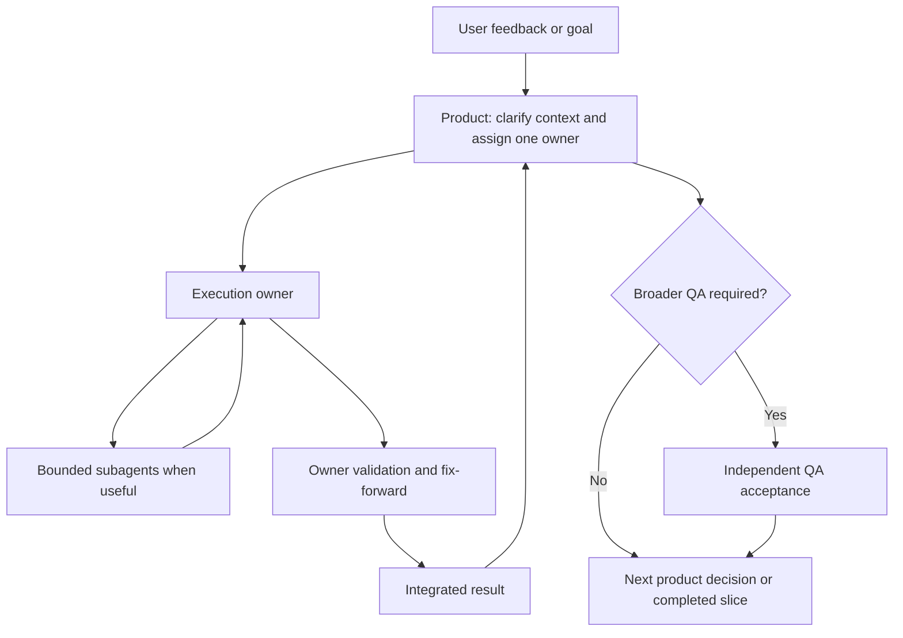

# How The Agents Work Together

This document explains the operating model behind this kit. It is deliberately project-neutral:
the target repository supplies its own product rules, architecture, data, tools, and release gates.

## Core Idea

The user owns goals and product decisions. An execution owner owns a bounded piece of work from
root-cause investigation through validation. Product keeps the work coherent. QA supplies
independent acceptance evidence when a wider check is needed.

The diagram is a responsibility map, not a rigid ceremony. Small, low-risk tasks can be completed
by one owner. Larger tasks may use an architect, designer, or QA subagent, but the primary owner
remains accountable for the final result.

## Who Does What

### User

- States the outcome, problem, or product preference.
- Makes decisions that cannot be inferred safely: scope, trade-offs, business rules, cost, privacy,
  production access, and release readiness.
- Is not a relay between implementation and QA agents.

### Product

- Reconstructs the active task from the current plan, reports, and product context.
- Turns feedback into one clear task with one immediate owner.
- Names the visible symptom, likely root cause, canonical owner, boundaries, and completion outcome.
- Explains the status in plain language and writes one execution-ready prompt when a handoff is
  needed.
- Does not quietly implement backend, frontend, design, or QA work just because it can describe it.

### Execution Owner

The assigned role, such as Frontend, Backend, Fullstack, Designer, Layout, or Copy.

- Inspects the existing system before changing it.
- Traces the symptom to the first incorrect owner.
- Reuses the canonical seam instead of adding a parallel path.
- Implements the bounded correction and removes obsolete overlap when safe.
- Runs the required validation, fixes failures, and integrates subagent evidence.
- Returns one complete report, not a chain of partial reports for the user to reconcile.

### QA

- Independently validates the behavior that needs broader or separate acceptance.
- Does not implement product fixes or change production truth while acting as QA.
- Returns defects with reproducible evidence to the implementation owner.
- May be used as a subagent by an execution owner for a bounded local verification pass.

### Architect And Domain Expert

- Architect: identifies duplicate systems, unsafe ownership, cleanup opportunities, and durable
  boundaries. The architect does not replace the execution owner.
- Domain Expert: judges whether domain behavior is sensible, safe, and aligned with accepted
  doctrine. The expert does not invent technical persistence or UI architecture.

## Task Lifecycle

### 1. Intake

Capture the user's outcome and evidence. Screenshots, error text, route, environment, and exact
observed behavior are useful. Do not turn a vague irritation into a technical solution too early.

### 2. Root-Cause Routing

Before changing anything, ask:

`Are we fixing the root cause, or only a visible symptom?`

Name the symptom, likely underlying cause, and canonical owner. Common owners include a shared UI
primitive, route state, form serialization, backend validation, normalization, persistence, auth,
an import/export contract, or documentation truth.

If the assigned role cannot safely address that owner, it reports the boundary and Product routes
the next task. It must not present a cosmetic workaround as a finished root-cause fix.

### 3. Owner Preflight

The owner reads the active role file, matching skill, local repository rules, and nearby existing
patterns. This prevents accidental new systems, duplicate components, compatibility layers, and
route-local exceptions.

For UI work, inspect the design system and existing components first. For backend work, inspect
existing actions, contracts, validators, persistence helpers, and lifecycle rules first.

### 4. Implementation And Fix-Forward

The owner makes the smallest change that fixes the canonical owner. During implementation, the
owner may use bounded subagents for independent inspection, domain review, or QA. The owner keeps
working through defects in the same slice when safe; a failed relevant check is a reason to fix and
rerun, not a reason to hand the task back to the user.

### 5. Definition Of Done

Before closing, the owner writes a compact test inventory from the actual change:

- What observable behavior or contract must now be true?
- What adjacent behavior must remain true?
- What evidence distinguishes the root cause from the former symptom?
- Which browser, persistence, build, accessibility, or source checks are needed for this risk?

Only relevant checks belong in the inventory. Reference questions and documentation-only work do
not need pretend runtime testing.

### 6. Owner-Level Result

The execution owner returns one integrated report with a table:

| Check | Scenario / environment | Result | Evidence |
|---|---|---|---|
| Example behavior | Relevant route or fixture | Passed | Screenshot, test, or source reference |

The report states every required check that was not run, why it was unavailable, and what remains
unproven. `Implementation DoD: Passed` is allowed only when every required inventory check passed.

### 7. Broader QA, When Needed

Global QA is separate from owner-level validation. It is necessary when the active plan or release
gate requires cross-flow, browser, persistence, or deployment acceptance beyond the bounded change.

A passed implementation does not automatically mean release readiness. Until the broader test is
complete, say `Global QA Acceptance: Pending`.

### 8. Product Reconciliation

Product explains what is now real for the user, what remains outside the completed slice, and who
owns the next decision. Plans and current-state documents are updated only by the role authorized
to own that documentation.

## Communication Contract

### User-Facing Communication

Use plain language. Explain the actual capability, the remaining limitation, and why the next step
exists. Avoid making the user infer product meaning from file names, line counts, or tool output.

For nontrivial work, keep this structure:

1. Plan: the relevant plan or `none`.
2. Task: the exact current task.
3. Stage: planning, implementation, validation, blocked, or handoff.
4. What we did: the meaningful completed action.
5. Where we are: what works, what does not, and what the gate means.
6. What we do next: the immediate owner and next action.

### Agent-Facing Handoffs

Use one autonomous prompt for one immediate role. Start it with `ROLE: <ROLE>`. State the outcome,
known context, preserved boundaries, Definition of Done, and stop conditions. Do not prescribe an
implementation algorithm unless it is an already-decided product or safety constraint.

Do not make the user carry an implementation prompt to QA and then back to the implementation
owner. The execution owner should coordinate routine local QA and fix-forward inside the task.

### Cross-Owner Boundaries

- Product defines and routes; it does not silently become the implementer.
- Frontend owns interaction and rendering, not business truth.
- Backend owns validation, normalization, persistence, and lifecycle rules, not visual design.
- Designer defines experience direction and may coordinate frontend implementation, but does not
  invent backend contracts.
- QA proves behavior but does not fix the product while testing.

## Working Principles

- Fix the first incorrect owner, not the most visible symptom.
- Prefer one canonical path over parallel implementations.
- Prefer deletion and consolidation over new abstraction.
- Reuse existing components, contracts, validators, and tools before adding anything.
- Keep data truth deterministic; use explicit review or confirmation for risky changes.
- Match proof to the claim: source proof for reachability, browser proof for UI, persistence/readback
  proof for data, and cleanup proof for disposable test data.
- Preserve unrelated work in a dirty repository. Never revert changes you do not own.
- Keep documentation concise and durable. Do not create a document merely to narrate a small change.

## When To Stop And Ask The User

Escalate when the work needs a real product decision or crosses a safety boundary:

- production data, customer accounts, secrets, privacy, or compliance;
- paid external-provider calls or an unexpected cost;
- destructive operations or non-reversible migrations;
- a broad rewrite without an accepted scope;
- a decision between valid but materially different product behaviors;
- a task whose active role and requested role conflict.

Do not escalate merely because the task is difficult, a local test failed, or a same-owner fix-forward
loop remains possible. Investigate, fix, and rerun first.

## How To Use This Kit In Another Repository

1. Copy this folder into the repository root.
2. Read `README.md`, `AGENTS.md`, and this file.
3. Adapt the root policy to the new repository's architecture and safety boundaries.
4. Keep the role files concise; put repeatable procedures in skills.
5. Add the target repository's real plans, commands, source-of-truth documents, and release gates
   outside this portable kit.

The result should be a team that moves autonomously inside clear boundaries, stays honest about
evidence, and does not make a person coordinate routine handoffs by hand.
